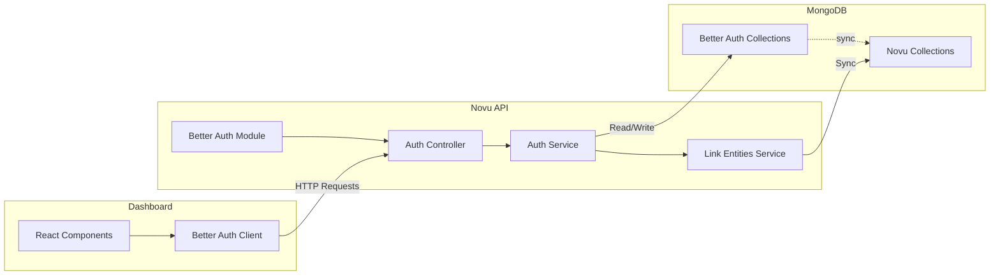

# Better Auth Full Implementation - Complete Guide

This document describes the complete implementation of Better Auth with email/password authentication and organization support in Novu.

## What Was Implemented

### Backend Components

#### 1. Better Auth Server Configuration
**File**: `enterprise/packages/auth/src/better-auth/better-auth.config.ts`

- Configured Better Auth with MongoDB adapter using existing Mongoose connection
- Enabled email/password authentication (no email verification required)
- Added organization plugin with the following settings:
  - Users can create up to 10 organizations
  - Each organization can have up to 100 members
  - Creator gets 'owner' role
  - Invitation links expire in 48 hours
- JWT signing uses existing `JWT_SECRET` or `BETTER_AUTH_SECRET`
- Configured trusted origins for CORS

#### 2. NestJS Integration
**Files**: 
- `enterprise/packages/auth/src/better-auth/better-auth.service.ts`
- `enterprise/packages/auth/src/better-auth/better-auth.controller.ts`
- `enterprise/packages/auth/src/better-auth/better-auth.module.ts`

- Created `BetterAuthService` that initializes Better Auth on module init
- Created `BetterAuthController` that handles all `/auth/*` routes
- Routes are exposed under `/api/auth/*` (e.g., `/api/auth/sign-in/email`, `/api/auth/sign-up/email`)
- Module is conditionally imported in `ee.auth.module.ts` when `EE_AUTH_PROVIDER=better-auth`

#### 3. Better Auth Passport Strategy
**File**: `enterprise/packages/auth/src/strategies/better-auth.strategy.ts`

- Validates Better Auth JWT tokens
- Uses HS256 algorithm with `BETTER_AUTH_SECRET` or `JWT_SECRET`
- Normalizes Better Auth JWT payload to Novu's internal `UserSessionData` format
- Integrates with `LinkEntitiesService` for user/organization linking
- Validates environment access

### Frontend Components

#### 1. Better Auth Client Configuration
**File**: `apps/dashboard/src/utils/better-auth/client.ts`

```typescript
import { createAuthClient } from 'better-auth/client';
import { organizationClient } from 'better-auth/client/plugins';

export const authClient = createAuthClient({
  baseURL: API_HOSTNAME,
  plugins: [organizationClient()],
});
```

#### 2. Sign In Component
**File**: `apps/dashboard/src/utils/better-auth/components/sign-in.tsx`

Features:
- Email and password input fields
- Form validation
- Error handling and display
- Loading states
- Token storage in localStorage
- Redirect to dashboard on success
- Link to sign-up page

#### 3. Sign Up Component  
**File**: `apps/dashboard/src/utils/better-auth/components/sign-up.tsx`

Features:
- Email, password, first name, last name, organization name fields
- Password validation (8-64 chars, uppercase, lowercase, number, special char)
- Automatic organization creation with slug generation
- Error handling for both user creation and org creation
- Token storage and redirect on success
- Link to sign-in page

#### 4. Organization Management Components
**Files**: 
- `apps/dashboard/src/utils/better-auth/components/organization-list.tsx`
- `apps/dashboard/src/utils/better-auth/components/organization-switcher.tsx`

**OrganizationList** features:
- Displays all user's organizations
- Create new organization form
- Switch active organization
- Slug auto-generation from name

**OrganizationSwitcher** features:
- Dropdown showing current organization
- List of all organizations
- Quick switch functionality
- Auto-reload on switch

#### 5. Updated Better Auth Wrapper
**File**: `apps/dashboard/src/utils/better-auth/index.tsx`

- Replaced all placeholder components with real implementations
- Updated hooks to use Better Auth client:
  - `useAuth()` - Auth state and methods
  - `useUser()` - User data and loading state
  - `useOrganization()` - Current organization data
  - `useOrganizationList()` - All user organizations
  - `useClerk()` - Clerk-compatible API
- Session management with Better Auth API
- Token handling via session API

## API Endpoints Exposed

When `EE_AUTH_PROVIDER=better-auth`, the following endpoints are available:

### Authentication
- `POST /api/auth/sign-up/email` - Create account with email/password
- `POST /api/auth/sign-in/email` - Sign in with email/password
- `POST /api/auth/sign-out` - Sign out current session
- `GET /api/auth/get-session` - Get current session

### Organization Management
- `POST /api/auth/organization/create` - Create new organization
- `GET /api/auth/organization/list` - List user's organizations
- `POST /api/auth/organization/set-active` - Switch active organization
- `POST /api/auth/organization/invite-member` - Invite member to organization
- `GET /api/auth/organization/get-invitation` - Get invitation details
- `POST /api/auth/organization/accept-invitation` - Accept invitation
- `POST /api/auth/organization/reject-invitation` - Reject invitation
- `DELETE /api/auth/organization/remove-member` - Remove member from organization
- `PATCH /api/auth/organization/update-member-role` - Update member role

## Environment Variables

### Backend
| Variable | Required | Default | Description |
|----------|----------|---------|-------------|
| `NOVU_ENTERPRISE` | Yes | - | Set to `true` for enterprise edition |
| `EE_AUTH_PROVIDER` | No | `clerk` | Set to `better-auth` to use Better Auth |
| `BETTER_AUTH_SECRET` | Yes* | `JWT_SECRET` | JWT signing secret |
| `BETTER_AUTH_URL` | No | `API_ROOT_URL` | Base URL for auth endpoints |
| `MONGO_URL` | Yes | - | MongoDB connection string |

*Required if `JWT_SECRET` is not set

### Frontend
| Variable | Required | Default | Description |
|----------|----------|---------|-------------|
| `VITE_IS_EE_AUTH_ENABLED` | Yes | - | Set to `true` for EE auth |
| `VITE_EE_AUTH_PROVIDER` | No | `clerk` | Set to `better-auth` |
| `VITE_BETTER_AUTH_BASE_URL` | No | `API_HOSTNAME` | Better Auth API base URL |

## Usage Example

### Enable Better Auth

**Backend (.env):**
```bash
NOVU_ENTERPRISE=true
EE_AUTH_PROVIDER=better-auth
BETTER_AUTH_SECRET=your-secret-key
BETTER_AUTH_URL=http://localhost:3000
MONGO_URL=mongodb://localhost:27017/novu-db
```

**Frontend (.env):**
```bash
VITE_IS_EE_AUTH_ENABLED=true
VITE_EE_AUTH_PROVIDER=better-auth
VITE_API_HOSTNAME=http://localhost:3000
```

### User Flow

1. **Sign Up**:
   - User visits `/auth/sign-up`
   - Fills in: email, password, first name, last name, organization name
   - System creates user account via Better Auth
   - System creates organization with user as owner
   - User is signed in and redirected to dashboard

2. **Sign In**:
   - User visits `/auth/sign-in`
   - Enters email and password
   - System validates credentials via Better Auth
   - User is signed in and redirected to dashboard

3. **Organization Switching**:
   - User clicks organization switcher
   - Selects different organization
   - Session updates with new active organization
   - Page reloads with new org context

## JWT Token Structure

Better Auth tokens include:

```typescript
{
  sub: string;              // User ID
  email: string;            // User email
  name: string;             // Full name
  picture?: string;         // Profile picture URL
  organizationId: string;   // Active organization ID
  role?: string;            // User role in organization
  permissions?: string[];   // User permissions
}
```

This is transformed to Novu's `UserSessionData` format in the `BetterAuthStrategy`.

## Database Schema

Better Auth requires the following MongoDB collections:

- `user` - User accounts
- `session` - User sessions (with activeOrganizationId field)
- `organization` - Organizations
- `member` - Organization memberships
- `invitation` - Pending invitations

These are automatically created by Better Auth when using the MongoDB adapter.

## Integration with Novu's Internal Data

The `LinkEntitiesService` handles synchronization between Better Auth users/organizations and Novu's internal user/organization tables:

1. When a Better Auth JWT is validated, the strategy extracts user and org IDs
2. `LinkEntitiesService` checks if internal Novu entities exist
3. If not, creates them via `SyncExternalUser` and organization sync
4. Returns internal IDs for use in Novu's business logic

## Testing

To test the Better Auth implementation:

1. **Start the API with Better Auth enabled**:
   ```bash
   cd apps/api
   NOVU_ENTERPRISE=true EE_AUTH_PROVIDER=better-auth pnpm start
   ```

2. **Start the dashboard with Better Auth**:
   ```bash
   cd apps/dashboard
   VITE_IS_EE_AUTH_ENABLED=true VITE_EE_AUTH_PROVIDER=better-auth pnpm start
   ```

3. **Test sign-up flow**:
   - Navigate to `http://localhost:4201/auth/sign-up`
   - Create account with organization
   - Verify redirect to dashboard

4. **Test sign-in flow**:
   - Sign out
   - Navigate to `http://localhost:4201/auth/sign-in`
   - Sign in with credentials
   - Verify session is restored

## Files Created

### Backend (7 files)
- `enterprise/packages/auth/src/better-auth/better-auth.config.ts`
- `enterprise/packages/auth/src/better-auth/better-auth.service.ts`
- `enterprise/packages/auth/src/better-auth/better-auth.controller.ts`
- `enterprise/packages/auth/src/better-auth/better-auth.module.ts`
- `enterprise/packages/auth/src/better-auth/index.ts`
- `enterprise/packages/auth/src/strategies/better-auth.strategy.ts`
- `enterprise/packages/auth/src/providers/better-auth/better-auth.provider.ts`

### Frontend (5 files)
- `apps/dashboard/src/utils/better-auth/client.ts`
- `apps/dashboard/src/utils/better-auth/components/sign-in.tsx`
- `apps/dashboard/src/utils/better-auth/components/sign-up.tsx`
- `apps/dashboard/src/utils/better-auth/components/organization-list.tsx`
- `apps/dashboard/src/utils/better-auth/components/organization-switcher.tsx`
- `apps/dashboard/src/utils/better-auth/components/index.ts`

### Modified Files
- `enterprise/packages/auth/package.json` - Added `better-auth` dependency
- `apps/dashboard/package.json` - Added `better-auth` dependency
- `enterprise/packages/auth/src/ee.auth.module.ts` - Conditional Better Auth module import
- `apps/dashboard/src/utils/better-auth/index.tsx` - Real implementations

## Next Steps

1. **Run `pnpm install`** to install the Better Auth dependencies
2. **Test the sign-up/sign-in flow** with the dashboard
3. **Add email verification** if needed (currently disabled for simplicity)
4. **Implement UserProfile component** for user settings
5. **Implement OrganizationProfile component** for organization settings
6. **Add invitation email templates** (currently logs to console)
7. **Add password reset flow** (currently logs to console)
8. **Add E2E tests** for Better Auth flows

## Security Considerations

- JWT tokens are signed with `BETTER_AUTH_SECRET` (or `JWT_SECRET`)
- Sessions expire after 7 days
- Session cache updates every 24 hours
- CORS is restricted to trusted origins only
- Password requirements enforced: 8-64 chars, uppercase, lowercase, number, special char

## Troubleshooting

**Issue**: "Cannot access API_HOSTNAME before initialization"
- **Fix**: Ensure `API_HOSTNAME` is defined before `BETTER_AUTH_BASE_URL` in config

**Issue**: MongoDB adapter type error
- **Fix**: Added type cast `as any` due to MongoDB version mismatch between Better Auth and Mongoose

**Issue**: "useUser must be used within ClerkProvider"
- **Fix**: EEAuthProvider now wraps children in ClerkProvider (which is aliased to Better Auth provider)

## Comparison with Clerk

| Feature | Clerk | Better Auth |
|---------|-------|-------------|
| User authentication | ✅ OAuth + Magic Link | ✅ Email/Password |
| Organizations | ✅ Built-in | ✅ Plugin |
| Session management | ✅ Built-in | ✅ Built-in |
| Webhooks | ✅ Required for sync | ❌ Direct DB access |
| Self-hosted | ❌ Cloud only | ✅ Fully self-hosted |
| Cost | 💰 Per user | 🆓 Open source |
| Database sync | External → Internal | Direct → Internal |

## Architecture Diagram



## References

- [Better Auth Documentation](https://www.better-auth.com/docs/introduction)
- [Better Auth Organization Plugin](https://www.better-auth.com/docs/plugins/organization)
- [Better Auth MongoDB Adapter](https://www.better-auth.com/docs/adapters/mongodb)
