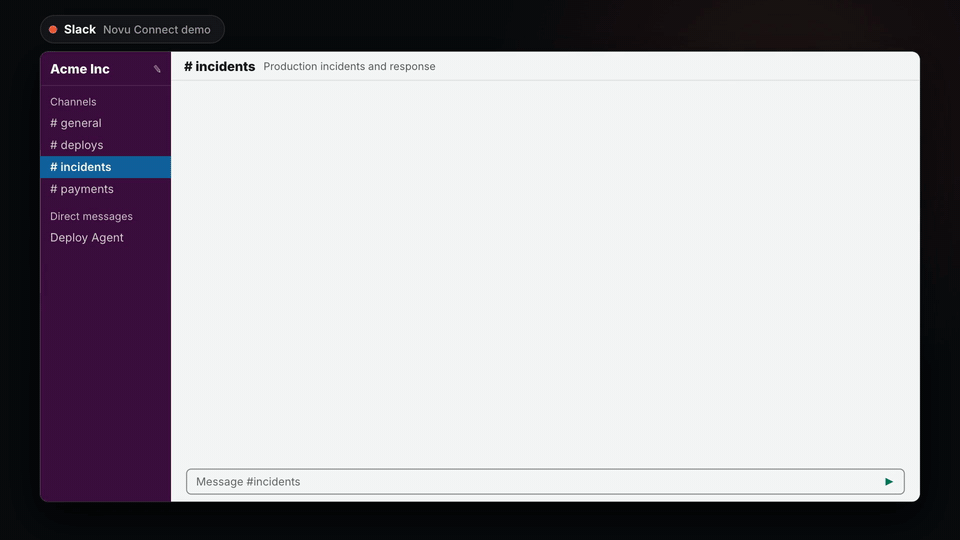
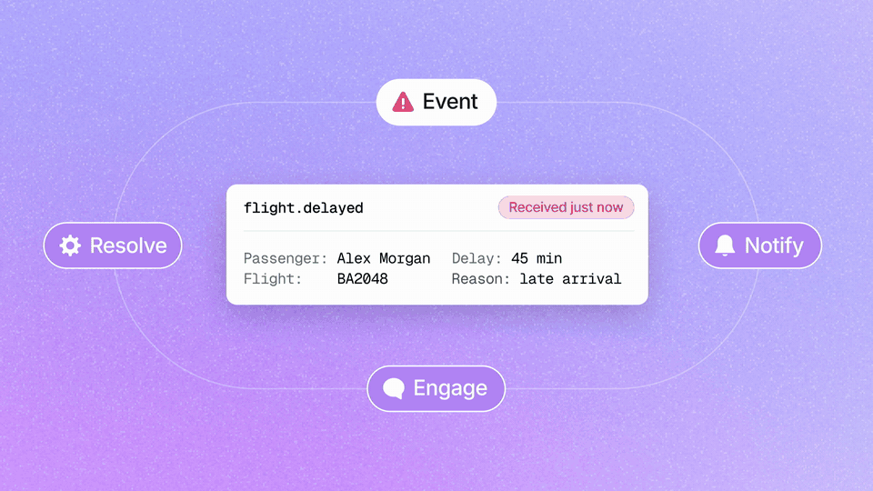
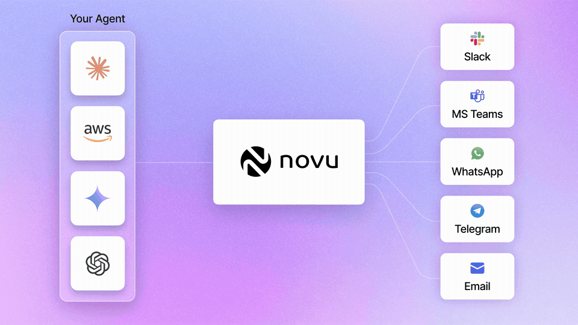

<a href="https://go.novu.co/github?utm_campaign=readme-logo" target="_blank" rel="noopener noreferrer">
  
</a>

<p align="center">
  <a href="https://github.com/novuhq/novu/stargazers" target="_blank" rel="noopener noreferrer"></a>
  <a href="https://www.producthunt.com/products/novu" target="_blank" rel="noopener noreferrer"></a>
  <a href="https://news.ycombinator.com/item?id=38419513" target="_blank" rel="noopener noreferrer"></a>
  <a href="https://www.npmjs.com/package/@novu/react" target="_blank" rel="noopener noreferrer"></a>
  <a href="https://www.npmjs.com/package/@novu/js" target="_blank" rel="noopener noreferrer"></a>
  <a href="https://github.com/novuhq/novu/blob/next/LICENSE" target="_blank" rel="noopener noreferrer"></a>
</p>

<h1 align="center">
  The communication layer between software and people
</h1>

<div align="center">
  Notifications for your product. Conversations for your AI agents. One API, one conversation model, every channel your users already use: Inbox, Email, SMS, Push, Slack, Microsoft Teams, WhatsApp, Telegram, and more.
</div>

<p align="center">
  <br />
  <a href="https://docs.novu.co" target="_blank" rel="noopener noreferrer">Docs</a>
  ·
  <a href="https://go.novu.co/github?utm_campaign=readme_website" target="_blank" rel="noopener noreferrer">Website</a>
  ·
  <a href="https://discord.novu.co" target="_blank" rel="noopener noreferrer">Discord</a>
  ·
  <a href="https://go.novu.co/changelog" target="_blank" rel="noopener noreferrer">Changelog</a>
  ·
  <a href="https://go.novu.co/roadmap" target="_blank" rel="noopener noreferrer">Roadmap</a>
  ·
  <a href="https://twitter.com/novuhq" target="_blank" rel="noopener noreferrer">X</a>
  ·
  <a href="https://github.com/novuhq/novu/issues/new?assignees=&labels=type%3A+bug&template=bug_report.yml&title=%F0%9F%90%9B+Bug+Report%3A+" target="_blank" rel="noopener noreferrer">Report a bug</a>
</p>

## ⚡ Add an agent to your app in about two minutes

Already working in Claude Code, Cursor, or any coding agent? Paste this and your agent does the rest: it sets up a managed agent for your project, connects the channel you pick, and hands you a claim link. No account, no API key.

```
Connect this project's AI agent to customer channels (Slack, Microsoft Teams, WhatsApp, Telegram, Email, or iMessage) with Novu Connect.

Follow https://novu.co/agents.md end to end. Default to the non-interactive CLI (`npx novu@latest connect … --ci`).

Inspect the repo first. Ask me which channel to connect if it is not clear. Detect the framework/runtime from the project, or ask once. Then run one connect command per agents.md (bridge vs managed, keyless vs dashboard OAuth).

Prefer the secure setup links the CLI prints. Do not invent setup steps or ask for secrets in chat unless agents.md says that channel requires it (e.g. iMessage/Sendblue).
```

Prefer to run it yourself?

```bash
npx novu@latest connect
```

Either way you go from template to a live agent talking with a real user in about two minutes. The first replies run keyless on a shared Claude demo runtime, then one link lets you claim the agent and keep it.

<!-- Real recording of the keyless flow (source: 08-assets/github-readme/, commit as .github/assets/novu-connect-demo.gif) -->
<div align="center">
  
</div>

<!-- Hero GIF clipped from the Connect channels demo video (Slack segment). Source: 08-assets/github-readme/agent-slack-conversation.gif -->
<div align="center">
  
</div>

## ⭐ Why Novu?

> MCP connects agents to tools. A2A connects agents to each other. ACI, Agent Communication Infrastructure, connects agents to people. Novu is the ACI layer, built on the open-source notification infrastructure 40,000 developers already trust.

Every product and every agent eventually needs to talk with people on the channels those people already use. Each channel has its own webhook format, identity model, and threading quirks. Novu standardizes that layer once, so you never rebuild inbox feeds, provider integrations, and channel webhooks from scratch again.

There are two ways to build with Novu, on one shared foundation:

- **For your product:** send notifications across Inbox/In-App, Email, SMS, Push, and Chat through one API, with workflows, digests, and an embeddable `<Inbox />` component.
- **For your agents:** connect any agent you already built to Slack, Microsoft Teams, WhatsApp, Telegram, and Email through one conversation model, in both directions.

## 🔁 One platform. Two ways to communicate.

Notifications and conversations are not two products. They are one loop, and Novu runs the whole thing:

<!-- Pixel Point "cycle" animation, delivered 2026-07-28. Masters: 08-assets/github-readme/cycle-dark.mp4 + cycle-light.mp4 (Slack files F0BKTAAD6BZ / F0BL8M49UPL). Convert to GIF per conversion note, commit both variants. -->
<div align="center">
  <picture>
    <source media="(prefers-color-scheme: dark)" srcset=".github/assets/cycle-dark.gif">
    
  </picture>
</div>

1. **Event.** Something happens in your application that needs user attention. A payment fails.
2. **Notify.** Your app notifies the user through push, email, or the in-app Inbox.
3. **Engage.** The user opens the notification and starts a conversation with your agent in their preferred channel.
4. **Resolve.** The agent resolves the issue in a two-way conversation, on WhatsApp, Slack, SMS, and more.

The notification is the front door. The conversation is what happens after the user walks in. Same rails, same identity, same observability, so the handoff from a notification to a live agent conversation is one platform doing its job, not two systems duct-taped together.

## 🤖 For AI agents: the ACI layer

ACI, Agent Communication Infrastructure, is the layer that lets AI agents hold a real, two-way conversation with the people they work for, across the channels those people already use.

You build the agent. Novu gives it a voice. Novu receives inbound messages from each channel, normalizes them into one consistent shape, routes them to your agent, and delivers your agent's replies back out. It keeps one conversation thread per user no matter which channel they are on, and handles identity resolution, OAuth and credentials, threading, and channel-aware formatting (Slack blocks, WhatsApp buttons, HTML email). Connect a new channel and your agent code does not change.

**We never run your brain. That's the whole point.** The intelligence is always yours: your own code, or a model platform you bring, like Claude. Novu is the delivery layer. Bring agents built with Claude Managed Agents, LangGraph, CrewAI, the OpenAI Agents SDK, or your own stack.

<!-- Pixel Point "agents" architecture animation, REVISED version with signals flowing both ways, delivered 2026-07-28 19:17. Masters: 08-assets/github-readme/agents-dark.mp4 + agents-light.mp4 (Slack files F0BM57T9DH6 / F0BLAT4HU8J). Convert to GIF per conversion note, commit both variants. -->
<div align="center">
  <picture>
    <source media="(prefers-color-scheme: dark)" srcset=".github/assets/agents-dark.gif">
    
  </picture>
</div>

Three ways in, same channels and observability the whole way up. You only ever change the part that holds your logic:

| | **Connect** | **Managed Agent** | **Custom Code Agent** |
|---|---|---|---|
| Best for | A working agent, now | Claude's reasoning, your tools | Your own logic and models |
| Who runs the brain | Novu + a template | Claude (your key) | You |
| Code | None | None | Yes |
| Tools | Curated | Any MCP server | Any MCP + your own |
| Time to live | ~2 min | ~10 min | ~1 hr+ |

Start with the quick start above, or read the [ACI docs](https://docs.novu.co/agents/get-started/what-is-aci?utm_source=github&utm_medium=readme&utm_campaign=aci-docs-link).

## 📬 For products: notification infrastructure

The notification platform that turns multi-channel delivery into a single component. Create workflows, define per-channel conditions, and let Novu deliver each notification the right way, without stitching together a provider per channel.

- One API for all messaging providers
- Embeddable, real-time `<Inbox />` component for React, with headless APIs for everything else
- Workflow engine with branching, conditions, and delays, visual or code-first in TypeScript
- Digest engine that batches many notifications into one message
- No-code email editor
- Embeddable preferences component so users control their own notifications

Add a full notification center to your app with one component:

```tsx
import { Inbox } from '@novu/react';

<Inbox
  applicationIdentifier="YOUR_APPLICATION_IDENTIFIER"
  subscriberId="YOUR_SUBSCRIBER_ID"
/>
```

<div align="center">
  
</div>

[Create a free account](https://go.novu.co/dashboard?utm_source=github&utm_medium=readme&utm_campaign=create-free-account-link) and follow the [Inbox quick start](https://docs.novu.co/inbox/react/get-started?utm_source=github&utm_medium=readme&utm_campaign=react-starter-link).

## Providers

Novu provides a single API to manage providers across multiple channels with a simple-to-use API and UI interface.

Expand a channel below to browse supported providers.

<details>
<summary><strong>💌 Email</strong> (20 providers)</summary>

| Provider |
| --- |
| [Amazon SES](https://github.com/novuhq/novu/tree/next/packages/providers/src/lib/email/ses) |
| [Anypost](https://github.com/novuhq/novu/tree/next/packages/providers/src/lib/email/anypost) |
| [Braze](https://github.com/novuhq/novu/tree/next/packages/providers/src/lib/email/braze) |
| [Brevo](https://github.com/novuhq/novu/tree/next/packages/providers/src/lib/email/brevo) |
| [Custom SMTP](https://github.com/novuhq/novu/tree/next/packages/providers/src/lib/email/nodemailer) |
| [Email Webhook](https://github.com/novuhq/novu/tree/next/packages/providers/src/lib/email/email-webhook) |
| [Email.js](https://github.com/novuhq/novu/tree/next/packages/providers/src/lib/email/emailjs) |
| [Infobip](https://github.com/novuhq/novu/tree/next/packages/providers/src/lib/email/infobip) |
| [MailerSend](https://github.com/novuhq/novu/tree/next/packages/providers/src/lib/email/mailersend) |
| [Mailgun](https://github.com/novuhq/novu/tree/next/packages/providers/src/lib/email/mailgun) |
| [Mailjet](https://github.com/novuhq/novu/tree/next/packages/providers/src/lib/email/mailjet) |
| [Mailtrap](https://github.com/novuhq/novu/tree/next/packages/providers/src/lib/email/mailtrap) |
| [Mandrill](https://github.com/novuhq/novu/tree/next/packages/providers/src/lib/email/mandrill) |
| [Netcore](https://github.com/novuhq/novu/tree/next/packages/providers/src/lib/email/netcore) |
| [Outlook 365](https://github.com/novuhq/novu/tree/next/packages/providers/src/lib/email/outlook365) |
| [Plunk](https://github.com/novuhq/novu/tree/next/packages/providers/src/lib/email/plunk) |
| [Postmark](https://github.com/novuhq/novu/tree/next/packages/providers/src/lib/email/postmark) |
| [Resend](https://github.com/novuhq/novu/tree/next/packages/providers/src/lib/email/resend) |
| [SendGrid](https://github.com/novuhq/novu/tree/next/packages/providers/src/lib/email/sendgrid) |
| [SparkPost](https://github.com/novuhq/novu/tree/next/packages/providers/src/lib/email/sparkpost) |

</details>

<details>
<summary><strong>📞 SMS</strong> (37 providers)</summary>

| Provider |
| --- |
| [46elks](https://github.com/novuhq/novu/tree/next/packages/providers/src/lib/sms/forty-six-elks) |
| [Africa's Talking](https://github.com/novuhq/novu/tree/next/packages/providers/src/lib/sms/africas-talking) |
| [Afro SMS](https://github.com/novuhq/novu/tree/next/packages/providers/src/lib/sms/afro-sms) |
| [Amazon SNS](https://github.com/novuhq/novu/tree/next/packages/providers/src/lib/sms/sns) |
| [Azure SMS](https://github.com/novuhq/novu/tree/next/packages/providers/src/lib/sms/azure-sms) |
| [Bandwidth](https://github.com/novuhq/novu/tree/next/packages/providers/src/lib/sms/bandwidth) |
| [Brevo SMS](https://github.com/novuhq/novu/tree/next/packages/providers/src/lib/sms/brevo-sms) |
| [Bulk SMS](https://github.com/novuhq/novu/tree/next/packages/providers/src/lib/sms/bulk-sms) |
| [Burst SMS](https://github.com/novuhq/novu/tree/next/packages/providers/src/lib/sms/burst-sms) |
| [Clickatell](https://github.com/novuhq/novu/tree/next/packages/providers/src/lib/sms/clickatell) |
| [ClickSend](https://github.com/novuhq/novu/tree/next/packages/providers/src/lib/sms/clicksend) |
| [CM Telecom](https://github.com/novuhq/novu/tree/next/packages/providers/src/lib/sms/cm-telecom) |
| [Eazy SMS](https://github.com/novuhq/novu/tree/next/packages/providers/src/lib/sms/eazy-sms) |
| [Firetext](https://github.com/novuhq/novu/tree/next/packages/providers/src/lib/sms/firetext) |
| [Generic SMS](https://github.com/novuhq/novu/tree/next/packages/providers/src/lib/sms/generic-sms) |
| [Gupshup](https://github.com/novuhq/novu/tree/next/packages/providers/src/lib/sms/gupshup) |
| [iMedia](https://github.com/novuhq/novu/tree/next/packages/providers/src/lib/sms/imedia) |
| [Infobip](https://github.com/novuhq/novu/tree/next/packages/providers/src/lib/sms/infobip) |
| [iSend SMS](https://github.com/novuhq/novu/tree/next/packages/providers/src/lib/sms/isend-sms) |
| [iSendPro SMS](https://github.com/novuhq/novu/tree/next/packages/providers/src/lib/sms/isendpro-sms) |
| [Kannel](https://github.com/novuhq/novu/tree/next/packages/providers/src/lib/sms/kannel) |
| [Maqsam](https://github.com/novuhq/novu/tree/next/packages/providers/src/lib/sms/maqsam) |
| [MessageBird](https://github.com/novuhq/novu/tree/next/packages/providers/src/lib/sms/messagebird) |
| [Mobishastra](https://github.com/novuhq/novu/tree/next/packages/providers/src/lib/sms/mobishastra) |
| [Plivo](https://github.com/novuhq/novu/tree/next/packages/providers/src/lib/sms/plivo) |
| [RingCentral](https://github.com/novuhq/novu/tree/next/packages/providers/src/lib/sms/ring-central) |
| [Sendchamp](https://github.com/novuhq/novu/tree/next/packages/providers/src/lib/sms/sendchamp) |
| [SimpleTexting](https://github.com/novuhq/novu/tree/next/packages/providers/src/lib/sms/simpletexting) |
| [Sinch](https://github.com/novuhq/novu/tree/next/packages/providers/src/lib/sms/sinch) |
| [SMS Central](https://github.com/novuhq/novu/tree/next/packages/providers/src/lib/sms/sms-central) |
| [SMS77](https://github.com/novuhq/novu/tree/next/packages/providers/src/lib/sms/sms77) |
| [SMSMode](https://github.com/novuhq/novu/tree/next/packages/providers/src/lib/sms/smsmode) |
| [Telnyx](https://github.com/novuhq/novu/tree/next/packages/providers/src/lib/sms/telnyx) |
| [Termii](https://github.com/novuhq/novu/tree/next/packages/providers/src/lib/sms/termii) |
| [Twilio](https://github.com/novuhq/novu/tree/next/packages/providers/src/lib/sms/twilio) |
| [Unifonic](https://github.com/novuhq/novu/tree/next/packages/providers/src/lib/sms/unifonic) |
| [Vonage](https://github.com/novuhq/novu/tree/next/packages/providers/src/lib/sms/nexmo) |

</details>

<details>
<summary><strong>📱 Push</strong> (8 providers)</summary>

| Provider |
| --- |
| [APNS](https://github.com/novuhq/novu/tree/next/packages/providers/src/lib/push/apns) |
| [App.io](https://github.com/novuhq/novu/tree/next/packages/providers/src/lib/push/appio) |
| [Expo](https://github.com/novuhq/novu/tree/next/packages/providers/src/lib/push/expo) |
| [FCM](https://github.com/novuhq/novu/tree/next/packages/providers/src/lib/push/fcm) |
| [OneSignal](https://github.com/novuhq/novu/tree/next/packages/providers/src/lib/push/one-signal) |
| [Push Webhook](https://github.com/novuhq/novu/tree/next/packages/providers/src/lib/push/push-webhook) |
| [Pusher Beams](https://github.com/novuhq/novu/tree/next/packages/providers/src/lib/push/pusher-beams) |
| [Pushpad](https://github.com/novuhq/novu/tree/next/packages/providers/src/lib/push/pushpad) |

</details>

<details>
<summary><strong>💬 Chat</strong> (13 providers)</summary>

| Provider |
| --- |
| [Chat Webhook](https://github.com/novuhq/novu/tree/next/packages/providers/src/lib/chat/chat-webhook) |
| [Discord](https://github.com/novuhq/novu/tree/next/packages/providers/src/lib/chat/discord) |
| [GetStream](https://github.com/novuhq/novu/tree/next/packages/providers/src/lib/chat/getstream) |
| [Grafana OnCall](https://github.com/novuhq/novu/tree/next/packages/providers/src/lib/chat/grafana-on-call) |
| [Mattermost](https://github.com/novuhq/novu/tree/next/packages/providers/src/lib/chat/mattermost) |
| [Microsoft Teams](https://github.com/novuhq/novu/tree/next/packages/providers/src/lib/chat/msTeams) |
| [Rocket.Chat](https://github.com/novuhq/novu/tree/next/packages/providers/src/lib/chat/rocket-chat) |
| [Ryver](https://github.com/novuhq/novu/tree/next/packages/providers/src/lib/chat/ryver) |
| [Slack](https://github.com/novuhq/novu/tree/next/packages/providers/src/lib/chat/slack) |
| [Telegram](https://github.com/novuhq/novu/tree/next/packages/providers/src/lib/chat/telegram) |
| [Webex Messaging](https://github.com/novuhq/novu/tree/next/packages/providers/src/lib/chat/webex-messaging) |
| [WhatsApp Business](https://github.com/novuhq/novu/tree/next/packages/providers/src/lib/chat/whatsapp-business) |
| [Zulip](https://github.com/novuhq/novu/tree/next/packages/providers/src/lib/chat/zulip) |

</details>

<details>
<summary><strong>📥 In-App</strong> (1 provider)</summary>

| Provider |
| --- |
| [Novu Inbox](https://docs.novu.co/inbox/react/get-started?utm_source=github&utm_medium=repository&utm_campaign=inbox-channel-link) |

</details>

## 🏠 Self-hosting

Novu is open source and genuinely self-hostable. Run the full platform on your own infrastructure with [Docker](https://docs.novu.co/community/self-hosting-novu/overview?utm_source=github&utm_medium=readme&utm_campaign=self-host-link), or [run it locally](https://docs.novu.co/community/run-in-local-machine?utm_source=github&utm_medium=readme&utm_campaign=novu-locally-link) to contribute. Same API, your servers, your data.

Need SOC 2 Type II, HIPAA, ISO 27001, or GDPR answers, data residency (US and EU regions), or a self-hosted plan for your company? [Talk to us](https://go.novu.co/contact?utm_source=github&utm_medium=readme&utm_campaign=contact-us-link).

## 🛡️ License

Novu is a commercial open source company. The core is MIT licensed and fully open source; enterprise features are covered by a commercial license (open core). The enterprise-licensed folders are:

- `enterprise` at the root of the project and all its subfolders and modules
- `apps/web/src/ee` and all its subfolders and modules
- `apps/dashboard/src/ee` and all its subfolders and modules

## 💬 Community

- Stuck or curious? Join our [Discord](https://discord.novu.co) and ask anything.
- Want to contribute? Read the [contribution guidelines](https://github.com/novuhq/novu/blob/main/CONTRIBUTING.md) and our [Code of Conduct](https://github.com/novuhq/novu/blob/main/CODE_OF_CONDUCT.md), then pick an issue.
- If Novu is useful to you, [star the repo](https://github.com/novuhq/novu/stargazers). It genuinely helps more developers find it.

## 💪 Thanks to all of our contributors

Four years of open-source notification infrastructure, built with this community. Thanks for spending your time helping Novu grow.

<a href="https://novu.co/contributors?utm_source=github" target="_blank" rel="noopener noreferrer">
  
</a>

The beautiful header animation was contributed by [LottieFiles](https://lottiefiles.com/) ❤️
