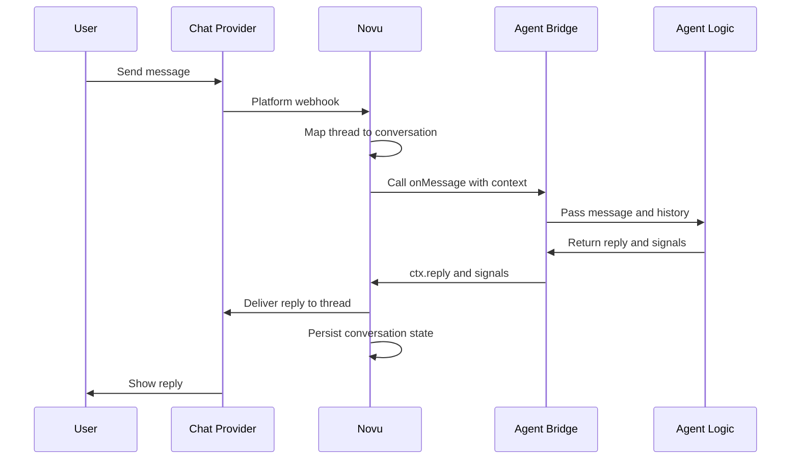

Novu gives your handler the same building blocks whether the message came from Slack, email, or another provider, and whether you call an LLM or plain TypeScript.

## Event handlers

Event handlers are functions that respond to events in a conversation. Your agent can respond to these event types:

| Handler | When it runs | Common use case |
| --- | --- | --- |
| `onMessage` | A user sends a message in the conversation | Process the message and reply |
| `onAction` | A user clicks a button or selects a value in an interactive card | Handle form submissions, button clicks, dropdown selections |
| `onReaction` | A user adds or removes a reaction | Capture feedback or trigger a follow-up |
| `onResolve` | The conversation is marked as resolved | Clean up state, log analytics, or send a summary |
| `onToolApproval` | A user approves or denies a gated tool call | Run or skip the tool, audit the decision. See [Tool approval](/agents/custom-code-agent/building-blocks/tool-approval) |

Handlers are where the communication layer connects to your application logic. For example, an `onMessage` handler receives the user's message, passes conversation context to an LLM or custom function, and sends the response back through Novu.

## Context object

Each event handler receives a context object with the information needed to understand the current event and respond. Depending on the event type, it can include:

- The incoming message
- The current conversation state and metadata
- The resolved subscriber (when available)
- Recent conversation history
- Provider information
- Platform-specific details, such as thread or channel identifiers
- Methods for replying, updating metadata, triggering workflows, or resolving the conversation

The context object is how your code talks to Novu. You do not call Slack, Teams, or email APIs directly in the handler.

## Event handling flow

When a user messages your agent:



<Steps>
  <Step title="User sends a message">
    A user sends a message from a connected provider (for example, Slack).
  </Step>

  <Step title="Novu receives the event">
    The provider delivers the inbound message to your agent endpoint.
  </Step>

  <Step title="Novu maps the thread">
    Novu maps the provider thread to a conversation and resolves the platform user to a subscriber, when possible.
  </Step>

  <Step title="Novu calls onMessage">
    Novu calls the agent's `onMessage` handler with the context object.
  </Step>

  <Step title="Handler passes context to agent logic">
  </Step>

  <Step title="Agent logic decides next action">
    Your agent logic decides what should happen next.
  </Step>

  <Step title="Handler sends reply or signals">
  </Step>

  <Step title="Novu delivers the reply">
    The agent response is posted back to the original provider thread.
  </Step>

  <Step title="Novu records conversation state">
    Novu records messages, participants, metadata, signals, and conversation status.
  </Step>
</Steps>

The same agent logic works across all connected providers because Novu handles the provider-specific communication layer. Connecting a new provider does not require changing your agent code.

### onMessage

`onMessage` fires every time a user sends a message in a conversation with your agent.

<Tabs>
  <Tab title="AI SDK">

```typescript
import { agent, toModelMessages } from '@novu/framework/ai-sdk';
import { openai } from '@ai-sdk/openai';
import { generateText } from 'ai';

export const myAgent = agent('my-agent', {
  onMessage: async (message, ctx) => {
    const userMessage = message.text ?? '';
    const conversationHistory = ctx.history;
    const subscriber = ctx.subscriber;

    return generateText({
      model: openai('gpt-4o-mini'),
      instructions: 'You are a helpful support agent.',
      messages: toModelMessages(conversationHistory),
    });
  },
});
```

Return `generateText()` or `streamText()` from the handler — Novu delivers the model output to the thread. See [AI SDK](/agents/custom-code-agent/frameworks/ai-sdk).

  </Tab>
  <Tab title="LangChain">

<Note>
  LangChain support is coming soon.
</Note>

  </Tab>
  <Tab title="Custom code">

```typescript
import { agent } from '@novu/framework';

export const myAgent = agent('my-agent', {
  onMessage: async (message, ctx) => {
    const userMessage = message.text ?? '';
    const conversationHistory = ctx.history;
    const subscriber = ctx.subscriber;

    const response = await yourLLM.chat(userMessage, conversationHistory);

    ctx.metadata.set('lastIntent', response.intent);
    await ctx.reply(response.text);
  },
});
```

Call your LLM or business logic yourself, then reply with `ctx.reply()` or by returning a string.

  </Tab>
</Tabs>

#### Handling attachments

Inbound messages can include file attachments when the platform supports them. Novu normalizes files into `message.attachments` with short-lived signed URLs. Keep in mind:

- Download attachment URLs promptly inside your handler.
- Signed links are valid for 15 minutes.
- Inbound attachments are limited to 25 MB per file.

```typescript
import { agent } from '@novu/framework';

export const myAgent = agent('my-agent', {
  onMessage: async (message, ctx) => {
    const attachments = message.attachments ?? [];

    for (const file of attachments) {
      // file.type: 'image', 'document', 'audio', 'video'
      // file.url: short-lived download URL
      // file.name: original filename
      // file.mimeType: e.g. 'image/jpeg'
      // file.size: size in bytes
    }
  },
});
```

### onAction

`onAction` fires when a user clicks a button or selects a value in an interactive card. The `action` payload carries `action.id` (the element's `id` prop), `action.value` (its `value` prop, if set), and `action.sourceMessageId`. See [Interactive cards](/agents/custom-code-agent/building-blocks/reply#interactive-cards).

```typescript
import { agent } from '@novu/framework';

export const myAgent = agent('my-agent', {
  onAction: async (action, ctx) => {
    if (action.id === 'approve' && action.value === 'true') {
      await ctx.reply('Request approved!');
      ctx.trigger('approval-workflow', {
        to: ctx.subscriber?.subscriberId,
        payload: { approved: true },
      });
    }
  },
});
```

### onReaction

`onReaction` fires when a user adds or removes an emoji reaction on a message. The `reaction` payload carries `reaction.emoji.name`, `reaction.added` (`true` when added, `false` when removed), and `reaction.messageId`.

```typescript
import { agent } from '@novu/framework';

export const myAgent = agent('my-agent', {
  onReaction: async (reaction, ctx) => {
    if (reaction.emoji.name === 'thumbs_up' && reaction.added) {
      ctx.metadata.set('userSatisfied', true);
    } else if (reaction.emoji.name === 'thumbs_down' && reaction.added) {
      ctx.metadata.set('userUnsatisfied', true);
    }
    await ctx.reply('Thank you for your feedback!');
  },
});
```

### onResolve

`onResolve` fires when the conversation is marked as resolved via `ctx.resolve()` or the resolve signal. It receives only the context object.

```typescript
import { agent } from '@novu/framework';

export const myAgent = agent('my-agent', {
  onResolve: async (ctx) => {
    ctx.metadata.set('resolvedAt', new Date().toISOString());
  },
});
```

### onToolApproval

`onToolApproval` fires when a user approves or denies a gated tool call. It receives a `decision` with the tool call, the verdict, and a handle to the approval card.

<Tabs>
  <Tab title="AI SDK">

On the AI SDK path, tools gated with `needsApproval: true` in `onMessage` trigger this handler when the user clicks **Approve** or **Deny**. Register it when you need a hook after the click — for example to audit the decision or change how the card is handled.

```typescript
import { agent, toModelMessages } from '@novu/framework/ai-sdk';
import { openai } from '@ai-sdk/openai';
import { generateText, tool } from 'ai';
import { z } from 'zod';

export const myAgent = agent('my-agent', {
  onMessage: async (message, ctx) => {
    return generateText({
      model: openai('gpt-4o'),
      messages: toModelMessages(ctx.history),
      tools: {
        issueRefund: tool({
          inputSchema: z.object({ orderId: z.string() }),
          needsApproval: true,
          execute: async ({ orderId }) => refund(orderId),
        }),
      },
    });
  },

  onToolApproval: async (decision, ctx) => {
    await decision.approvalMessage.delete();

    if (!decision.approved) return 'Refund denied.';
    // return nothing → onMessage auto-resumes
  },
});
```

  </Tab>
  <Tab title="LangChain">

<Note>
  LangChain support is coming soon.
</Note>

  </Tab>
  <Tab title="Custom code">

Gate the tool with `ctx.toolApproval.request()` and handle the click in `onToolApproval`:

```typescript
import { agent } from '@novu/framework';

export const myAgent = agent('my-agent', {
  onMessage: async (message, ctx) => {
    return ctx.toolApproval.request({ id: 'call_1', name: 'issueRefund', input: { orderId: 'A-123' } });
  },

  onToolApproval: async (decision, ctx) => {
    await decision.approvalMessage.delete();
    if (!decision.approved) return 'Action cancelled.';

    await issueRefund(decision.toolCall.input);
    return 'Done.';
  },
});
```

  </Tab>
</Tabs>

See [Tool approval](/agents/custom-code-agent/building-blocks/tool-approval) for card customization, auditing, and `renderApproval`.

## Related

<Columns cols={2}>
  <Card icon="reply" href="/agents/custom-code-agent/building-blocks/reply" title="Reply">
    Send plain text, markdown, attachments, and interactive cards.
  </Card>
  <Card icon="loader" href="/agents/custom-code-agent/building-blocks/typing-indicator" title="Typing indicator">
    Show a Thinking… or custom status while your handler runs.
  </Card>
  <Card icon="shield-check" href="/agents/custom-code-agent/building-blocks/tool-approval" title="Tool approval">
    Gate tool calls with an in-thread Approve / Deny card.
  </Card>
  <Card icon="sparkles" href="/agents/custom-code-agent/frameworks/ai-sdk" title="AI SDK">
    Build end to end with `@novu/framework/ai-sdk`.
  </Card>
</Columns>
