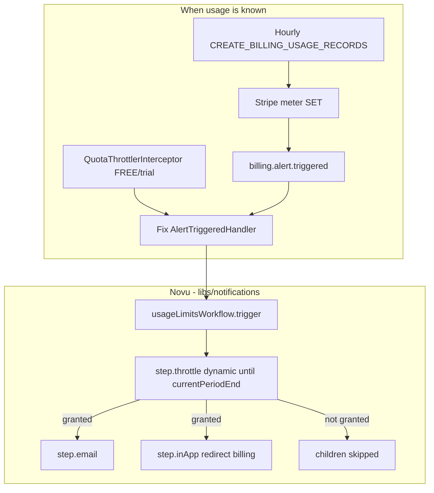

# Handover: 75% / 90% usage threshold alerts

**Status:** plan only — do not treat this file as implemented.  
**Audience:** local setup agent implementing the feature.  
**Base branch:** `next`  
**Canonical path:** `docs/agents/plans/usage-threshold-alerts.md`  
**Repos:** `novuhq/novu` (this file + `libs/notifications` + dashboard) and `novuhq/packages-enterprise` (billing producer).

## Local agent: start here

1. Read this entire file before writing code.
2. Read `.cursor/skills/enterprise-submodule/SKILL.md` before touching `enterprise/` or `.source/`.
3. Create a Linear ticket (`NV-XXXX`) and use it on both branch names and PR titles (`fixes NV-XXXX`).
4. Implement **v1 only** (scope below). Do not invent a new usage pipeline, Redis dedup store, or cron.
5. When done, follow `.cursor/skills/novu-prepare-pr/SKILL.md` and open **two** PRs (monorepo + enterprise), cross-linked.

Paste this as the implementation prompt if needed:

> Implement v1 of `docs/agents/plans/usage-threshold-alerts.md`. Novu is the transport. Billing only triggers `usageLimitsWorkflow`. Dedup via `step.throttle`, not Redis in billing. Dual-repo EE workflow. Do not add a new usage scan cron.

---

## Product (locked)

When an organization uses **75%** of included monthly **workflow runs / events**, send a usage alert. When they use **90%**, send a second, stronger alert.

- Metric: `subscription.events.current / subscription.events.included` (same unit as billing).
- Not in v1: subscribers, agents, conversations, LLM tokens, API RPS.
- Recipients (v1): org owner via existing `GetOrganizationOwnerUser` (same as today’s Stripe alert handler).
- Channels: **email + in-app** through Novu (`usageLimitsWorkflow`).
- Cadence: **at most once per threshold per billing period per recipient**.
- If usage jumps from below 75% to ≥90% in one check: **trigger only `threshold: 90`** (do not also send 75%).
- If 75% ≤ usage < 90%: trigger `threshold: 75` only.
- FREE copy may say notifications block at 100%. Paid copy must **not** say that (pay-as-you-grow).
- Community / self-hosted enterprise (`events.included === null`): **never trigger**.

---

## Architecture (locked)

Billing is a **dumb producer**. Novu is the **transport and policy layer**.



### When to calculate (do not change this)

| Source | When | Why |
|---|---|---|
| **Primary** | Stripe `billing.alert.triggered` after hourly `CreateUsageRecords` | Period meter already exists; zero extra aggregation |
| **Secondary** | `QuotaThrottlerInterceptor` on FREE/trial event triggers | Burst orgs can hit 100% inside the hourly lag; interceptor already has `remaining` / `limit` |
| **Forbidden** | New all-org cron, per-trigger `GetSubscription` for paid tiers, dashboard GET as the only sender | Extra ClickHouse/Mongo/Stripe load or missed idle orgs |

`CreateUsageRecords` usage window is **UTC day → last completed hour**, not the Stripe billing period. Do **not** compute 75/90 from that range. Use Stripe alert `data.value` + `GetSubscription.events.included`, or `events.current` / `events.included` on the quota path.

### Why throttle, not digest, not billing Redis

- Today `usage-limits` uses a **5-minute digest** (batches then sends). Wrong: we need **send once, drop the rest**.
- `step.throttle` with `threshold: 1` skips the rest of the workflow (`handleThrottleSkip`).
- Dynamic window: `dynamicKey: 'payload.currentPeriodEnd'` (ISO-8601). Worker parses this to `targetTime - now` in `add-job.usecase.ts` `parseDynamicDurationValue`.
- `throttleKey` from `payload.threshold` (`75` vs `90`) so the two alerts do not share a slot.
- Redis key is already per `subscriberId` + workflow + step + throttleKey. Each owner gets one 75 and one 90 without a billing `SETNX`.
- Do **not** add `usage-alert:{org}:{period}:{threshold}` in billing.

### Launch constraint (throttle window tier)

Dynamic throttle until period end can be **~31 days**. Tier cap `PLATFORM_MAX_THROTTLE_WINDOW_TIME` is 7 days on Business and unlimited on Enterprise. The **internal Novu org** that owns the `/bridge/novu` workflows must allow a period-length window (Enterprise, or `MAX_THROTTLE_WINDOW_DURATION_IN_MS_NUMBER` override on that environment). If the window is over the cap, the step **fails** (`DEFER_DURATION_LIMIT_EXCEEDED`) and nobody is emailed. Verify this before enabling the flag in production.

---

## What already exists (reuse)

| Piece | Path |
|---|---|
| Workflow + email | `libs/notifications/src/workflows/usage-limits/` |
| Bridge registration | `apps/api/src/app.module.ts` (`NovuModule.register`, `NOVU_INTERNAL_SECRET_KEY`) |
| Stripe webhook routing | `enterprise/packages/billing/src/usecases/stripe-webhook/stripe-webhook.usecase.ts` → `AlertTriggeredHandler` |
| Broken producer | `enterprise/packages/billing/src/stripe/handlers/alert.triggered.handler.ts` (hardcoded `freeTierLimit = 10_000`) |
| Flag | `FeatureFlagsKeysEnum.IS_USAGE_ALERTS_ENABLED` (default **false**) |
| Event: `billing.alert.triggered` | `enterprise/packages/billing/src/stripe/types.ts` |
| Hourly meter cron | `enterprise/packages/billing/src/services/billing-usage-cron.service.ts` |
| Period usage | `GetSubscription` + `GetPlatformNotificationUsage` (usage cache 1h, subscription cache 24h) |
| FREE quota path | `enterprise/packages/billing/src/guards/quota-throttler.guard.ts` (analytics at ≤10% remaining; **no email**) |
| Owner lookup | `GetOrganizationOwnerUser` |
| Quiet-hours delay pattern (v1 optional / v2) | `libs/notifications/src/workflows/usage-report/usage-report.workflow.ts` |
| Dashboard widget | `apps/dashboard/src/components/side-navigation/usage-card.tsx` (red at **≥80%** today) |

EE sources are **symlinked**: `enterprise/packages/billing/src` → `.source/billing/src`. Edit via the submodule workflow, not by treating `enterprise/` as a normal folder.

---

## v1 scope (implement this)

1. **Workflow** (`libs/notifications`): replace digest with throttle; extend payload; fix email copy; in-app redirect to billing.
2. **Producer** (EE billing): fix `AlertTriggeredHandler` math; snap to 75 or 90; pass `currentPeriodEnd` and related payload; keep flag gate.
3. **FREE burst**: in `QuotaThrottlerInterceptor`, when used% crosses 75 or 90, `usageLimitsWorkflow.trigger` with the same payload shape. No local dedup.
4. **Dashboard**: align `UsageCard` visual thresholds with 75 (warning) and 90 (error). Do not invent new components.
5. **Tests** for handler percentage/snapping, workflow payload schema, throttler trigger conditions (unit; EE e2e if an existing billing e2e file is the natural home).

## Out of scope (v2 — do not build unless asked)

- Billing topics (`org:{id}:billing`) for multi-admin fan-out.
- Subscriber preferences / mute 75 but not 90.
- Quiet-hours `step.delay` (usage-report `_nvDelayDuration` pattern) — allowed as a small follow-up, not required for v1.
- New Pulse cron that scans all orgs.
- Conversation/agent/LLM usage emails.
- Changing Stripe Dashboard alert configuration in code (ops: configure 75% and 90% on the metered price; document in the PR).
- `libs/internal-sdk` edits.

---

## Implementation steps

### A. Monorepo — `usageLimitsWorkflow`

File: `libs/notifications/src/workflows/usage-limits/usage-limits.workflow.ts`

- Remove `step.digest`.
- Add `step.throttle('once-per-period', ...)` **before** channel steps:

```ts
await step.throttle('once-per-period', async () => ({
  type: 'dynamic' as const,
  dynamicKey: 'payload.currentPeriodEnd',
  threshold: 1,
  throttleKey: String(payload.threshold),
}));
```

- Extend `payloadSchema` (zod). Suggested fields:

  - `percentage: number`
  - `threshold: 75 | 90`
  - `organizationName: string`
  - `currentPeriodEnd: string` (ISO-8601, required for dynamic throttle)
  - `current: number`
  - `included: number`
  - `apiServiceLevel: string` (or enum string)
  - keep `organizationName`

- Email + in-app copy uses `threshold` / `percentage` / `included`. In-app: billing redirect (`https://dashboard.novu.co/settings/billing` or existing dashboard billing route used in `usage-limits/email.tsx`).
- File: `libs/notifications/src/workflows/usage-limits/email.tsx` — delete hardcoded “30,000” and unconditional “blocked at 100%”. Mention hard block only when `apiServiceLevel` is FREE.
- Follow repo conventions: named exports, `type` on frontend email props if you touch TS types there, blank line before `return`.
- After `libs/notifications` changes: `pnpm build` (package change).

Throttle API reference: `packages/framework/src/schemas/steps/actions/throttle.schema.ts` and `packages/novu/src/commands/step/templates/step-file.ts` (`generateThrottleStepFile`).

### B. Enterprise — `AlertTriggeredHandler`

File: `.source/billing/src/stripe/handlers/alert.triggered.handler.ts` (same as `enterprise/packages/billing/...`).

Today:

```ts
const freeTierLimit = 10_000;
const usedPercentage = Math.round((data.value / freeTierLimit) * 100);
```

Change:

1. Inject / call `GetSubscription` for the org (already used everywhere for included events).
2. If `events.included` is null or 0, return.
3. `rawPercentage = (data.value / included) * 100`.
4. Snap: `>= 90` → trigger once with `threshold: 90`; `>= 75` → `threshold: 75`; else return (Stripe may fire other thresholds).
5. Payload must include `currentPeriodEnd` from subscription (ISO string).
6. Keep `IS_USAGE_ALERTS_ENABLED` (default false). If off, keep the existing log-only path but log the **corrected** payload.
7. `to`: same owner subscriber as today (`GetOrganizationOwnerUser` + customer email).

Stripe alerts must be configured in Stripe for 75% and 90% of included events per metered price. Code cannot assume 10k.

### C. Enterprise — FREE/trial quota path

File: `.source/billing/src/guards/quota-throttler.guard.ts`

- After `percentageRemaining` is known, compute used% = `100 - percentageRemaining` (watch divide-by-zero / `limit === 0`).
- If used% ≥ 75 (snap same as handler) **and** `IS_USAGE_ALERTS_ENABLED`, trigger `usageLimitsWorkflow` with the same payload fields.
- Need org name, period end, included, current: `GetEventResourceUsage` already has limit/remaining/reset/start. You may need a light org fetch for `name` if not already loaded (`findById` already loads `apiServiceLevel`).
- Do **not** await a slow extra usage query. Do **not** add Redis dedup.
- Keep existing analytics at ≤10% remaining.
- Do not send if `IS_DOCKER_HOSTED` / existing interceptor early-returns.
- Failure to trigger must not fail the customer request (log and continue), same spirit as trigger-base cache incr.

If `GetSubscription` is too heavy to call from the interceptor just for `currentPeriodEnd`, pass ISO from `resourceUsageDto.reset` (already period end ms) — that is enough for the throttle window.

### D. Dashboard

File: `apps/dashboard/src/components/side-navigation/usage-card.tsx`

- Align `getUsageStatus`: warning at ≥75%, error at ≥90% (or error at ≥75% if `Progress` only has default/error — then use `warning` at 75 and `error` at 90; `UsageStatus` already has `progressVariant: 'error' | 'warning' | 'default'`).
- Reuse Radix/shadcn `Progress`; no new components.
- Dashboard-only change does not require `pnpm build`.

### E. Dual-repo git (mandatory for B and C)

Follow `.cursor/skills/enterprise-submodule/SKILL.md`:

1. Branch **both** repos with the **same** conventional name including Linear id, from `next`.
2. Commit **submodule first**, push `.source`, open enterprise PR vs `next`.
3. In novu: point submodule at that commit, commit, push, open monorepo PR vs `next`.
4. Cross-link PR bodies. Do **not** “fix” Validate Submodule Sync by reverting the pointer.
5. Merge enterprise first, then monorepo.

Cloud agent branch prefix `cursor/...-24bf` does not apply to the local agent; use team convention (`feat/usage-threshold-alerts-fixes-NV-XXXX`).

---

## Testing

**Never** run mocha under `apps/api` without `NODE_ENV=test` (drops `novu-db`). See `.cursor/rules/safe-api-tests.mdc`.

Suggested:

```bash
# Official API tests (sets NODE_ENV=test)
cd apps/api && pnpm test -- grep='billing'   # only if this matches existing scripts; otherwise use targeted e2e-ee files

# Isolated unit spec example — --no-config, NODE_ENV=test
cd apps/api && cross-env NODE_ENV=test NOVU_ENTERPRISE=true CLERK_ENABLED=true \
  npx mocha --no-config --timeout 30000 --require ts-node/register --exit \
  'src/path/to/file.spec.ts'
```

Add/extend:

- Handler unit tests: included 10k vs 30k vs 250k; snap 74 → no send, 75–89 → 75, ≥90 → 90 only; `included === null` → no send.
- Quota interceptor: FREE/trial sends; paid non-trial does not (existing early return); trigger failure does not 500 the request.
- Workflow: payload schema accepts new fields; throttle step present (framework/client tests only if that is the repo pattern — prefer not to spin a full worker throttle integration unless one already exists).

Existing EE e2e live under `apps/api/src/app/billing/e2e/*.e2e-ee.ts`. Prefer extending those over a new harness.

Package tests: if `libs/notifications` has no test runner, email render can be asserted with a small unit test next to `email.tsx` **only if** the package already tests that way; otherwise rely on TypeScript + a manual trigger in local dashboard/inbox.

Browser: after dashboard threshold CSS change, verify usage card at <75 / 75–89 / ≥90 (seed or mock subscription). Dev dashboard is port **4201**; do not rebuild/start it if already running.

---

## Acceptance criteria

- [ ] Second `usageLimitsWorkflow.trigger` for the same org owner, same `threshold`, same billing period, does not send a second email (throttle skip in Activity).
- [ ] 75 then later 90 in the same period both send (different `throttleKey`).
- [ ] Jump to 92% sends only the 90% variant.
- [ ] Pro/Business percentage uses Stripe/plan included events, not 10_000.
- [ ] Email does not say 30,000 for every org; FREE-only block-at-100% language.
- [ ] `IS_USAGE_ALERTS_ENABLED=false` → no customer email (log-only remains OK).
- [ ] Paid orgs are not quota-blocked; they can still get Stripe-webhook alerts.
- [ ] Self-hosted enterprise / unlimited: no trigger.
- [ ] Internal org throttle window can span the billing period (documented in PR).
- [ ] Dashboard usage card matches 75 / 90.
- [ ] Two PRs cross-linked; Linear id in titles.

---

## Ops / launch (not all code)

1. Stripe Billing Alerts: 75% and 90% of included events on each metered notifications price.
2. Confirm `NOVU_INTERNAL_SECRET_KEY` and bridge workflows deployed.
3. Confirm internal org throttle tier / LD override.
4. Enable `IS_USAGE_ALERTS_ENABLED` on a canary org, then wider.
5. Watch Activity for `STEP_THROTTLED` vs successful email.

---

## Files cheat sheet

| Action | File |
|---|---|
| Edit workflow | `libs/notifications/src/workflows/usage-limits/usage-limits.workflow.ts` |
| Edit email | `libs/notifications/src/workflows/usage-limits/email.tsx` |
| Edit Stripe producer | `.source/billing/src/stripe/handlers/alert.triggered.handler.ts` |
| Edit FREE producer | `.source/billing/src/guards/quota-throttler.guard.ts` |
| Maybe inject GetSubscription | `.source/billing/src/billing.module.ts` (only if constructor deps change) |
| Dashboard | `apps/dashboard/src/components/side-navigation/usage-card.tsx` |
| Flag (read only unless new flag needed) | `packages/shared/src/types/feature-flags.ts` — **reuse** `IS_USAGE_ALERTS_ENABLED` |
| Do not edit | `libs/internal-sdk`, `apps/webhook` |

---

## Conventions reminder

- File names: lowercase dashes.
- Backend `interface`, frontend `type`.
- Blank line before every `return`.
- No nested ternaries.
- Ask before new npm deps or new dashboard components outside `apps/dashboard/src/components/`.
- Do not add packages to `minimumReleaseAgeExclude`.
