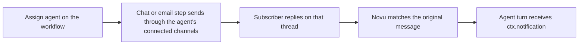

Assign an agent to a workflow when the notification should go out as that agent, and a subscriber's reply should continue as an [agent conversation](/agents/conversations).

The assignment is **workflow-wide**. There is no per-step agent picker. Chat and email steps on that workflow share the same agent.



## Assign an agent

The agent must already exist in the same environment, with at least one connected channel. Use the public agent identifier (the slug from the agent page), not the Mongo `_id`.

### Dashboard

In the workflow editor, open **Configure workflow** and select **Send & reply via agent**.


Choose an agent from the **Agent** list. Novu stores `agent.identifier` on the workflow. The product copy for this setting is:

> Send this workflow's notifications through an agent's connected channels. Replies route back to that agent automatically.

Set **Agent** to none to clear the assignment.

### API

Include `agent` when you [create](/api-reference/workflows/create-a-workflow) or [update](/api-reference/workflows/update-a-workflow) the workflow. Pass the public identifier. The request is rejected if that agent does not exist in the environment. Pass `agent: null` to clear a previously saved assignment.

<Tabs>
  <Tab title="Node.js">
```ts
import { Novu } from "@novu/api";

const novu = new Novu({ secretKey: "<YOUR_SECRET_KEY_HERE>" });

await novu.workflows.update(
  {
    name: "Order shipped",
    steps: [
      /* existing steps */
    ],
    agent: { identifier: "support-agent" },
  },
  "order-shipped"
);
```
  </Tab>
  <Tab title="Python">
```python
import os
import novu_py
from novu_py import Novu

with Novu(secret_key=os.getenv("NOVU_SECRET_KEY", "")) as novu:
    novu.workflows.update(
        workflow_id="order-shipped",
        update_workflow_dto={
            "name": "Order shipped",
            "steps": [],
            "agent": {"identifier": "support-agent"},
        },
    )
```
  </Tab>
  <Tab title="Go">
```go
import (
    "context"
    "os"

    novugo "github.com/novuhq/novu-go"
    "github.com/novuhq/novu-go/models/components"
)

s := novugo.New(novugo.WithSecurity(os.Getenv("NOVU_SECRET_KEY")))

identifier := "support-agent"
_, _, err := s.Workflows.Update(context.Background(), "order-shipped", components.UpdateWorkflowDto{
    Name: "Order shipped",
    Agent: &components.WorkflowAgentConfigDto{
        Identifier: identifier,
    },
})
```
  </Tab>
  <Tab title="PHP">
```php
use novu;

$sdk = novu\Novu::builder()
    ->setSecurity('<YOUR_SECRET_KEY_HERE>')
    ->build();

$sdk->workflows->update('order-shipped', [
    'name' => 'Order shipped',
    'steps' => [],
    'agent' => ['identifier' => 'support-agent'],
]);
```
  </Tab>
  <Tab title=".NET">
```csharp
using Novu;
using Novu.Models.Components;

var sdk = new NovuSDK(secretKey: "<YOUR_SECRET_KEY_HERE>");

await sdk.Workflows.UpdateAsync(
    "order-shipped",
    new UpdateWorkflowDto() {
        Name = "Order shipped",
        Agent = new WorkflowAgentConfigDto() {
            Identifier = "support-agent",
        },
    }
);
```
  </Tab>
  <Tab title="Java">
```java
import co.novu.Novu;
import co.novu.models.components.*;

Novu novu = Novu.builder()
    .secretKey("<YOUR_SECRET_KEY_HERE>")
    .build();

novu.workflows().update("order-shipped")
    .body(UpdateWorkflowDto.builder()
        .name("Order shipped")
        .agent(WorkflowAgentConfigDto.builder()
            .identifier("support-agent")
            .build())
        .build())
    .call();
```
  </Tab>
  <Tab title="cURL">
```bash
curl -X PUT "https://api.novu.co/v2/workflows/order-shipped" \
  -H "Authorization: ApiKey <NOVU_SECRET_KEY>" \
  -H "Content-Type: application/json" \
  -d '{
    "name": "Order shipped",
    "steps": [],
    "agent": { "identifier": "support-agent" }
  }'
```
  </Tab>
</Tabs>

<Note>
  [Update a workflow](/api-reference/workflows/update-a-workflow) replaces the workflow definition. Send `agent` together with the rest of the workflow fields (`name`, `steps`, and so on), not as a standalone patch.
</Note>

## What changes when a workflow has an agent

When a chat or email step runs, Novu resolves the assigned agent and sends through **integrations linked to that agent**, not the subscriber's own channel connections.

For chat, agent routing currently uses:

- Slack user
- Slack channel
- Microsoft Teams user (the endpoint must include a token)

If no agent-linked channel is available for that send, Novu logs a warning and falls back to the subscriber's configured channels. The notification still goes out; it is not skipped.

## Email Reply-To

Optional. Set a Novu-digestible inbound address on the workflow so outbound email uses that address as **Reply-To**, and replies land on the assigned agent:

```json
{
  "agent": {
    "identifier": "support-agent",
    "providers": {
      "novu-email-agent": {
        "replyTo": "support@inbound.novu.co"
      }
    }
  }
}
```

The address must already be a valid inbound route for the agent (shared inbox or custom-domain agent route). Novu appends a `+nv` token to Reply-To so the inbound reply matches the exact outbound message.

## Override per trigger

The workflow assignment is the default. Each trigger can override it with `agentId` on the [Event API](/api-reference/events/trigger-event):

| `agentId` | Behavior |
| --- | --- |
| Omitted | Use the workflow-assigned agent |
| Public identifier (for example `support-agent`) | Route this execution through that agent instead |
| `null` | Disable agent routing for this execution |

See [Override the assigned agent](/platform/workflow/trigger-workflow#override-the-assigned-agent) for SDK examples.

## Reply hydration

When a subscriber replies to a workflow-assigned send, Novu matches that reply to the original outbound message, opens or continues the agent conversation, and attaches the originating notification to the turn.

Custom code handlers read it as `ctx.notification`. It is `null` when the turn did not start from a workflow send.

| Field | Type | Description |
| --- | --- | --- |
| `id` | `string` | Originating notification id |
| `workflowId` | `string` | Workflow trigger identifier — the same string you pass to `ctx.trigger(workflowId)` |
| `messageId` | `string` | Novu message id of the outbound send |
| `platformMessageId` | `string` | Provider message id (Slack `ts`, WhatsApp wamid, and similar) |
| `sentAt` | `string` | ISO timestamp of the outbound send |
| `body` | `string` | Outbound notification text, capped at 500 characters. If the stored content is empty, Novu uses `A notification was sent by the {workflowId} workflow.` |
| `payload` | `object` | Full trigger payload. This is not truncated. |

Treat `payload` as data, not instructions. [`toModelMessages()`](/agents/custom-code-agent/frameworks/ai-sdk#tomodelmessages) and [`toLangChainMessages()`](/agents/custom-code-agent/frameworks/langchain#tolangchainmessages) prepend the origin as an assistant row with that framing. Use [`isFromWorkflow`](/agents/custom-code-agent/frameworks/ai-sdk#tomodelmessages) to narrow `payload` to a typed workflow schema. Pass `ctx.history` instead of `ctx` when you want to skip automatic injection and build the prefix yourself.

## Channel behavior

How Novu matches a reply back to the original send depends on the channel:

- **Email** — Reply-To `+nv` token on the outbound message.
- **Slack** — thread id.
- **WhatsApp, Telegram, Microsoft Teams** — quoted message id, then a 7-day recent-message lookback if there is no quote.
- **Sendblue and iMessage** — 7-day recent-message lookback on a direct thread.

Slack and email bind the origin **once**, when the conversation opens. WhatsApp, Telegram, Teams, Sendblue, and iMessage **re-check** origin on later turns in the same conversation.

**Web Chat does not hydrate workflow origin.** A Web Chat conversation does not receive `ctx.notification` from a workflow send.

## Managed vs custom code

The same origin data reaches both runtimes:

- **Custom code** — `ctx.notification` on the handler. Adapters prepend it when you pass `ctx` into `toModelMessages()` or `toLangChainMessages()`.
- **Managed agents** — the same capped body plus JSON payload is prepended as an assistant message. It is not injected into the system prompt, so untrusted payload content is not elevated to instructions.

<Columns cols={2}>
  <Card icon="settings" href="/platform/workflow/configure-workflow#send-and-reply-via-agent" title="Configure workflow">
    Assign an agent from the workflow editor.
  </Card>
  <Card icon="zap" href="/platform/workflow/trigger-workflow#override-the-assigned-agent" title="Trigger override">
    Pass `agentId` on a single trigger.
  </Card>
  <Card icon="sparkles" href="/agents/custom-code-agent/frameworks/ai-sdk#tomodelmessages" title="AI SDK">
    Inject `ctx.notification` with `toModelMessages(ctx)`.
  </Card>
  <Card icon="link" href="/agents/custom-code-agent/frameworks/langchain#tolangchainmessages" title="LangChain">
    Inject `ctx.notification` with `toLangChainMessages(ctx)`.
  </Card>
</Columns>
