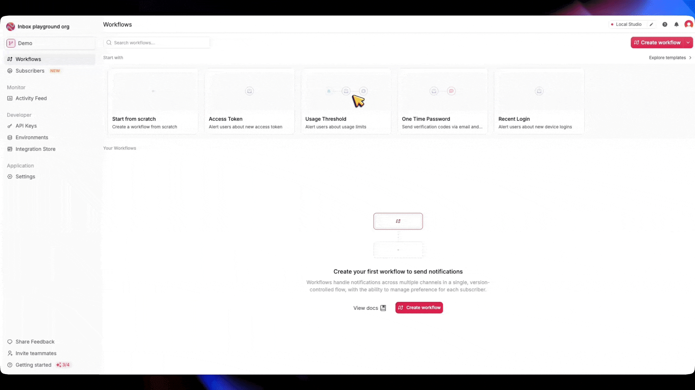

You'll learn how to automatically trigger notification workflows when Clerk events occur, such as user creation, email events, or password changes.

## Overview

When specific events happen in Clerk (for example, user signup, password changes, or email verification), this integration will:

1. Receive the webhook event from Clerk.
2. Verify the webhook signature.
3. Process the event data.
4. Trigger the corresponding **Novu notification workflow**.

<Note>
  You can also clone this repository: https://github.com/novuhq/clerk-to-novu-webhooks
</Note>

## Prerequisites

Before proceeding, ensure you have:

- A **Clerk + Next.js app** ([Set up Clerk](https://clerk.com/docs/quickstarts/nextjs)).
- A **Novu account** ([Sign up here](https://novu.com/signup)).

<Steps>
<Step>

## Install Dependencies

Run the following command to install the required packages:

```
npm install @novu/api @clerk/nextjs
```

</Step>

<Step>

## Configure Environment Variables

Add the following variables to your `.env.local` file:

```
NEXT_PUBLIC_CLERK_PUBLISHABLE_KEY=pk_test_...
CLERK_SECRET_KEY=sk_test_...
CLERK_WEBHOOK_SIGNING_SECRET=whsec_...
NOVU_SECRET_KEY=novu_secret_...
```

</Step>

<Step>

## Expose Your Local Server

To test webhooks locally, you need to expose your **local server** to the internet.

There are two common options:

<Tabs>
<Tab title="localtunnel">

**localtunnel** is a simple and free way to expose your local server without requiring an account.

1. Start a localtunnel listener

   ```bash
   npx localtunnel 3000
   ```

2. Copy and save the generated **public URL** (for example, `https://your-localtunnel-url.loca.lt`).

Learn more about **localtunnel** [here](https://www.npmjs.com/package/localtunnel).

<Note>
  **localtunnel** links may expire quickly and sometimes face reliability issues.
</Note>

</Tab>
<Tab title="ngrok">

For a more stable and configurable tunnel, use **ngrok**:

1. Create an account at [ngrok dashboard](https://dashboard.ngrok.com/).
2. Follow the [setup guide](https://dashboard.ngrok.com/get-started/setup).
3. Run the command:

   ```bash
   ngrok http 3000
   ```

4. Copy and save the **Forwarding URL** (for example, `https://your-ngrok-url.ngrok.io`).

Learn more about **ngrok** [here](https://dashboard.ngrok.com/get-started/setup).

</Tab>
</Tabs>

</Step>

<Step>

## Set Up Clerk Webhook Endpoint

1. Go to the **Clerk Webhooks** page ([link](https://dashboard.clerk.com/last-active?path=webhooks)).
2. Click **Add Endpoint**.
3. Set the **Endpoint URL** as:

   ```
      https://your-forwarding-URL/api/webhooks/clerk
   ```

4. Subscribe to the **relevant Clerk events** (for example, `user.created`, `email.created`).

<Note>
  You can find the list of all supported Clerk events [here](https://clerk.com/docs/reference/webhooks/events), or continue to [Identify the Triggering Event(s)](#identify-the-triggering-events).
</Note>

5. Click **Create** and keep the settings page open.

</Step>

<Step>

## Add Signing Secret to Environment Variables

1. Copy the **Signing Secret** from Clerk's **Webhook Endpoint Settings**.
2. Add it to your `.env.local` file:

```
CLERK_WEBHOOK_SIGNING_SECRET=your_signing_secret_here
```

</Step>

<Step>

## Make the webhook route public

Incoming Clerk webhooks are not signed-in sessions. If you protect routes with Clerk middleware, exclude the webhook path:

```tsx
import { clerkMiddleware, createRouteMatcher } from '@clerk/nextjs/server';

const isPublicRoute = createRouteMatcher(['/api/webhooks(.*)']);

export default clerkMiddleware(async (auth, req) => {
  if (!isPublicRoute(req)) {
    await auth.protect();
  }
});
```

By default, `clerkMiddleware()` does not protect any routes. This step only matters if you have already added auth checks that would block `/api/webhooks`.

</Step>

<Step>

## Create Webhook Endpoint for Clerk in Next.js

Create `app/api/webhooks/clerk/route.ts`:

<Tree>
  <Tree.Folder name="app" defaultOpen>
    <Tree.Folder name="api">
      <Tree.Folder name="webhooks">
        <Tree.Folder name="clerk">
          <Tree.File name="route.ts" />
        </Tree.Folder>
      </Tree.Folder>
    </Tree.Folder>
  </Tree.Folder>
</Tree>

The following snippet is the complete webhook route for Clerk in Next.js:

```tsx
import { verifyWebhook } from '@clerk/nextjs/webhooks'
import type { WebhookEvent } from '@clerk/nextjs/server'
import { triggerWorkflow } from '@/app/utils/novu'

// Map Clerk event types (and email.created slugs) to Novu workflow identifiers
const EVENT_TO_WORKFLOW_MAPPINGS = {
  'session.created': 'session-created',
  'user.created': 'user-created',
  'email.created': {
    magic_link_sign_in: 'auth-magic-link-login',
    magic_link_sign_up: 'auth-magic-link-registration',
    magic_link_user_profile: 'profile-magic-link-update',
    organization_invitation: 'organization-invitation',
    organization_invitation_accepted: 'org-member-joined',
    passkey_added: 'security-passkey-created',
    passkey_removed: 'security-passkey-deleted',
    password_changed: 'security-password-updated',
    password_removed: 'security-password-deleted',
    primary_email_address_changed: 'profile-email-updated',
    reset_password_code: 'reset-password-code',
    verification_code: 'verification-code',
    waitlist_confirmation: 'waitlist-signup-confirmed',
    waitlist_invitation: 'waitlist-access-granted',
    invitation: 'user-invitation',
  },
} as const

export async function POST(request: Request) {
  try {
    // verifyWebhook reads CLERK_WEBHOOK_SIGNING_SECRET and validates the raw body
    const event = await verifyWebhook(request)
    await handleWebhookEvent(event as WebhookEvent)

    return new Response('Webhook received', { status: 200 })
  } catch (error) {
    console.error('Webhook processing error:', error)
    return new Response(
      `Error: ${error instanceof Error ? error.message : 'Unknown error'}`,
      { status: 400 }
    )
  }
}

async function handleWebhookEvent(event: WebhookEvent) {
  const workflow = workflowBuilder(event)
  if (!workflow) {
    console.log(`Unsupported event type: ${event.type}`)
    return
  }

  const subscriber = subscriberBuilder(event)
  const payload = payloadBuilder(event)

  await triggerWorkflow(workflow, subscriber, payload)
}

function workflowBuilder(event: WebhookEvent): string | undefined {
  if (!(event.type in EVENT_TO_WORKFLOW_MAPPINGS)) {
    return undefined
  }

  if (event.type === 'email.created') {
    if (!('slug' in event.data) || !event.data.slug) {
      return undefined
    }

    const emailMappings = EVENT_TO_WORKFLOW_MAPPINGS['email.created']
    const emailSlug = event.data.slug as keyof typeof emailMappings

    return emailMappings[emailSlug]
  }

  return EVENT_TO_WORKFLOW_MAPPINGS[event.type as keyof typeof EVENT_TO_WORKFLOW_MAPPINGS] as string
}

function subscriberBuilder(event: WebhookEvent) {
  const data = event.data as Record<string, any>
  const subscriberId = data.user_id ?? data.id

  if (!subscriberId) {
    throw new Error('Missing subscriber ID from webhook data')
  }

  return {
    subscriberId,
    firstName: data.first_name ?? undefined,
    lastName: data.last_name ?? undefined,
    email:
      data.email_addresses?.[0]?.email_address ??
      data.to_email_address ??
      undefined,
    phone: data.phone_numbers?.[0]?.phone_number ?? undefined,
    avatar: data.image_url ?? undefined,
    data: {
      clerkUserId: subscriberId,
      username: data.username ?? '',
    },
  }
}

function payloadBuilder(event: WebhookEvent) {
  return event.data
}
```

<AccordionGroup>
<Accordion title="How the handler works">

- **`verifyWebhook`**: Clerk's helper validates the Svix signature using `CLERK_WEBHOOK_SIGNING_SECRET`. Pass the `Request` directly so the raw body is preserved. Do not call `request.json()` before verification.
- **`EVENT_TO_WORKFLOW_MAPPINGS`**: Maps Clerk event types to Novu workflow identifiers. For `email.created`, the nested map uses the email `slug` (for example, `password_changed`).
- **`subscriberBuilder`**: Builds the Novu `to` object. Prefer `user_id` when present (session and email events); fall back to `id` for `user.created`.
- **`triggerWorkflow`**: Calls your Novu helper with the workflow ID, subscriber, and event payload.

Update the mapping values to match the workflow identifiers you create in the Novu dashboard.

</Accordion>
</AccordionGroup>

</Step>

<Step>

## Add Novu Workflow Notification Trigger Function

Create `app/utils/novu.ts` :

<Tree>
  <Tree.Folder name="app" defaultOpen>
    <Tree.Folder name="utils">
      <Tree.File name="novu.ts" />
    </Tree.Folder>
    <Tree.Folder name="api">
      <Tree.Folder name="webhooks">
        <Tree.Folder name="clerk">
          <Tree.File name="route.ts" />
        </Tree.Folder>
      </Tree.Folder>
    </Tree.Folder>
  </Tree.Folder>
</Tree>

```typescript
import { Novu } from '@novu/api';

const novu = new Novu({
  secretKey: process.env.NOVU_SECRET_KEY!,
});

export async function triggerWorkflow(
  workflowId: string,
  subscriber: Record<string, unknown>,
  payload: Record<string, unknown>
) {
  await novu.trigger({ workflowId, to: subscriber, payload });
}
```

This helper is for the Next.js route above. For other languages, see the [server SDKs](/platform/sdks#server-side-sdks).

</Step>

<Step>

## Add or create Novu workflows in your Novu dashboard

In Novu, a Clerk webhook event can trigger one or more workflows, depending on how you want to handle those events.

A workflow defines a sequence of actions (for example, sending notifications) that run when triggered by a webhook.

The Novu dashboard lets you create a custom workflow from scratch or start from a template.

**Steps to Create a Workflow**

Follow these steps to set up your workflow(s) in the Novu dashboard:

### Identify the Triggering Event(s)

   Determine which Clerk webhook events will activate your workflow (for example, `user.created` or `email.created`).
   Create Novu workflow identifiers that match the values in `EVENT_TO_WORKFLOW_MAPPINGS`.

<AccordionGroup>
  <Accordion title="Supported webhook events">

  To find a list of all the events Clerk supports:
  1. In the Clerk Dashboard, navigate to the Webhooks page.
  2. Select the Event Catalog tab.

  </Accordion>

  <Accordion title="Payload structure">

  Clerk events are JSON objects with `type`, `data`, `timestamp`, and `instance_id`. For `user.*` events, `data` is a [User object](https://clerk.com/docs/references/javascript/user). Your handler maps `data.id` (or `data.user_id` when present) to Novu's `subscriberId`.

  Shortened `user.created` example:

  ```json
  {
    "type": "user.created",
    "object": "event",
    "data": {
      "id": "user_29w83sxmDNGwOuEthce5gg56FcC",
      "first_name": "Example",
      "last_name": "Example",
      "email_addresses": [
        {
          "email_address": "example@example.org",
          "id": "idn_29w83yL7CwVlJXylYLxcslromF1"
        }
      ],
      "image_url": "https://img.clerk.com/xxxxxx"
    }
  }
  ```

  </Accordion>

</AccordionGroup>

### Choose Your Starting Point

<Tabs>
<Tab title="Use a Workflow Template">
   
   Browse the workflow template store in the Novu dashboard. If a template matches your use case (for example, user onboarding), select it and customize it.

   
 

</Tab>
<Tab title="Create a Blank Workflow">

   If no template fits or you need full control, start with a blank workflow and define every step yourself.

   
</Tab>
<Tab title="Code-First Workflow (Novu Framework)">

   If you prefer a more code-based approach, you can create a workflow using the Novu Framework.
   
   <Card title="Novu Framework" icon="square-code" href="/framework">
   <p>
      The Novu framework allows you to build and manage advanced notification workflows with code, and expose no-code controls for non-technical users to modify.
   </p>
   </Card>

</Tab>
</Tabs>
   

### Configure the Workflow  

   - For a template, tweak the existing steps to align with your requirements.  

   - For a blank workflow, add actions like sending emails, sending in-app notifications, Push notifications, or other actions.

   - For a code-first workflow, you can use the Novu Framework to build your workflow right within your code base.

### Set Trigger Conditions

   - Link the workflow to the correct webhook event(s). 

   - Ensure the Novu workflow identifier matches the value in `EVENT_TO_WORKFLOW_MAPPINGS` for that Clerk event.

<Tip>
  - **Start Simple:** Use templates for common tasks and switch to blank workflows for unique needs.  

  - **Test Thoroughly:** Simulate webhook events to ensure your workflows behave as expected.  

  - **Plan for Growth:** Organize workflows logically (separate or combined) to make future updates easier.
</Tip>

</Step>

<Step>

## Disable Email **Delivered by Clerk**

By default, Clerk sends email notifications whenever necessary, such as Magic Links for email verification, Invitations, Password Resets, and more.

To prevent users from receiving duplicate emails, we need to disable email delivery by Clerk for the notifications handled by Novu.

1. Navigate to the **Emails** section in the Clerk Dashboard.

   

2. Select any **email.created** event that you want Novu to handle.
3. Toggle **off** email delivery for the selected event.

   

This keeps Clerk from sending the same email that Novu already handles.

</Step>

<Step>

## Test the Webhook

1. Start your Next.js server.
2. Go to **Clerk Webhooks → Testing**.
3. Select an event (for example, `user.created` or `email.created`).
4. Click **Send Example**.
5. Verify logs in **your terminal**.

</Step>
</Steps>
