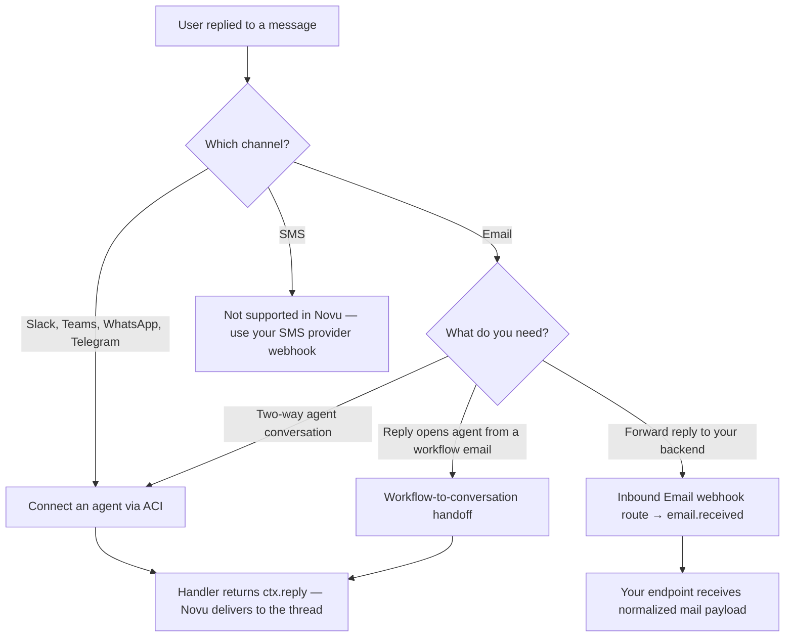

Novu supports **inbound replies** on several channels. How you handle a reply depends on the channel and your use case: conversational agents, inbound email webhooks, or workflow handoff to an agent.

<Note>
  **SMS replies are not supported.** The SMS channel in Novu is outbound-only. To process inbound SMS, configure webhooks directly with your SMS provider (for example, Twilio) outside of Novu.
</Note>

## Channel reply support

| Channel | Inbound replies in Novu? | How to handle |
| --- | --- | --- |
| **Email** | Yes | [Agent email](/agents/get-started/agents-and-providers#supported-providers), [Inbound Email](/platform/inbound-email/overview) (webhook or agent routes), or workflow-to-agent handoff |
| **Slack** | Yes | Connect Slack to an [agent](/agents/get-started/agents-and-providers) |
| **Microsoft Teams** | Yes | Connect Teams to an [agent](/agents/get-started/agents-and-providers) |
| **WhatsApp** | Yes | Connect WhatsApp to an [agent](/agents/get-started/agents-and-providers) |
| **Telegram** | Yes | Connect Telegram to an [agent](/agents/get-started/agents-and-providers) |
| **SMS** | No | Outbound workflow notifications only |
| **Push / In-App** | No | One-way delivery; use In-App actions or deep links for follow-up |

## Choose an approach

### Agent conversations (ACI)

Use [Agent Communication Infrastructure (ACI)](/agents/get-started/what-is-aci) when users should have a **two-way conversation** with your agent on Slack, Microsoft Teams, WhatsApp, Telegram, or email.

- Novu receives the inbound message, normalizes it, and calls your agent handler.
- Your handler returns a reply with `ctx.reply()` (or a string/card return value).
- Novu delivers the reply back to the same thread or inbox.

See [Agents and providers](/agents/get-started/agents-and-providers) and [Mental model](/agents/get-started/mental-model).

### Inbound Email (webhook route)

Use [Inbound Email](/platform/inbound-email/overview) when you want Novu to **receive mail on your domain** and forward it to **your own HTTP endpoint**.

- Verify a domain and add an MX record in the Novu dashboard.
- Create a **Webhook** route for the local-part you want to receive (or a catch-all `*` route).
- Novu fires an [`email.received`](/platform/developer/webhooks/event-types#email-events) event to your configured webhook endpoints.

This is separate from [Email Activity Tracking](/platform/integrations/email/activity-tracking), which tracks delivery and engagement events from your **outbound** email provider — not user replies.

### Workflow to agent conversation

Workflows can send messages on behalf of an agent. When a user **replies to that email or chat message**, Novu can open a new agent conversation and continue in context.

See [Conversations and workflows](/agents/custom-code-agent/concepts#conversations-and-workflows) and [What is Novu? — Workflow to conversation](/platform/what-is-novu#workflow-to-conversation).

## Sending vs receiving email

Novu email integrations (SendGrid, SES, Resend, and others) handle **outbound** delivery. The `replyTo` override on a trigger sets where replies are addressed — it does not by itself process inbound mail.

To **receive and act on replies**, use one of the inbound paths above (agent email, Inbound Email routes, or workflow-to-agent handoff).

## Related

<Columns cols={2}>
  <Card icon="mail" href="/platform/inbound-email/overview" title="Inbound Email">
    Verify domains, add routes, and receive mail on your own addresses.
  </Card>
  <Card icon="bot" href="/agents" title="Agents">
    Connect agents to Slack, Teams, WhatsApp, Telegram, and email.
  </Card>
  <Card icon="webhook" href="/platform/developer/webhooks/event-types#email-events" title="email.received webhook">
    Event type and payload for inbound email webhook routes.
  </Card>
  <Card icon="activity" href="/platform/integrations/email/activity-tracking" title="Email Activity Tracking">
    Track delivered, opened, and clicked events from outbound providers — not user replies.
  </Card>
</Columns>
