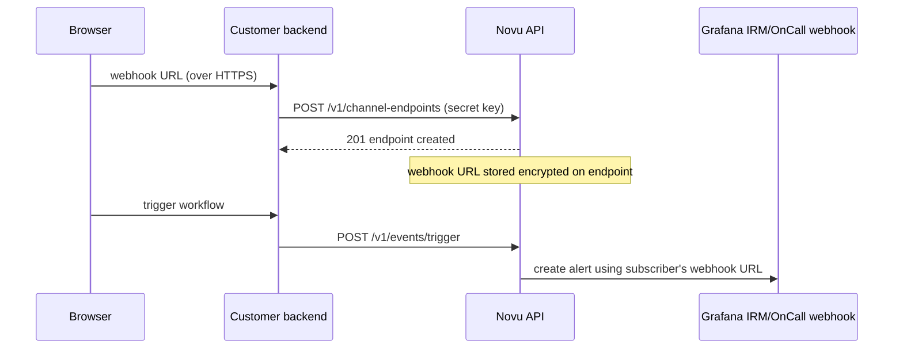

Grafana in Novu is routed **per subscriber**. Each subscriber brings their own Grafana IRM/OnCall incoming-webhook (Formatted Webhook) URL, so one workflow trigger can create alert groups on different Grafana stacks and escalation chains for different recipients. The integration itself never stores a webhook URL. It acts as the anchor that per-subscriber [channel endpoints](/api-reference/channel-endpoints/create-a-channel-endpoint) hang off of.

<Note>
  There is no shared, environment-level Grafana webhook URL. If a subscriber has no Grafana endpoint registered, the Tool step is marked **skipped** for that subscriber; no alert is created and no error is raised.
</Note>

## Prerequisites

- A [Grafana Cloud](https://grafana.com/products/cloud/) stack with IRM/OnCall (or a self-hosted Grafana OnCall install) and permission to add integrations
- Access to the [Novu dashboard](https://dashboard.novu.co)

## Get a Formatted Webhook URL

Every subscriber routes to their own Grafana OnCall integration, so each subscriber needs a webhook URL from **their** stack.

<Steps>
  <Step title="Open Integrations in Grafana IRM">
    In Grafana IRM (or OnCall), go to the **Integrations** tab and click **New integration**.
  </Step>

  <Step title="Create a Formatted Webhook integration">
    Under **Monitoring systems**, choose **Formatted Webhook**, give it a name and team, and create it.
  </Step>

  <Step title="Copy the webhook URL">
    Grafana generates a unique webhook URL such as `https://<stack>.grafana.net/integrations/v1/formatted_webhook/<token>/`. Copy it. This is the URL Novu will store for the subscriber.
  </Step>
</Steps>

<Warning>
  The webhook URL embeds a routing token that grants the ability to create alerts on the integration. Treat it like a password: keep it on your server, never embed it in client-side code, and never log it.
</Warning>

If the integration is configured to **require a Grafana service account bearer token**, mint a token for a service account with alert-ingestion permission and store it alongside the URL as `authToken` (see below).

## Add Grafana in Novu

<Steps>
  <Step title="Open the Integrations Store">
    In the Novu dashboard, click **Integrations Store** in the sidebar.
  </Step>

  <Step title="Add Grafana">
    Click **Connect Provider**, select **Tool**, then choose **Grafana**.
  </Step>

  <Step title="Create the integration">
    Grafana has no environment-level credentials, so there is nothing to paste on this screen. Click **Create Integration** to save it. This gives you the `integrationIdentifier` you'll reference below when registering subscribers' webhook URLs.
  </Step>
</Steps>

## Store a subscriber's webhook URL

Register each subscriber's webhook URL as a **channel endpoint** on the Grafana integration. Novu encrypts the URL (and the optional `authToken`) at rest on `ChannelEndpoint.endpoint` and returns the wire shape `{ url, authToken? }` on reads.

<Warning>
  Registering an endpoint requires your Novu secret key. Always call the channel-endpoints API from your server, never from a browser or mobile client. A typical flow is: your app UI sends the webhook URL to **your** backend, and your backend forwards it to Novu.
</Warning>



### Create the endpoint

Send the webhook URL as a `grafana_oncall_integration` endpoint. Set `createSubscriberIfMissing: true` so this call also provisions the Novu subscriber the first time an end user connects Grafana, with no separate identify call required.

<Tabs>
  <Tab title="Node.js">
```typescript
import { Novu } from '@novu/api';

const novu = new Novu({ secretKey: '<NOVU_SECRET_KEY>' });

await novu.channelEndpoints.create({
  type: 'grafana_oncall_integration',
  integrationIdentifier: 'grafana',
  subscriberId: '<SUBSCRIBER_ID>',
  createSubscriberIfMissing: true,
  endpoint: {
    url: '<GRAFANA_WEBHOOK_URL>',
  },
});
```
  </Tab>
  <Tab title="Python">
```python
import os
from novu_py import Novu

with Novu(secret_key=os.getenv("NOVU_SECRET_KEY", "")) as novu:
    novu.channel_endpoints.create(create_channel_endpoint_request_body={
        "type": "grafana_oncall_integration",
        "integration_identifier": "grafana",
        "subscriber_id": "<SUBSCRIBER_ID>",
        "create_subscriber_if_missing": True,
        "endpoint": {
            "url": "<GRAFANA_WEBHOOK_URL>",
        },
    })
```
  </Tab>
  <Tab title="Go">
```go
import (
    "context"
    "os"

    novugo "github.com/novuhq/novu-go"
    "github.com/novuhq/novu-go/models/components"
)

s := novugo.New(novugo.WithSecurity(os.Getenv("NOVU_SECRET_KEY")))

_, err := s.ChannelEndpoints.Create(context.Background(), components.CreateGrafanaOnCallIntegrationEndpointDto{
    Type:                      "grafana_oncall_integration",
    IntegrationIdentifier:     "grafana",
    SubscriberID:              "<SUBSCRIBER_ID>",
    CreateSubscriberIfMissing: novugo.Bool(true),
    Endpoint: components.GrafanaOnCallIntegrationEndpointDto{
        URL: "<GRAFANA_WEBHOOK_URL>",
    },
}, nil)
```
  </Tab>
  <Tab title="PHP">
```php
use novu;
use novu\Models\Components;

$sdk = novu\Novu::builder()->setSecurity('<NOVU_SECRET_KEY>')->build();

$sdk->channelEndpoints->create(
    createChannelEndpointRequestBody: new Components\CreateGrafanaOnCallIntegrationEndpointDto(
        type: 'grafana_oncall_integration',
        integrationIdentifier: 'grafana',
        subscriberId: '<SUBSCRIBER_ID>',
        createSubscriberIfMissing: true,
        endpoint: new Components\GrafanaOnCallIntegrationEndpointDto(
            url: '<GRAFANA_WEBHOOK_URL>',
        ),
    ),
);
```
  </Tab>
  <Tab title=".NET">
```csharp
using Novu;
using Novu.Models.Components;

var sdk = new NovuSDK(secretKey: "<NOVU_SECRET_KEY>");

await sdk.ChannelEndpoints.CreateAsync(
    createChannelEndpointRequestBody: new CreateGrafanaOnCallIntegrationEndpointDto()
    {
        Type = "grafana_oncall_integration",
        IntegrationIdentifier = "grafana",
        SubscriberId = "<SUBSCRIBER_ID>",
        CreateSubscriberIfMissing = true,
        Endpoint = new GrafanaOnCallIntegrationEndpointDto()
        {
            Url = "<GRAFANA_WEBHOOK_URL>",
        },
    });
```
  </Tab>
  <Tab title="Java">
```java
import co.novu.Novu;
import co.novu.models.components.*;

Novu novu = Novu.builder().secretKey("<NOVU_SECRET_KEY>").build();

novu.channelEndpoints().create()
    .body(CreateGrafanaOnCallIntegrationEndpointDto.builder()
        .type("grafana_oncall_integration")
        .integrationIdentifier("grafana")
        .subscriberId("<SUBSCRIBER_ID>")
        .createSubscriberIfMissing(true)
        .endpoint(GrafanaOnCallIntegrationEndpointDto.builder()
            .url("<GRAFANA_WEBHOOK_URL>")
            .build())
        .build())
    .call();
```
  </Tab>
  <Tab title="cURL">
```bash
curl -L -X POST 'https://api.novu.co/v1/channel-endpoints' \
-H 'Content-Type: application/json' \
-H 'Authorization: ApiKey <NOVU_SECRET_KEY>' \
-d '{
  "type": "grafana_oncall_integration",
  "integrationIdentifier": "grafana",
  "subscriberId": "<SUBSCRIBER_ID>",
  "createSubscriberIfMissing": true,
  "endpoint": {
    "url": "<GRAFANA_WEBHOOK_URL>"
  }
}'
```
  </Tab>
</Tabs>

### Endpoint shape

| Field | Type | Description |
| --- | --- | --- |
| `type` | `"grafana_oncall_integration"` | Discriminator for the endpoint variant. |
| `integrationIdentifier` | `string` | Identifier of the Grafana integration created in the Integrations Store. |
| `subscriberId` | `string` | The subscriber to alert when a workflow selects this endpoint. |
| `createSubscriberIfMissing` | `boolean` | Optional. When `true`, Novu creates the subscriber on the fly if it does not exist yet. Existing subscribers are never modified. Defaults to `false`. |
| `endpoint.url` | `string` | The HTTPS Formatted Webhook URL from Grafana, ending in `/integrations/v1/formatted_webhook/<token>/`. Stored encrypted. |
| `endpoint.authToken` | `string` | Optional. A Grafana service account bearer token, required when the integration enforces authenticated ingestion. Stored encrypted and sent as `Authorization: Bearer <token>`. |

### One endpoint per subscriber, per integration

A subscriber may have at most one Grafana endpoint per integration. A second `POST` with the same `(subscriberId, integrationIdentifier)` returns **`409 Conflict`**. Rotate the webhook URL (or bearer token) by `PATCH`ing the existing endpoint instead:

```bash
curl -L -X PATCH 'https://api.novu.co/v1/channel-endpoints/<ENDPOINT_IDENTIFIER>' \
-H 'Content-Type: application/json' \
-H 'Authorization: ApiKey <NOVU_SECRET_KEY>' \
-d '{
  "endpoint": {
    "url": "<NEW_GRAFANA_WEBHOOK_URL>"
  }
}'
```

### Reading and disconnecting

Reads return the full wire shape (including the webhook URL), so you can display connection status. Mask it in your UI (the Novu dashboard shows only the last four characters).

```bash
curl -L 'https://api.novu.co/v1/channel-endpoints?subscriberId=<SUBSCRIBER_ID>&integrationIdentifier=grafana' \
-H 'Authorization: ApiKey <NOVU_SECRET_KEY>'
```

Delete the endpoint to disconnect a subscriber. This removes the encrypted webhook URL stored on the endpoint:

```bash
curl -L -X DELETE 'https://api.novu.co/v1/channel-endpoints/<ENDPOINT_IDENTIFIER>' \
-H 'Authorization: ApiKey <NOVU_SECRET_KEY>'
```

## Alert a subscriber from a workflow

Once a subscriber has a Grafana endpoint, add a **Tool** step with Grafana to your workflow and trigger it like any other workflow.

<Steps>
  <Step title="Add a Tool step">
    In the workflow editor, add a step and select **Tool** as the channel. Choose the Grafana integration you created.
  </Step>

  <Step title="Write the alert message">
    The step content becomes the alert `message` (and default `title`) in the Formatted Webhook request. Use dynamic placeholders such as `{{payload.orderNumber}}` or `{{subscriber.firstName}}`.
  </Step>

  <Step title="Trigger the workflow">
    Send a trigger for a subscriber who has connected Grafana. Novu resolves that subscriber's webhook URL and creates an alert group on their Grafana stack.
  </Step>
</Steps>

<Tabs>
  <Tab title="Node.js">
```typescript
import { Novu } from '@novu/api';

const novu = new Novu({ secretKey: '<NOVU_SECRET_KEY>' });

await novu.trigger({
  workflowId: 'order-failed',
  to: { subscriberId: '<SUBSCRIBER_ID>' },
  payload: {
    orderNumber: 'ORD-12345',
    reason: 'payment_declined',
  },
});
```
  </Tab>
  <Tab title="Python">
```python
import os
import novu_py
from novu_py import Novu

with Novu(secret_key=os.getenv("NOVU_SECRET_KEY", "")) as novu:
    novu.trigger(trigger_event_request_dto=novu_py.TriggerEventRequestDto(
        workflow_id="order-failed",
        to={"subscriber_id": "<SUBSCRIBER_ID>"},
        payload={
            "orderNumber": "ORD-12345",
            "reason": "payment_declined",
        },
    ))
```
  </Tab>
  <Tab title="Go">
```go
import (
    "context"
    "os"

    novugo "github.com/novuhq/novu-go"
    "github.com/novuhq/novu-go/models/components"
)

s := novugo.New(novugo.WithSecurity(os.Getenv("NOVU_SECRET_KEY")))

_, err := s.Trigger(context.Background(), components.TriggerEventRequestDto{
    WorkflowID: "order-failed",
    To: components.CreateToSubscriberPayloadDto(components.SubscriberPayloadDto{
        SubscriberID: "<SUBSCRIBER_ID>",
    }),
    Payload: map[string]any{
        "orderNumber": "ORD-12345",
        "reason":      "payment_declined",
    },
}, nil)
```
  </Tab>
  <Tab title="PHP">
```php
use novu;
use novu\Models\Components;

$sdk = novu\Novu::builder()->setSecurity('<NOVU_SECRET_KEY>')->build();

$sdk->trigger(
    triggerEventRequestDto: new Components\TriggerEventRequestDto(
        workflowId: 'order-failed',
        to: new Components\SubscriberPayloadDto(subscriberId: '<SUBSCRIBER_ID>'),
        payload: [
            'orderNumber' => 'ORD-12345',
            'reason' => 'payment_declined',
        ],
    ),
);
```
  </Tab>
  <Tab title=".NET">
```csharp
using Novu;
using Novu.Models.Components;

var sdk = new NovuSDK(secretKey: "<NOVU_SECRET_KEY>");

await sdk.TriggerAsync(triggerEventRequestDto: new TriggerEventRequestDto()
{
    WorkflowId = "order-failed",
    To = To.CreateSubscriberPayloadDto(new SubscriberPayloadDto() { SubscriberId = "<SUBSCRIBER_ID>" }),
    Payload = new Dictionary<string, object>
    {
        ["orderNumber"] = "ORD-12345",
        ["reason"] = "payment_declined",
    },
});
```
  </Tab>
  <Tab title="Java">
```java
import co.novu.Novu;
import co.novu.models.components.*;

Novu novu = Novu.builder().secretKey("<NOVU_SECRET_KEY>").build();

novu.trigger()
    .body(TriggerEventRequestDto.builder()
        .workflowId("order-failed")
        .to(To2.of(SubscriberPayloadDto.builder().subscriberId("<SUBSCRIBER_ID>").build()))
        .payload(Map.of(
            "orderNumber", "ORD-12345",
            "reason", "payment_declined"
        ))
        .build())
    .call();
```
  </Tab>
  <Tab title="cURL">
```bash
curl --location 'https://api.novu.co/v1/events/trigger' \
--header 'Content-Type: application/json' \
--header 'Authorization: ApiKey <NOVU_SECRET_KEY>' \
-d '{
    "name": "order-failed",
    "to": ["<SUBSCRIBER_ID>"],
    "payload": {
        "orderNumber": "ORD-12345",
        "reason": "payment_declined"
    }
}'
```
  </Tab>
</Tabs>

### Alert payload defaults and overrides

| Field | Default | Override with |
| --- | --- | --- |
| `message` | Step content | Step content or a `message` override on the step. |
| `title` | Step content (truncated to 1024 characters) | `title` step override. |
| `state` | `alerting` | `state` step override (`alerting`, `ok`). Send `ok` with the same `alert_uid` to auto-resolve. |
| `alert_uid` | Deterministic, derived from the workflow `transactionId`, `subscriberId`, and step ID. | Explicit `alert_uid` step override. |
| `link_to_upstream_details` | Not sent | `link_to_upstream_details` step override. |
| `image_url` | Not sent | `image_url` step override. |
| Extra keys | Passed through top-level in the JSON body, available to Grafana alert templates. | Step overrides. |

The deterministic `alert_uid` means Novu retries for the same step group into the same Grafana alert instead of creating duplicates.

## What happens without an endpoint

If a workflow triggers for a subscriber who has **no** Grafana endpoint on the target integration, Novu marks the step as **skipped** in the Activity feed for that subscriber and does not create an alert. Other subscribers on the same trigger are unaffected. Each is routed to their own Grafana stack.

## Related

<Columns cols={2}>
  <Card icon="plug" href="/api-reference/channel-endpoints/create-a-channel-endpoint" title="Create a channel endpoint">
    API reference for `POST /v1/channel-endpoints`, including the `grafana_oncall_integration` variant.
  </Card>
  <Card icon="pen" href="/api-reference/channel-endpoints/update-a-channel-endpoint" title="Rotate a webhook URL">
    API reference for `PATCH /v1/channel-endpoints/:identifier`. Use this to rotate an existing subscriber's webhook URL or bearer token.
  </Card>
</Columns>
