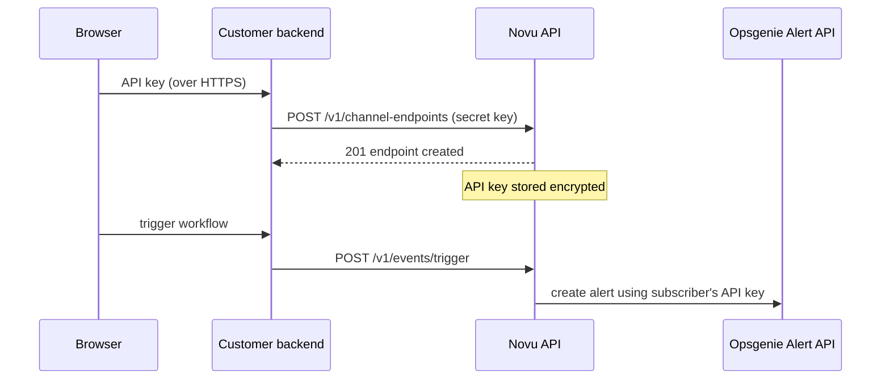

Opsgenie in Novu is routed **per subscriber**. Each subscriber brings their own Opsgenie API integration key (GenieKey), so one workflow trigger can raise alerts in different Opsgenie accounts and teams for different recipients. The integration itself never stores an API key. It acts as the anchor that per-subscriber [channel endpoints](/api-reference/channel-endpoints/create-a-channel-endpoint) hang off of.

<Note>
  There is no shared, environment-level Opsgenie API key. If a subscriber has no Opsgenie endpoint registered, the Tool step is marked **skipped** for that subscriber; no alert is created and no error is raised.
</Note>

## Prerequisites

- An [Opsgenie](https://www.atlassian.com/software/opsgenie) account with permission to manage integrations
- Access to the [Novu dashboard](https://dashboard.novu.co)

## Get an API key from Opsgenie

Every subscriber routes to their own Opsgenie account or team, so each subscriber needs an API key from **their** API integration.

<Steps>
  <Step title="Open integrations in Opsgenie">
    In Opsgenie, go to **Settings** → **Integrations**. To scope alerts to a single team, open the team and go to its **Integrations** tab instead.
  </Step>

  <Step title="Add an API integration">
    Click **Add integration**, choose **API**, and save. Opsgenie creates an API integration with alert create permissions.
  </Step>

  <Step title="Copy the API key">
    Opsgenie generates a UUID-format **API Key** (for example `xxxxxxxx-xxxx-xxxx-xxxx-xxxxxxxxxxxx`). Copy it. This is the GenieKey Novu will store for the subscriber.
  </Step>
</Steps>

<Warning>
  Use a key from an **API integration** (Settings → Integrations, or a team's integrations). Keys from the account-level **API Key Management** page will not work: the Opsgenie Alert API rejects them with an authentication error.
</Warning>

<Warning>
  The API key grants the ability to create alerts in the Opsgenie account. Treat it like a password: keep it on your server, never embed it in client-side code, and never log it.
</Warning>

## Add Opsgenie in Novu

<Steps>
  <Step title="Open the Integrations Store">
    In the Novu dashboard, click **Integrations Store** in the sidebar.
  </Step>

  <Step title="Add Opsgenie">
    Click **Connect Provider**, select **Tool**, then choose **Opsgenie**.
  </Step>

  <Step title="Create the integration">
    Opsgenie has no environment-level credentials, so there is nothing to paste on this screen. Click **Create Integration** to save it. This gives you the `integrationIdentifier` you'll reference below when registering subscribers' API keys.
  </Step>
</Steps>

## Store a subscriber's API key

Register each subscriber's API key as a **channel endpoint** on the Opsgenie integration. Novu encrypts the API key at rest on the linked channel connection and hydrates the wire shape `{ apiKey, region }` back on reads.

<Warning>
  Registering an endpoint requires your Novu secret key. Always call the channel-endpoints API from your server, never from a browser or mobile client. A typical flow is: your app UI sends the API key to **your** backend, and your backend forwards it to Novu.
</Warning>



### Create the endpoint

Send the API key as an `opsgenie_integration` endpoint. Set `createSubscriberIfMissing: true` so this call also provisions the Novu subscriber the first time an end user connects Opsgenie, with no separate identify call required.

<Tabs>
  <Tab title="Node.js">
```typescript
import { Novu } from '@novu/api';

const novu = new Novu({ secretKey: '<NOVU_SECRET_KEY>' });

await novu.channelEndpoints.create({
  type: 'opsgenie_integration',
  integrationIdentifier: 'opsgenie',
  subscriberId: '<SUBSCRIBER_ID>',
  createSubscriberIfMissing: true,
  endpoint: {
    apiKey: '<OPSGENIE_API_KEY>',
    region: 'us',
  },
});
```
  </Tab>
  <Tab title="Python">
```python
import os
from novu_py import Novu

with Novu(secret_key=os.getenv("NOVU_SECRET_KEY", "")) as novu:
    novu.channel_endpoints.create(create_channel_endpoint_request_body={
        "type": "opsgenie_integration",
        "integration_identifier": "opsgenie",
        "subscriber_id": "<SUBSCRIBER_ID>",
        "create_subscriber_if_missing": True,
        "endpoint": {
            "api_key": "<OPSGENIE_API_KEY>",
            "region": "us",
        },
    })
```
  </Tab>
  <Tab title="Go">
```go
import (
    "context"
    "os"

    novugo "github.com/novuhq/novu-go"
    "github.com/novuhq/novu-go/models/components"
)

s := novugo.New(novugo.WithSecurity(os.Getenv("NOVU_SECRET_KEY")))

_, err := s.ChannelEndpoints.Create(context.Background(), components.CreateOpsgenieIntegrationEndpointDto{
    Type:                      "opsgenie_integration",
    IntegrationIdentifier:     "opsgenie",
    SubscriberID:              "<SUBSCRIBER_ID>",
    CreateSubscriberIfMissing: novugo.Bool(true),
    Endpoint: components.OpsgenieIntegrationEndpointDto{
        APIKey: "<OPSGENIE_API_KEY>",
        Region: "us",
    },
}, nil)
```
  </Tab>
  <Tab title="PHP">
```php
use novu;
use novu\Models\Components;

$sdk = novu\Novu::builder()->setSecurity('<NOVU_SECRET_KEY>')->build();

$sdk->channelEndpoints->create(
    createChannelEndpointRequestBody: new Components\CreateOpsgenieIntegrationEndpointDto(
        type: 'opsgenie_integration',
        integrationIdentifier: 'opsgenie',
        subscriberId: '<SUBSCRIBER_ID>',
        createSubscriberIfMissing: true,
        endpoint: new Components\OpsgenieIntegrationEndpointDto(
            apiKey: '<OPSGENIE_API_KEY>',
            region: 'us',
        ),
    ),
);
```
  </Tab>
  <Tab title=".NET">
```csharp
using Novu;
using Novu.Models.Components;

var sdk = new NovuSDK(secretKey: "<NOVU_SECRET_KEY>");

await sdk.ChannelEndpoints.CreateAsync(
    createChannelEndpointRequestBody: new CreateOpsgenieIntegrationEndpointDto()
    {
        Type = "opsgenie_integration",
        IntegrationIdentifier = "opsgenie",
        SubscriberId = "<SUBSCRIBER_ID>",
        CreateSubscriberIfMissing = true,
        Endpoint = new OpsgenieIntegrationEndpointDto()
        {
            ApiKey = "<OPSGENIE_API_KEY>",
            Region = "us",
        },
    });
```
  </Tab>
  <Tab title="Java">
```java
import co.novu.Novu;
import co.novu.models.components.*;

Novu novu = Novu.builder().secretKey("<NOVU_SECRET_KEY>").build();

novu.channelEndpoints().create()
    .body(CreateOpsgenieIntegrationEndpointDto.builder()
        .type("opsgenie_integration")
        .integrationIdentifier("opsgenie")
        .subscriberId("<SUBSCRIBER_ID>")
        .createSubscriberIfMissing(true)
        .endpoint(OpsgenieIntegrationEndpointDto.builder()
            .apiKey("<OPSGENIE_API_KEY>")
            .region("us")
            .build())
        .build())
    .call();
```
  </Tab>
  <Tab title="cURL">
```bash
curl -L -X POST 'https://api.novu.co/v1/channel-endpoints' \
-H 'Content-Type: application/json' \
-H 'Authorization: ApiKey <NOVU_SECRET_KEY>' \
-d '{
  "type": "opsgenie_integration",
  "integrationIdentifier": "opsgenie",
  "subscriberId": "<SUBSCRIBER_ID>",
  "createSubscriberIfMissing": true,
  "endpoint": {
    "apiKey": "<OPSGENIE_API_KEY>",
    "region": "us"
  }
}'
```
  </Tab>
</Tabs>

### Endpoint shape

| Field | Type | Description |
| --- | --- | --- |
| `type` | `"opsgenie_integration"` | Discriminator for the endpoint variant. |
| `integrationIdentifier` | `string` | Identifier of the Opsgenie integration created in the Integrations Store. |
| `subscriberId` | `string` | The subscriber to alert when a workflow selects this endpoint. |
| `createSubscriberIfMissing` | `boolean` | Optional. When `true`, Novu creates the subscriber on the fly if it does not exist yet. Existing subscribers are never modified. Defaults to `false`. |
| `endpoint.apiKey` | `string` | The UUID-format API key from an Opsgenie API integration. Stored encrypted. |
| `endpoint.region` | `"us" \| "eu"` | Selects the Opsgenie data-center endpoint (`api.opsgenie.com` vs `api.eu.opsgenie.com`). |

### One endpoint per subscriber, per integration

A subscriber may have at most one Opsgenie endpoint per integration. A second `POST` with the same `(subscriberId, integrationIdentifier)` returns **`409 Conflict`**. Rotate the API key by `PATCH`ing the existing endpoint instead:

```bash
curl -L -X PATCH 'https://api.novu.co/v1/channel-endpoints/<ENDPOINT_IDENTIFIER>' \
-H 'Content-Type: application/json' \
-H 'Authorization: ApiKey <NOVU_SECRET_KEY>' \
-d '{
  "endpoint": {
    "apiKey": "<NEW_API_KEY>",
    "region": "us"
  }
}'
```

### Reading and disconnecting

Reads return the full wire shape (including the API key), so you can display connection status. Mask it in your UI (the Novu dashboard shows only the last four characters).

```bash
curl -L 'https://api.novu.co/v1/channel-endpoints?subscriberId=<SUBSCRIBER_ID>&integrationIdentifier=opsgenie' \
-H 'Authorization: ApiKey <NOVU_SECRET_KEY>'
```

Delete the endpoint to disconnect a subscriber. Novu cascades the delete to the underlying channel connection, dropping the encrypted API key:

```bash
curl -L -X DELETE 'https://api.novu.co/v1/channel-endpoints/<ENDPOINT_IDENTIFIER>' \
-H 'Authorization: ApiKey <NOVU_SECRET_KEY>'
```

## Page a subscriber from a workflow

Once a subscriber has an Opsgenie endpoint, add a **Tool** step with Opsgenie to your workflow and trigger it like any other workflow.

<Steps>
  <Step title="Add a Tool step">
    In the workflow editor, add a step and select **Tool** as the channel. Choose the Opsgenie integration you created.
  </Step>

  <Step title="Write the alert message">
    The step content becomes the alert `message` in the Opsgenie Alert API request. Use dynamic placeholders such as `{{payload.orderNumber}}` or `{{subscriber.firstName}}`. Opsgenie caps `message` at 130 characters; Novu truncates longer content.
  </Step>

  <Step title="Trigger the workflow">
    Send a trigger for a subscriber who has connected Opsgenie. Novu resolves that subscriber's API key and creates an alert in their Opsgenie account. Opsgenie accepts the request asynchronously (`202` with a `requestId`).
  </Step>
</Steps>

<Tabs>
  <Tab title="Node.js">
```typescript
import { Novu } from '@novu/api';

const novu = new Novu({ secretKey: '<NOVU_SECRET_KEY>' });

await novu.trigger({
  workflowId: 'order-failed',
  to: { subscriberId: '<SUBSCRIBER_ID>' },
  payload: {
    orderNumber: 'ORD-12345',
    reason: 'payment_declined',
  },
});
```
  </Tab>
  <Tab title="Python">
```python
import os
import novu_py
from novu_py import Novu

with Novu(secret_key=os.getenv("NOVU_SECRET_KEY", "")) as novu:
    novu.trigger(trigger_event_request_dto=novu_py.TriggerEventRequestDto(
        workflow_id="order-failed",
        to={"subscriber_id": "<SUBSCRIBER_ID>"},
        payload={
            "orderNumber": "ORD-12345",
            "reason": "payment_declined",
        },
    ))
```
  </Tab>
  <Tab title="Go">
```go
import (
    "context"
    "os"

    novugo "github.com/novuhq/novu-go"
    "github.com/novuhq/novu-go/models/components"
)

s := novugo.New(novugo.WithSecurity(os.Getenv("NOVU_SECRET_KEY")))

_, err := s.Trigger(context.Background(), components.TriggerEventRequestDto{
    WorkflowID: "order-failed",
    To: components.CreateToSubscriberPayloadDto(components.SubscriberPayloadDto{
        SubscriberID: "<SUBSCRIBER_ID>",
    }),
    Payload: map[string]any{
        "orderNumber": "ORD-12345",
        "reason":      "payment_declined",
    },
}, nil)
```
  </Tab>
  <Tab title="PHP">
```php
use novu;
use novu\Models\Components;

$sdk = novu\Novu::builder()->setSecurity('<NOVU_SECRET_KEY>')->build();

$sdk->trigger(
    triggerEventRequestDto: new Components\TriggerEventRequestDto(
        workflowId: 'order-failed',
        to: new Components\SubscriberPayloadDto(subscriberId: '<SUBSCRIBER_ID>'),
        payload: [
            'orderNumber' => 'ORD-12345',
            'reason' => 'payment_declined',
        ],
    ),
);
```
  </Tab>
  <Tab title=".NET">
```csharp
using Novu;
using Novu.Models.Components;

var sdk = new NovuSDK(secretKey: "<NOVU_SECRET_KEY>");

await sdk.TriggerAsync(triggerEventRequestDto: new TriggerEventRequestDto()
{
    WorkflowId = "order-failed",
    To = To.CreateSubscriberPayloadDto(new SubscriberPayloadDto() { SubscriberId = "<SUBSCRIBER_ID>" }),
    Payload = new Dictionary<string, object>
    {
        ["orderNumber"] = "ORD-12345",
        ["reason"] = "payment_declined",
    },
});
```
  </Tab>
  <Tab title="Java">
```java
import co.novu.Novu;
import co.novu.models.components.*;

Novu novu = Novu.builder().secretKey("<NOVU_SECRET_KEY>").build();

novu.trigger()
    .body(TriggerEventRequestDto.builder()
        .workflowId("order-failed")
        .to(To2.of(SubscriberPayloadDto.builder().subscriberId("<SUBSCRIBER_ID>").build()))
        .payload(Map.of(
            "orderNumber", "ORD-12345",
            "reason", "payment_declined"
        ))
        .build())
    .call();
```
  </Tab>
  <Tab title="cURL">
```bash
curl --location 'https://api.novu.co/v1/events/trigger' \
--header 'Content-Type: application/json' \
--header 'Authorization: ApiKey <NOVU_SECRET_KEY>' \
-d '{
    "name": "order-failed",
    "to": ["<SUBSCRIBER_ID>"],
    "payload": {
        "orderNumber": "ORD-12345",
        "reason": "payment_declined"
    }
}'
```
  </Tab>
</Tabs>

### Alert payload defaults and overrides

| Field | Default | Override with |
| --- | --- | --- |
| `message` | Step content, truncated at 130 characters (the Opsgenie limit). | Step content or a `message` override on the step. |
| `description` | Not sent. | `description` step override (up to 15,000 characters). |
| `alias` | Deterministic: `novu:{transactionId}:{subscriberId}:{stepId}`. | Explicit `alias` step override (up to 512 characters). |
| `priority` | Not sent (Opsgenie applies its own default). | `priority` step override (`P1` to `P5`). |
| `tags` | Not sent. | `tags` step override. |
| `responders` | Not sent. | `responders` step override. |
| `source` | Not sent. | `source` step override. |
| `details` | Any extra keys you pass on the step (excluding reserved names). | Step overrides. |

The deterministic `alias` is Opsgenie's deduplication key: Novu retries for the same step will deduplicate into the same Opsgenie alert instead of creating duplicates.

## What happens without an endpoint

If a workflow triggers for a subscriber who has **no** Opsgenie endpoint on the target integration, Novu marks the step as **skipped** in the Activity feed for that subscriber and does not create an alert. Other subscribers on the same trigger are unaffected. Each is routed to their own Opsgenie account.

## Related

<Columns cols={2}>
  <Card icon="plug" href="/api-reference/channel-endpoints/create-a-channel-endpoint" title="Create a channel endpoint">
    API reference for `POST /v1/channel-endpoints`, including the `opsgenie_integration` variant.
  </Card>
  <Card icon="pen" href="/api-reference/channel-endpoints/update-a-channel-endpoint" title="Rotate an API key">
    API reference for `PATCH /v1/channel-endpoints/:identifier`. Use this to rotate an existing subscriber's API key.
  </Card>
</Columns>
