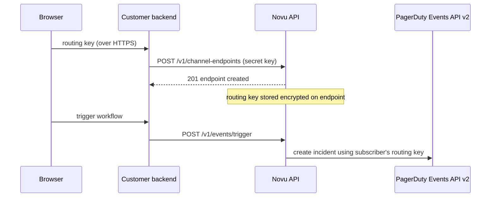

PagerDuty in Novu is routed **per subscriber**. Each subscriber brings their own Events API v2 integration key, so one workflow trigger can page different PagerDuty services and escalation policies for different recipients. The integration itself never stores a routing key. It acts as the anchor that per-subscriber [channel endpoints](/api-reference/channel-endpoints/create-a-channel-endpoint) hang off of.

<Note>
  There is no shared, environment-level PagerDuty routing key. If a subscriber has no PagerDuty endpoint registered, the Tool step is marked **skipped** for that subscriber; no incident is created and no error is raised.
</Note>

## Prerequisites

- A [PagerDuty](https://www.pagerduty.com/) account with permission to add integrations to services
- A PagerDuty **service** to page (create one under **Services** → **Service Directory** if needed)
- Access to the [Novu dashboard](https://dashboard.novu.co)

## Get an Events API v2 routing key

Every subscriber routes to their own PagerDuty service, so each subscriber needs a routing key from **their** service.

<Steps>
  <Step title="Open the service in PagerDuty">
    In PagerDuty, go to **Services** → **Service Directory** and open the service you want Novu to page.
  </Step>

  <Step title="Add an Events API v2 integration">
    Open the **Integrations** tab, click **Add another integration**, choose **Events API v2**, and save.
  </Step>

  <Step title="Copy the integration key">
    PagerDuty generates a 32-character alphanumeric **Integration Key**. Copy it. This is the routing key Novu will store for the subscriber.
  </Step>
</Steps>

<Warning>
  The routing key grants the ability to create incidents on the service. Treat it like a password: keep it on your server, never embed it in client-side code, and never log it.
</Warning>

## Add PagerDuty in Novu

<Steps>
  <Step title="Open the Integrations Store">
    In the Novu dashboard, click **Integrations Store** in the sidebar.
  </Step>

  <Step title="Add PagerDuty">
    Click **Connect Provider**, select **Tool**, then choose **PagerDuty**.
  </Step>

  <Step title="Create the integration">
    PagerDuty has no environment-level credentials, so there is nothing to paste on this screen. Click **Create Integration** to save it. This gives you the `integrationIdentifier` you'll reference below when registering subscribers' routing keys.
  </Step>
</Steps>

## Store a subscriber's routing key

Register each subscriber's routing key as a **channel endpoint** on the PagerDuty integration. Novu encrypts the routing key at rest on `ChannelEndpoint.endpoint` and returns the wire shape `{ routingKey, region }` on reads (`region` stays plaintext).

<Warning>
  Registering an endpoint requires your Novu secret key. Always call the channel-endpoints API from your server, never from a browser or mobile client. A typical flow is: your app UI sends the routing key to **your** backend, and your backend forwards it to Novu.
</Warning>



### Create the endpoint

Send the routing key as a `pagerduty_service` endpoint. Set `createSubscriberIfMissing: true` so this call also provisions the Novu subscriber the first time an end user connects PagerDuty, with no separate identify call required.

<Tabs>
  <Tab title="Node.js">
```typescript
import { Novu } from '@novu/api';

const novu = new Novu({ secretKey: '<NOVU_SECRET_KEY>' });

await novu.channelEndpoints.create({
  type: 'pagerduty_service',
  integrationIdentifier: 'pagerduty',
  subscriberId: '<SUBSCRIBER_ID>',
  createSubscriberIfMissing: true,
  endpoint: {
    routingKey: '<PAGERDUTY_ROUTING_KEY>',
    region: 'us',
  },
});
```
  </Tab>
  <Tab title="Python">
```python
import os
from novu_py import Novu

with Novu(secret_key=os.getenv("NOVU_SECRET_KEY", "")) as novu:
    novu.channel_endpoints.create(create_channel_endpoint_request_body={
        "type": "pagerduty_service",
        "integration_identifier": "pagerduty",
        "subscriber_id": "<SUBSCRIBER_ID>",
        "create_subscriber_if_missing": True,
        "endpoint": {
            "routing_key": "<PAGERDUTY_ROUTING_KEY>",
            "region": "us",
        },
    })
```
  </Tab>
  <Tab title="Go">
```go
import (
    "context"
    "os"

    novugo "github.com/novuhq/novu-go"
    "github.com/novuhq/novu-go/models/components"
)

s := novugo.New(novugo.WithSecurity(os.Getenv("NOVU_SECRET_KEY")))

_, err := s.ChannelEndpoints.Create(context.Background(), components.CreatePagerDutyServiceEndpointDto{
    Type:                      "pagerduty_service",
    IntegrationIdentifier:     "pagerduty",
    SubscriberID:              "<SUBSCRIBER_ID>",
    CreateSubscriberIfMissing: novugo.Bool(true),
    Endpoint: components.PagerDutyServiceEndpointDto{
        RoutingKey: "<PAGERDUTY_ROUTING_KEY>",
        Region:     "us",
    },
}, nil)
```
  </Tab>
  <Tab title="PHP">
```php
use novu;
use novu\Models\Components;

$sdk = novu\Novu::builder()->setSecurity('<NOVU_SECRET_KEY>')->build();

$sdk->channelEndpoints->create(
    createChannelEndpointRequestBody: new Components\CreatePagerDutyServiceEndpointDto(
        type: 'pagerduty_service',
        integrationIdentifier: 'pagerduty',
        subscriberId: '<SUBSCRIBER_ID>',
        createSubscriberIfMissing: true,
        endpoint: new Components\PagerDutyServiceEndpointDto(
            routingKey: '<PAGERDUTY_ROUTING_KEY>',
            region: 'us',
        ),
    ),
);
```
  </Tab>
  <Tab title=".NET">
```csharp
using Novu;
using Novu.Models.Components;

var sdk = new NovuSDK(secretKey: "<NOVU_SECRET_KEY>");

await sdk.ChannelEndpoints.CreateAsync(
    createChannelEndpointRequestBody: new CreatePagerDutyServiceEndpointDto()
    {
        Type = "pagerduty_service",
        IntegrationIdentifier = "pagerduty",
        SubscriberId = "<SUBSCRIBER_ID>",
        CreateSubscriberIfMissing = true,
        Endpoint = new PagerDutyServiceEndpointDto()
        {
            RoutingKey = "<PAGERDUTY_ROUTING_KEY>",
            Region = "us",
        },
    });
```
  </Tab>
  <Tab title="Java">
```java
import co.novu.Novu;
import co.novu.models.components.*;

Novu novu = Novu.builder().secretKey("<NOVU_SECRET_KEY>").build();

novu.channelEndpoints().create()
    .body(CreatePagerDutyServiceEndpointDto.builder()
        .type("pagerduty_service")
        .integrationIdentifier("pagerduty")
        .subscriberId("<SUBSCRIBER_ID>")
        .createSubscriberIfMissing(true)
        .endpoint(PagerDutyServiceEndpointDto.builder()
            .routingKey("<PAGERDUTY_ROUTING_KEY>")
            .region("us")
            .build())
        .build())
    .call();
```
  </Tab>
  <Tab title="cURL">
```bash
curl -L -X POST 'https://api.novu.co/v1/channel-endpoints' \
-H 'Content-Type: application/json' \
-H 'Authorization: ApiKey <NOVU_SECRET_KEY>' \
-d '{
  "type": "pagerduty_service",
  "integrationIdentifier": "pagerduty",
  "subscriberId": "<SUBSCRIBER_ID>",
  "createSubscriberIfMissing": true,
  "endpoint": {
    "routingKey": "<PAGERDUTY_ROUTING_KEY>",
    "region": "us"
  }
}'
```
  </Tab>
</Tabs>

### Endpoint shape

| Field | Type | Description |
| --- | --- | --- |
| `type` | `"pagerduty_service"` | Discriminator for the endpoint variant. |
| `integrationIdentifier` | `string` | Identifier of the PagerDuty integration created in the Integrations Store. |
| `subscriberId` | `string` | The subscriber to page when a workflow selects this endpoint. |
| `createSubscriberIfMissing` | `boolean` | Optional. When `true`, Novu creates the subscriber on the fly if it does not exist yet. Existing subscribers are never modified. Defaults to `false`. |
| `endpoint.routingKey` | `string` | The 32-character Events API v2 integration key from PagerDuty. Stored encrypted. |
| `endpoint.region` | `"us" \| "eu"` | Selects the PagerDuty data-center endpoint (`events.pagerduty.com` vs `events.eu.pagerduty.com`). |

### One endpoint per subscriber, per integration

A subscriber may have at most one PagerDuty endpoint per integration. A second `POST` with the same `(subscriberId, integrationIdentifier)` returns **`409 Conflict`**. Rotate the routing key by `PATCH`ing the existing endpoint instead:

```bash
curl -L -X PATCH 'https://api.novu.co/v1/channel-endpoints/<ENDPOINT_IDENTIFIER>' \
-H 'Content-Type: application/json' \
-H 'Authorization: ApiKey <NOVU_SECRET_KEY>' \
-d '{
  "endpoint": {
    "routingKey": "<NEW_ROUTING_KEY>",
    "region": "us"
  }
}'
```

### Reading and disconnecting

Reads return the full wire shape (including the routing key), so you can display connection status. Mask it in your UI (the Novu dashboard shows only the last four characters).

```bash
curl -L 'https://api.novu.co/v1/channel-endpoints?subscriberId=<SUBSCRIBER_ID>&integrationIdentifier=pagerduty' \
-H 'Authorization: ApiKey <NOVU_SECRET_KEY>'
```

Delete the endpoint to disconnect a subscriber. This removes the encrypted routing key stored on the endpoint:

```bash
curl -L -X DELETE 'https://api.novu.co/v1/channel-endpoints/<ENDPOINT_IDENTIFIER>' \
-H 'Authorization: ApiKey <NOVU_SECRET_KEY>'
```

## Page a subscriber from a workflow

Once a subscriber has a PagerDuty endpoint, add a **Tool** step with PagerDuty to your workflow and trigger it like any other workflow.

<Steps>
  <Step title="Add a Tool step">
    In the workflow editor, add a step and select **Tool** as the channel. Choose the PagerDuty integration you created.
  </Step>

  <Step title="Write the incident summary">
    The step content becomes the incident `payload.summary` in the PagerDuty Events API v2 request. Use dynamic placeholders such as `{{payload.orderNumber}}` or `{{subscriber.firstName}}`.
  </Step>

  <Step title="Trigger the workflow">
    Send a trigger for a subscriber who has connected PagerDuty. Novu resolves that subscriber's routing key and creates an incident on their PagerDuty service.
  </Step>
</Steps>

<Tabs>
  <Tab title="Node.js">
```typescript
import { Novu } from '@novu/api';

const novu = new Novu({ secretKey: '<NOVU_SECRET_KEY>' });

await novu.trigger({
  workflowId: 'order-failed',
  to: { subscriberId: '<SUBSCRIBER_ID>' },
  payload: {
    orderNumber: 'ORD-12345',
    reason: 'payment_declined',
  },
});
```
  </Tab>
  <Tab title="Python">
```python
import os
import novu_py
from novu_py import Novu

with Novu(secret_key=os.getenv("NOVU_SECRET_KEY", "")) as novu:
    novu.trigger(trigger_event_request_dto=novu_py.TriggerEventRequestDto(
        workflow_id="order-failed",
        to={"subscriber_id": "<SUBSCRIBER_ID>"},
        payload={
            "orderNumber": "ORD-12345",
            "reason": "payment_declined",
        },
    ))
```
  </Tab>
  <Tab title="Go">
```go
import (
    "context"
    "os"

    novugo "github.com/novuhq/novu-go"
    "github.com/novuhq/novu-go/models/components"
)

s := novugo.New(novugo.WithSecurity(os.Getenv("NOVU_SECRET_KEY")))

_, err := s.Trigger(context.Background(), components.TriggerEventRequestDto{
    WorkflowID: "order-failed",
    To: components.CreateToSubscriberPayloadDto(components.SubscriberPayloadDto{
        SubscriberID: "<SUBSCRIBER_ID>",
    }),
    Payload: map[string]any{
        "orderNumber": "ORD-12345",
        "reason":      "payment_declined",
    },
}, nil)
```
  </Tab>
  <Tab title="PHP">
```php
use novu;
use novu\Models\Components;

$sdk = novu\Novu::builder()->setSecurity('<NOVU_SECRET_KEY>')->build();

$sdk->trigger(
    triggerEventRequestDto: new Components\TriggerEventRequestDto(
        workflowId: 'order-failed',
        to: new Components\SubscriberPayloadDto(subscriberId: '<SUBSCRIBER_ID>'),
        payload: [
            'orderNumber' => 'ORD-12345',
            'reason' => 'payment_declined',
        ],
    ),
);
```
  </Tab>
  <Tab title=".NET">
```csharp
using Novu;
using Novu.Models.Components;

var sdk = new NovuSDK(secretKey: "<NOVU_SECRET_KEY>");

await sdk.TriggerAsync(triggerEventRequestDto: new TriggerEventRequestDto()
{
    WorkflowId = "order-failed",
    To = To.CreateSubscriberPayloadDto(new SubscriberPayloadDto() { SubscriberId = "<SUBSCRIBER_ID>" }),
    Payload = new Dictionary<string, object>
    {
        ["orderNumber"] = "ORD-12345",
        ["reason"] = "payment_declined",
    },
});
```
  </Tab>
  <Tab title="Java">
```java
import co.novu.Novu;
import co.novu.models.components.*;

Novu novu = Novu.builder().secretKey("<NOVU_SECRET_KEY>").build();

novu.trigger()
    .body(TriggerEventRequestDto.builder()
        .workflowId("order-failed")
        .to(To2.of(SubscriberPayloadDto.builder().subscriberId("<SUBSCRIBER_ID>").build()))
        .payload(Map.of(
            "orderNumber", "ORD-12345",
            "reason", "payment_declined"
        ))
        .build())
    .call();
```
  </Tab>
  <Tab title="cURL">
```bash
curl --location 'https://api.novu.co/v1/events/trigger' \
--header 'Content-Type: application/json' \
--header 'Authorization: ApiKey <NOVU_SECRET_KEY>' \
-d '{
    "name": "order-failed",
    "to": ["<SUBSCRIBER_ID>"],
    "payload": {
        "orderNumber": "ORD-12345",
        "reason": "payment_declined"
    }
}'
```
  </Tab>
</Tabs>

### Incident payload defaults and overrides

| Field | Default | Override with |
| --- | --- | --- |
| `event_action` | `trigger` | Step control (`trigger`, `acknowledge`, `resolve`). |
| `payload.summary` | Step content | Step content or a `summary` override on the step. |
| `payload.severity` | `critical` | `severity` step override (`critical`, `error`, `warning`, `info`). |
| `payload.source` | `novu` | `source` step override. |
| `dedup_key` | Deterministic, derived from the workflow `transactionId`, `subscriberId`, and step ID. | Explicit `dedup_key` step override. |
| `payload.custom_details` | Any extra keys you pass on the step (excluding reserved names). | Step overrides. |

The deterministic `dedup_key` means Novu retries for the same step will update the same PagerDuty incident instead of creating duplicates.

## What happens without an endpoint

If a workflow triggers for a subscriber who has **no** PagerDuty endpoint on the target integration, Novu marks the step as **skipped** in the Activity feed for that subscriber and does not create an incident. Other subscribers on the same trigger are unaffected. Each is routed to their own PagerDuty service.

## Related

<Columns cols={2}>
  <Card icon="plug" href="/api-reference/channel-endpoints/create-a-channel-endpoint" title="Create a channel endpoint">
    API reference for `POST /v1/channel-endpoints`, including the `pagerduty_service` variant.
  </Card>
  <Card icon="pen" href="/api-reference/channel-endpoints/update-a-channel-endpoint" title="Rotate a routing key">
    API reference for `PATCH /v1/channel-endpoints/:identifier`. Use this to rotate an existing subscriber's routing key.
  </Card>
</Columns>
