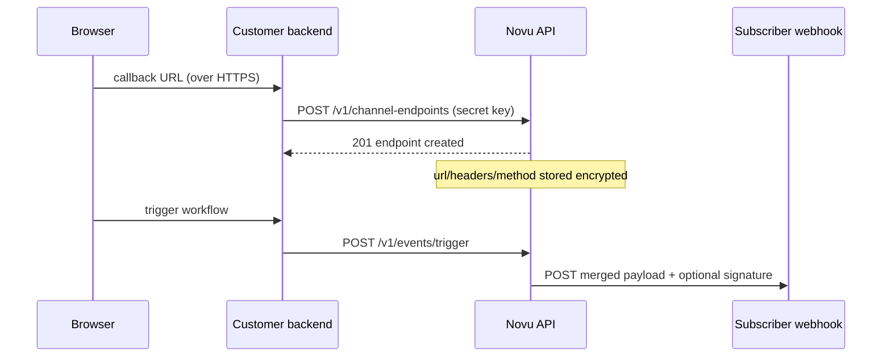

Tool Webhook sends workflow Tool step output to an HTTP endpoint you control. Choose **static** routing to call a single integration URL for every subscriber, or **dynamic** routing to register one or more destination URLs per subscriber as [channel endpoints](/api-reference/channel-endpoints/create-a-channel-endpoint).

<Note>
  Static mode never uses channel endpoints. Dynamic mode fans out to every `tool_webhook` endpoint registered for the subscriber on the integration. If a subscriber has no endpoints in dynamic mode, the Tool step is marked **skipped** for that subscriber.
</Note>

## Prerequisites

- An HTTPS (or HTTP for local testing) endpoint that accepts `POST`, `PUT`, or `PATCH` requests and returns a `2xx` response
- Access to the [Novu dashboard](https://dashboard.novu.co)
- For **dynamic** routing: your Novu **secret key** to register endpoints from your server

## Static vs dynamic routing

| Mode | Where the URL lives | When to use |
| --- | --- | --- |
| **Static** | Integration **Endpoint URL** (`webhookUrl`) | One shared webhook for all subscribers — internal automation, a single SaaS inbox, or a team-wide handler. |
| **Dynamic** | Per-subscriber `tool_webhook` [channel endpoints](/api-reference/channel-endpoints/create-a-channel-endpoint) | Each subscriber (or tenant) brings their own callback URL — customer webhooks, per-org automation, or multi-tenant fan-out. |

Set **Routing Mode** when you create the integration. Defaults to **Static** when omitted.

<Warning>
  Dynamic routing does not fall back to the integration URL. Register at least one `tool_webhook` endpoint per subscriber you intend to deliver to, or the step is skipped for that subscriber.
</Warning>

## Add Tool Webhook in Novu

<Steps>
  <Step title="Open the Integrations Store">
    In the Novu dashboard, click **Integrations Store** in the sidebar.
  </Step>

  <Step title="Add Tool Webhook">
    Click **Connect Provider**, select **Tool**, then choose **Tool webhook**.
  </Step>

  <Step title="Choose routing mode and defaults">
    Configure shared defaults that apply to every delivery in this environment:

    | Field | Static | Dynamic | Description |
    | --- | --- | --- | --- |
    | **Routing Mode** | `Static` | `Dynamic` | Static uses the integration URL; dynamic uses subscriber endpoints. |
    | **Endpoint URL** | Required | Omit | Destination URL for static mode. |
    | **HTTP Method** | Yes | Yes | Default `POST`, `PUT`, or `PATCH`. Overridable per endpoint or step. |
    | **Headers** | Optional | Optional | Default request headers as a JSON object string, for example `{"Authorization":"Bearer shared-token"}`. |
    | **Body** | Optional | Optional | Default JSON object string merged into every request body (see [Body merge](#body-merge)). |
    | **Signing Secret** | Optional | Optional | HMAC secret for the `X-Novu-Signature` header (see [Verify signatures](#verify-x-novu-signature)). |
  </Step>

  <Step title="Create the integration">
    Click **Create Integration** and note the `integrationIdentifier` — you need it when registering dynamic endpoints and when adding a Tool step to a workflow.
  </Step>
</Steps>

## Request shape

Novu sends `Content-Type: application/json`. The exact JSON body depends on whether you configured a **Body** template on the integration.

### Body merge

1. **Integration Body** (optional) — parsed as a JSON object and used as the base key/value map.
2. **Step editor** — the rendered Tool step content is always sent as `content` and **wins** over any `content` key in the integration Body template.
3. **Step overrides** — additional keys from the step or trigger overrides are merged into the payload (excluding reserved routing fields).

Without an integration Body template, the request body is:

```json
{
  "content": "Rendered Tool step text with {{payload}} placeholders resolved"
}
```

With an integration Body template of `{"event":"novu.tool","version":1}`, the outbound body becomes:

```json
{
  "event": "novu.tool",
  "version": 1,
  "content": "Rendered Tool step text"
}
```

### Header merge

Headers are merged in this order (later keys override earlier ones):

1. `Content-Type: application/json`
2. Integration **Headers** (JSON object)
3. Dynamic endpoint `headers` (when present on the `tool_webhook` endpoint)
4. Step-level header overrides (when configured on the step)

Use endpoint or step headers to override integration defaults — for example, swap an `Authorization` token per subscriber without changing the integration.

### HTTP method

Resolution order: endpoint `method` (dynamic) → step override → integration **HTTP Method** → `POST`.

## Verify `X-Novu-Signature`

When you set a **Signing Secret** on the integration, Novu signs the **exact UTF-8 request body string** with HMAC SHA-256 and sends the hex digest in the `X-Novu-Signature` header.

Verify on your server using the raw request body bytes (before JSON re-serialization):

```typescript
import crypto from 'crypto';

const signingSecret = process.env.NOVU_TOOL_WEBHOOK_SECRET!;

export function verifyNovuToolWebhook(rawBody: string, signatureHeader: string | undefined): boolean {
  if (!signatureHeader) {
    return false;
  }

  const expected = crypto.createHmac('sha256', signingSecret).update(rawBody, 'utf-8').digest('hex');

  if (signatureHeader.length !== expected.length) {
    return false;
  }

  return crypto.timingSafeEqual(Buffer.from(signatureHeader), Buffer.from(expected));
}

// Express example — register before express.json()
app.post('/novu-tool-webhook', express.raw({ type: 'application/json' }), (req, res) => {
  const rawBody = req.body.toString('utf-8');
  const signature = req.headers['x-novu-signature'] as string | undefined;

  if (!verifyNovuToolWebhook(rawBody, signature)) {
    return res.status(401).send('Invalid signature');
  }

  const payload = JSON.parse(rawBody);
  // handle payload.content, etc.
  res.status(200).json({ id: 'received' });
});
```

<Warning>
  Re-stringifying a parsed JSON object often produces a different byte sequence than Novu signed. Always verify against the raw request body.
</Warning>

Your endpoint should return any `2xx` response. Novu treats non-2xx responses as delivery failures.

## Dynamic mode: register subscriber endpoints

In **dynamic** routing, each subscriber can have **multiple** `tool_webhook` endpoints on the same integration. Novu delivers the Tool step once per endpoint — useful when a subscriber wants parallel notifications to several systems.

<Warning>
  Registering endpoints requires your Novu secret key. Call the channel-endpoints API from your server, never from a browser or mobile client.
</Warning>



### Create an endpoint

Register a subscriber destination with type `tool_webhook`. Set `createSubscriberIfMissing: true` to provision the Novu subscriber on first connect.

<Tabs>
  <Tab title="Node.js">
```typescript
import { Novu } from '@novu/api';

const novu = new Novu({ secretKey: '<NOVU_SECRET_KEY>' });

await novu.channelEndpoints.create({
  type: 'tool_webhook',
  integrationIdentifier: 'tool-webhook',
  subscriberId: '<SUBSCRIBER_ID>',
  createSubscriberIfMissing: true,
  endpoint: {
    url: 'https://customer.example.com/hooks/novu',
    headers: { Authorization: 'Bearer subscriber-token' },
    method: 'POST',
  },
});
```
  </Tab>
  <Tab title="Python">
```python
import os
from novu_py import Novu

with Novu(secret_key=os.getenv("NOVU_SECRET_KEY", "")) as novu:
    novu.channel_endpoints.create(create_channel_endpoint_request_body={
        "type": "tool_webhook",
        "integration_identifier": "tool-webhook",
        "subscriber_id": "<SUBSCRIBER_ID>",
        "create_subscriber_if_missing": True,
        "endpoint": {
            "url": "https://customer.example.com/hooks/novu",
            "headers": {"Authorization": "Bearer subscriber-token"},
            "method": "POST",
        },
    })
```
  </Tab>
  <Tab title="Go">
```go
import (
    "context"
    "os"

    novugo "github.com/novuhq/novu-go"
    "github.com/novuhq/novu-go/models/components"
)

s := novugo.New(novugo.WithSecurity(os.Getenv("NOVU_SECRET_KEY")))

_, err := s.ChannelEndpoints.Create(context.Background(), components.CreateToolWebhookEndpointDto{
    Type:                      "tool_webhook",
    IntegrationIdentifier:     "tool-webhook",
    SubscriberID:              "<SUBSCRIBER_ID>",
    CreateSubscriberIfMissing: novugo.Bool(true),
    Endpoint: components.ToolWebhookEndpointDto{
        URL:     "https://customer.example.com/hooks/novu",
        Headers: map[string]string{"Authorization": "Bearer subscriber-token"},
        Method:  novugo.String("POST"),
    },
}, nil)
```
  </Tab>
  <Tab title="PHP">
```php
use novu;
use novu\Models\Components;

$sdk = novu\Novu::builder()->setSecurity('<NOVU_SECRET_KEY>')->build();

$sdk->channelEndpoints->create(
    createChannelEndpointRequestBody: new Components\CreateToolWebhookEndpointDto(
        type: 'tool_webhook',
        integrationIdentifier: 'tool-webhook',
        subscriberId: '<SUBSCRIBER_ID>',
        createSubscriberIfMissing: true,
        endpoint: new Components\ToolWebhookEndpointDto(
            url: 'https://customer.example.com/hooks/novu',
            headers: ['Authorization' => 'Bearer subscriber-token'],
            method: 'POST',
        ),
    ),
);
```
  </Tab>
  <Tab title=".NET">
```csharp
using Novu;
using Novu.Models.Components;

var sdk = new NovuSDK(secretKey: "<NOVU_SECRET_KEY>");

await sdk.ChannelEndpoints.CreateAsync(
    createChannelEndpointRequestBody: new CreateToolWebhookEndpointDto()
    {
        Type = "tool_webhook",
        IntegrationIdentifier = "tool-webhook",
        SubscriberId = "<SUBSCRIBER_ID>",
        CreateSubscriberIfMissing = true,
        Endpoint = new ToolWebhookEndpointDto()
        {
            Url = "https://customer.example.com/hooks/novu",
            Headers = new Dictionary<string, string>
            {
                ["Authorization"] = "Bearer subscriber-token",
            },
            Method = "POST",
        },
    });
```
  </Tab>
  <Tab title="Java">
```java
import co.novu.Novu;
import co.novu.models.components.*;

Novu novu = Novu.builder().secretKey("<NOVU_SECRET_KEY>").build();

novu.channelEndpoints().create()
    .body(CreateToolWebhookEndpointDto.builder()
        .type("tool_webhook")
        .integrationIdentifier("tool-webhook")
        .subscriberId("<SUBSCRIBER_ID>")
        .createSubscriberIfMissing(true)
        .endpoint(ToolWebhookEndpointDto.builder()
            .url("https://customer.example.com/hooks/novu")
            .headers(Map.of("Authorization", "Bearer subscriber-token"))
            .method("POST")
            .build())
        .build())
    .call();
```
  </Tab>
  <Tab title="cURL">
```bash
curl -L -X POST 'https://api.novu.co/v1/channel-endpoints' \
-H 'Content-Type: application/json' \
-H 'Authorization: ApiKey <NOVU_SECRET_KEY>' \
-d '{
  "type": "tool_webhook",
  "integrationIdentifier": "tool-webhook",
  "subscriberId": "<SUBSCRIBER_ID>",
  "createSubscriberIfMissing": true,
  "endpoint": {
    "url": "https://customer.example.com/hooks/novu",
    "headers": {
      "Authorization": "Bearer subscriber-token"
    },
    "method": "POST"
  }
}'
```
  </Tab>
</Tabs>

### Endpoint shape

| Field | Type | Description |
| --- | --- | --- |
| `type` | `"tool_webhook"` | Discriminator for the endpoint variant. |
| `integrationIdentifier` | `string` | Identifier of the Tool Webhook integration (must have **Routing Mode** = Dynamic). |
| `subscriberId` | `string` | Subscriber whose endpoints receive the Tool step payload. |
| `createSubscriberIfMissing` | `boolean` | Optional. When `true`, Novu creates the subscriber if missing. Defaults to `false`. |
| `endpoint.url` | `string` | HTTPS or HTTP URL Novu calls for this endpoint. Stored encrypted. |
| `endpoint.headers` | `Record<string, string>` | Optional. Per-endpoint headers; override integration defaults on key collision. Stored encrypted. |
| `endpoint.method` | `"POST" \| "PUT" \| "PATCH"` | Optional. Overrides the integration HTTP method for this endpoint only. |

Unlike PagerDuty or Opsgenie, a subscriber may register **multiple** `tool_webhook` endpoints on the same integration. Each endpoint receives its own HTTP request when the workflow runs.

### Update, list, and delete

Rotate a URL or headers with `PATCH /v1/channel-endpoints/:identifier`. List endpoints for a subscriber:

```bash
curl -L 'https://api.novu.co/v1/channel-endpoints?subscriberId=<SUBSCRIBER_ID>&integrationIdentifier=tool-webhook' \
-H 'Authorization: ApiKey <NOVU_SECRET_KEY>'
```

Delete an endpoint to remove a destination. Novu cascades the delete to the underlying channel connection.

See the [channel endpoints API reference](/api-reference/channel-endpoints/create-a-channel-endpoint) for full request and response details.

## Send from a workflow

<Steps>
  <Step title="Add a Tool step">
    In the workflow editor, add a step and select **Tool** as the channel. Choose the Tool Webhook integration you created.
  </Step>

  <Step title="Write the step body">
    The step body becomes the `content` field in the outbound JSON (after template rendering). Use placeholders such as `{{payload.orderId}}` or `{{subscriber.firstName}}`.
  </Step>

  <Step title="Trigger the workflow">
    Trigger the workflow for a subscriber. In static mode Novu calls the integration URL. In dynamic mode Novu calls every `tool_webhook` endpoint registered for that subscriber.
  </Step>
</Steps>

<Tabs>
  <Tab title="Node.js">
```typescript
import { Novu } from '@novu/api';

const novu = new Novu({ secretKey: '<NOVU_SECRET_KEY>' });

await novu.trigger({
  workflowId: 'ops-handoff',
  to: { subscriberId: '<SUBSCRIBER_ID>' },
  payload: {
    incidentId: 'INC-42',
    severity: 'high',
  },
});
```
  </Tab>
  <Tab title="Python">
```python
import os
import novu_py
from novu_py import Novu

with Novu(secret_key=os.getenv("NOVU_SECRET_KEY", "")) as novu:
    novu.trigger(trigger_event_request_dto=novu_py.TriggerEventRequestDto(
        workflow_id="ops-handoff",
        to={"subscriber_id": "<SUBSCRIBER_ID>"},
        payload={
            "incidentId": "INC-42",
            "severity": "high",
        },
    ))
```
  </Tab>
  <Tab title="Go">
```go
import (
    "context"
    "os"

    novugo "github.com/novuhq/novu-go"
    "github.com/novuhq/novu-go/models/components"
)

s := novugo.New(novugo.WithSecurity(os.Getenv("NOVU_SECRET_KEY")))

_, err := s.Trigger(context.Background(), components.TriggerEventRequestDto{
    WorkflowID: "ops-handoff",
    To: components.CreateToSubscriberPayloadDto(components.SubscriberPayloadDto{
        SubscriberID: "<SUBSCRIBER_ID>",
    }),
    Payload: map[string]any{
        "incidentId": "INC-42",
        "severity":   "high",
    },
}, nil)
```
  </Tab>
  <Tab title="PHP">
```php
use novu;
use novu\Models\Components;

$sdk = novu\Novu::builder()->setSecurity('<NOVU_SECRET_KEY>')->build();

$sdk->trigger(
    triggerEventRequestDto: new Components\TriggerEventRequestDto(
        workflowId: 'ops-handoff',
        to: new Components\SubscriberPayloadDto(subscriberId: '<SUBSCRIBER_ID>'),
        payload: [
            'incidentId' => 'INC-42',
            'severity' => 'high',
        ],
    ),
);
```
  </Tab>
  <Tab title=".NET">
```csharp
using Novu;
using Novu.Models.Components;

var sdk = new NovuSDK(secretKey: "<NOVU_SECRET_KEY>");

await sdk.TriggerAsync(triggerEventRequestDto: new TriggerEventRequestDto()
{
    WorkflowId = "ops-handoff",
    To = To.CreateSubscriberPayloadDto(new SubscriberPayloadDto() { SubscriberId = "<SUBSCRIBER_ID>" }),
    Payload = new Dictionary<string, object>
    {
        ["incidentId"] = "INC-42",
        ["severity"] = "high",
    },
});
```
  </Tab>
  <Tab title="Java">
```java
import co.novu.Novu;
import co.novu.models.components.*;

Novu novu = Novu.builder().secretKey("<NOVU_SECRET_KEY>").build();

novu.trigger()
    .body(TriggerEventRequestDto.builder()
        .workflowId("ops-handoff")
        .to(To2.of(SubscriberPayloadDto.builder().subscriberId("<SUBSCRIBER_ID>").build()))
        .payload(Map.of(
            "incidentId", "INC-42",
            "severity", "high"
        ))
        .build())
    .call();
```
  </Tab>
  <Tab title="cURL">
```bash
curl --location 'https://api.novu.co/v1/events/trigger' \
--header 'Content-Type: application/json' \
--header 'Authorization: ApiKey <NOVU_SECRET_KEY>' \
-d '{
    "name": "ops-handoff",
    "to": ["<SUBSCRIBER_ID>"],
    "payload": {
        "incidentId": "INC-42",
        "severity": "high"
    }
}'
```
  </Tab>
</Tabs>

## What happens without an endpoint (dynamic mode)

If **Routing Mode** is **Dynamic** and a subscriber has **no** `tool_webhook` endpoints on the integration, Novu marks the Tool step as **skipped** for that subscriber in the Activity feed. Other subscribers on the same trigger are unaffected.

## Related

<Columns cols={2}>
  <Card icon="plug" href="/api-reference/channel-endpoints/create-a-channel-endpoint" title="Create a channel endpoint">
    API reference for `POST /v1/channel-endpoints`, including the `tool_webhook` variant.
  </Card>
  <Card icon="pen" href="/api-reference/channel-endpoints/update-a-channel-endpoint" title="Update an endpoint">
    API reference for `PATCH /v1/channel-endpoints/:identifier`. Rotate URLs or headers for a subscriber destination.
  </Card>
</Columns>
