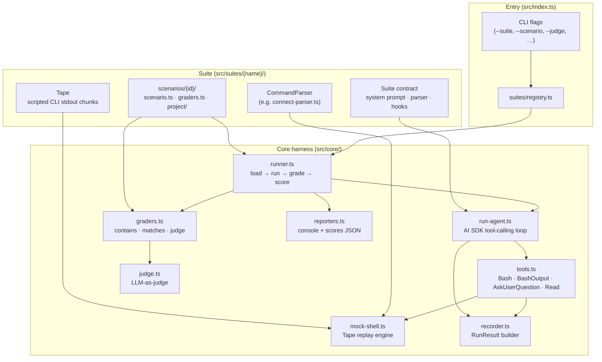
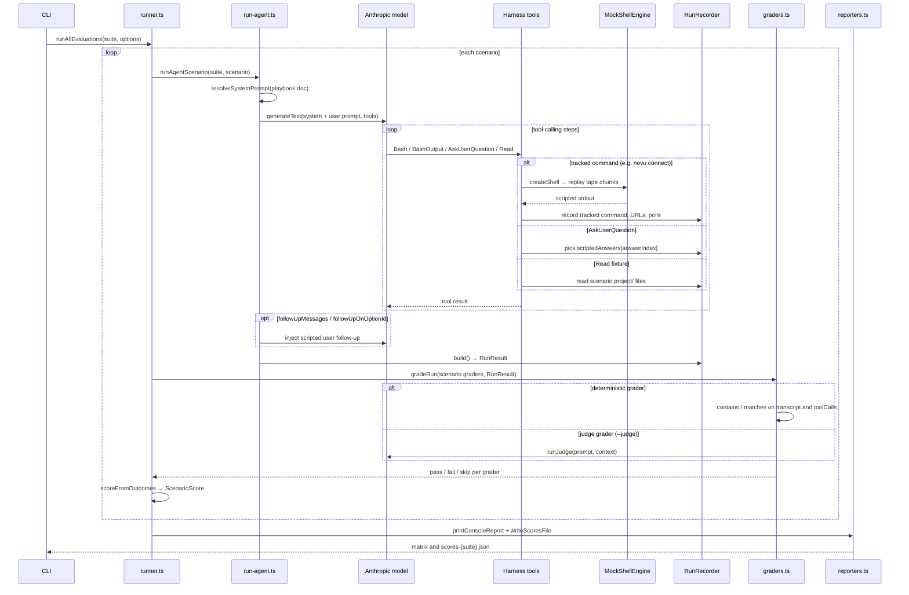
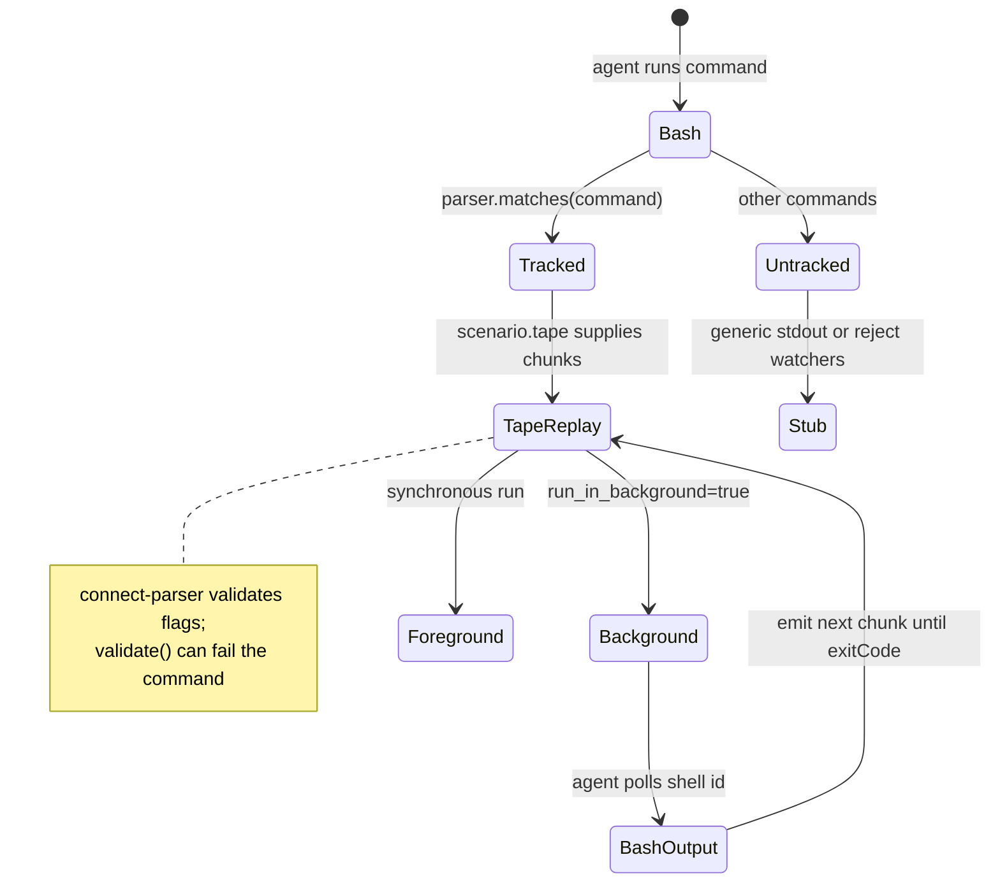

# @novu/agent-evals

Behavioral eval harness for Novu coding-agent playbooks. Runs a real LLM agent against scripted scenarios with a mocked CLI, then grades whether the agent follows the playbook using deterministic structural checks plus optional LLM-as-judge graders for fuzzy criteria.

The harness is **suite-based**: `src/core/` is playbook-agnostic, and each suite under `src/suites/` plugs in its own system prompt, command parser, scenarios, and grader catalog. The first suite, `agent-onboarding`, tests `@novu/shared/docs/agent-onboarding.md` (the `npx novu connect` flow), resolved via the `@novu/shared` package export.

## Architecture

### Layer overview

The package splits into three layers: a CLI entrypoint, a playbook-agnostic **core harness**, and pluggable **suites** that supply scenarios, tapes, and graders.



### Execution flow

Each scenario runs the real agent against a mocked environment, then grades the recorded behavior.



### Key concepts

| Concept | Role |
| --- | --- |
| **Suite** | Plugs a playbook (system prompt), `CommandParser`, scenario list, and optional hooks (`onTrackedCommand`, sentinel URL patterns) into the generic harness. |
| **Scenario** | One eval case: user prompt, fixture `project/`, scripted user answers, optional CLI **tape**, and follow-up messages. |
| **Tape** | Ordered stdout chunks replayed when the agent runs a tracked command; `when(parsed)` can branch on parsed flags. |
| **CommandParser** | Decides which shell commands are tracked (e.g. `novu connect`) and parses them for tape selection and validation. |
| **RunResult** | Everything the agent did: tool calls, assistant text, captured URLs, polled/killed shells, suite metadata. |
| **Graders** | **Deterministic** checks on `RunResult` structure, or **judge** graders that call a second LLM pass for fuzzy criteria. |

### Mock CLI model

The harness simulates a Claude Code–like environment without running real `novu connect`:



## Structure

```
src/
  core/                 # suite-agnostic harness
    types.ts            # Suite contract, RunResult, Tape, CommandParser
    run-agent.ts        # AI SDK tool-calling loop
    tools.ts            # Bash / BashOutput / AskUserQuestion / Read
    mock-shell.ts       # tape replay engine (pluggable command parser)
    recorder.ts         # RunResult builder
    graders.ts          # defineGraders, contains, matches, judge, gradeRun
    judge.ts            # LLM-as-judge runner
    runner.ts           # load -> run -> grade -> score
    reporters.ts        # console matrix + scores-<suite>.json
  suites/
    registry.ts         # suite id -> Suite
    agent-onboarding/   # the connect-flow suite
      index.ts          # the Suite object
      connect-parser.ts # novu connect flag parser + validation
      tape.ts           # connectTape / buildDefaultTape helpers
      catalog.ts        # connect grader catalog + judge prompts
      kit.ts            # stable import surface for scenario files
      scenarios/<name>/ # scenario.ts + graders.ts + project/ fixtures
```

## Setup

```bash
cp .env.example .env   # from libs/agent-evals/
pnpm install
```

Set `ANTHROPIC_API_KEY` in `.env` before running real evals. Judge graders also use this key when enabled.

## Local testing

**No API key** — verify the harness without calling any LLM:

```bash
pnpm --filter @novu/agent-evals test              # deterministic grader self-test
pnpm --filter @novu/agent-evals start -- --dry    # list scenarios; no agent run
pnpm --filter @novu/agent-evals start -- --smoke --dry
```

**With API key** — runs the agent (and optionally the judge) against scenarios:

```bash
pnpm --filter @novu/agent-evals start
pnpm --filter @novu/agent-evals start -- --scenario keyless-slack-secure
pnpm --filter @novu/agent-evals start -- --smoke          # first scenario only
pnpm --filter @novu/agent-evals start -- --judge          # enable LLM judge graders
pnpm --filter @novu/agent-evals start -- --fail-under 80  # CI gate
```

## Flags

| Flag | Description |
| --- | --- |
| `--suite <id>` | Suite to run (default: `agent-onboarding`) |
| `--scenario <id\|category>` | Filter evals by id or category |
| `--model <name>` | Agent model (default: `claude-sonnet-4-5`) |
| `--judge` / `--no-judge` | LLM-as-judge graders (auto-on when `ANTHROPIC_API_KEY` is set) |
| `--judge-model <name>` | Judge model (defaults to agent model) |
| `--smoke` | First scenario only |
| `--dry` | Print summary only; does not run the agent or call any LLM |
| `--debug` | Save run artifacts to `debug-runs/<suite>/` |
| `--fail-under <pct>` | Exit non-zero if average score is below threshold |

## Adding a new suite

1. Create `src/suites/<name>/` with a `CommandParser`, scenario folders, and a grader catalog.
2. Export a `Suite` object from its `index.ts` (system prompt source, parser, scenarios, optional hooks).
3. Register it in `src/suites/registry.ts`.

## Output

- Console: scenario × grader matrix
- `scores-<suite>.json`: structured results for CI
