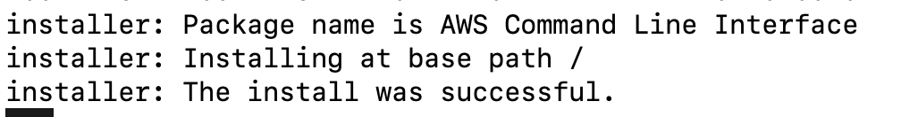
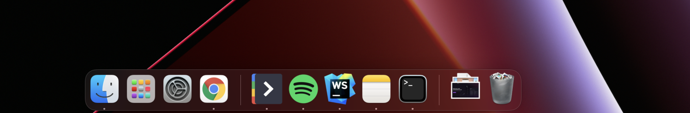

# Dev Machine Setup

# Mac Setup:

## Terminal upgrade (Optional)

### Install ZSH

curl -o- [https://raw.githubusercontent.com/nvm-sh/nvm/v0.39.1/install.sh](https://raw.githubusercontent.com/nvm-sh/nvm/v0.39.1/install.sh) | bash

ZSH is a shell on steroids, it has multiple plugins and functionality that can save a lot of time. 

To install zsh run in your command line:

```bash
sh -c "$(curl -fsSL https://raw.github.com/ohmyzsh/ohmyzsh/master/tools/install.sh)"
```

<aside>
💡 If you previously haven’t installed git on the machine, a prompt to install git will show up. After installation, run the `sh` command from above again.

</aside>

<aside>
❕ Make sure you have a `~/.zshrc` exists, if not it might be an indicator that the installation failed for some reason.

</aside>

### ZSH auto-complete plugin

Add the autocomplete plugin for autocompleting previously typed commands in the shell. Follow the instructions [here](https://github.com/zsh-users/zsh-autosuggestions/blob/master/INSTALL.md#oh-my-zsh).

### Powerlevel10k (optional)

[Powerlevel10k](https://github.com/romkatv/powerlevel10k) is a theme for Zsh. It emphasizes [speed](https://github.com/romkatv/powerlevel10k#uncompromising-performance), [flexibility](https://github.com/romkatv/powerlevel10k#extremely-customizable), and [out-of-the-box experience](https://github.com/romkatv/powerlevel10k#configuration-wizard).

1. Clone the repository:
    
    `git clone --depth=1 https://github.com/romkatv/powerlevel10k.git ${ZSH_CUSTOM:-$HOME/.oh-my-zsh/custom}/themes/powerlevel10k`
    
2. Set `ZSH_THEME="powerlevel10k/powerlevel10k"` in `~/.zshrc`.
3. Restart your terminal and follow the onboarding wizard to configure it to your likings and preferences.

## Command Line Tools, Homebrew & Casks

Every developer utilizes *Command Line Tools*. A simple terminal command will allow you to download these. It will ask you to confirm after you have entered the command.

```bash
xcode-select --install
```

### Homebrew & Casks

[Homebrew](https://brew.sh/), it’s the missing package manager for macOS, and quite powerful at that.

Copy and paste the following code into your terminal to install Homebrew.

```bash
/bin/bash -c "$(curl -fsSL https://raw.githubusercontent.com/Homebrew/install/HEAD/install.sh)"
```

It will ask you to enter 'Return' to confirm the installation. 

<aside>
💡 After installation run, the `echo` and `eval` commands shown on screen to add brew to your shell executables

</aside>

## Setting up git

To set up git and create an access token for GitHub, suggested installing [GitHub Desktop](https://www.notion.so/Dev-Machine-Setup-98d274c80fa249b0b0be75b9a7a72acb) before.

## Helpful settings

Show hidden files in Finder

```bash
defaults write com.apple.finder AppleShowAllFiles YES
```

# Development Environment

## Node & NVM

For installing node we suggest installing it using [NVM](https://github.com/nvm-sh/nvm) (Node Version Manager) for easily managing multiple node versions.

1. Install nvm on your machine.

```bash
curl -o- https://raw.githubusercontent.com/nvm-sh/nvm/v0.39.1/install.sh | bash
```

<aside>
💡 Make sure that you have installed zsh previously, so NVM can automatically inject the executable to PATH in the .zshrc config file.

</aside>

1. After installing nvm and checking that it’s in the path by running `nvm --version` in your CLI. You can now install our node version:

<aside>
💡 After running the install script, if you get `nvm: command not found` or see no feedback from your terminal after you type `command -v nvm`, simply **close your current terminal, open a new terminal**, and try verifying again.

</aside>

```bash
nvm install v14.19.3
```

1. Optional for M1 processors - Install Rosetta. 

Rosetta enables a Mac with Apple silicon to use apps built for a Mac with an Intel processor.

```bash
softwareupdate --install-rosetta
```

## PNPM

For package management, we use [PNPM](https://pnpm.io/) instead of npm or yarn to speed up our install times and space efficiency. To install pnpm globally run:

```bash
npm install -g pnpm@6
```

## Docker

Follow the installation guide on [docker website](https://docs.docker.com/desktop/mac/install/) to install docker on your own machine. For ease of use, we suggest installing **Docker Desktop**.

## AWS CLI

Follow the instructions to install the AWS CLI so you can use it to create env later on, based on existing S3 buckets:

[Installing or updating the latest version of the AWS CLI](https://docs.aws.amazon.com/cli/latest/userguide/getting-started-install.html)

You should get something like this:



If needed, see: 

[Resolve "Unable to locate credentials" error in Amazon S3](https://aws.amazon.com/premiumsupport/knowledge-center/s3-locate-credentials-error/)

## Run LocalStack

This is needed only when you upload files (for example - an image) in the admin panel from your local environment. 

LocalStack emulates cloud service that runs in a single container on your computer. So you can run your AWS applications on your local machine without connecting to the remote cloud provider. 

1. Build a container and run it: 

```bash
docker run --rm -it -p 4566:4566 -p 4571:4571 localstack/localstack
```

1. Create local S3 buckets needed for the app: 
    
    In **local** environment:
    
    ```bash
    aws --endpoint-url=http://localhost:4566 s3 mb s3://novu-local
    ```
    
    In **test** environment:
    
    ```bash
    aws --endpoint-url=http://localhost:4566 s3 mb s3://novu-test
    ```
    

## MongoDB

After installing brew you can easily install the MongoDB community edition.

1. Tap the [MongoDB Homebrew Tap](https://github.com/mongodb/homebrew-brew) to download the official Homebrew formula for MongoDB and the Database Tools, by running the following command in your macOS Terminal:

```bash
brew tap mongodb/brew
```

1. To install MongoDB, run the following command in your macOS Terminal application
    1. You might need to update the Command Line Tools to be compatible with Xcode - see 
    
    [Sign in with your Apple ID](https://developer.apple.com/download/all/?q=Xcode)
    

```bash
brew install mongodb-community@5.0
```

1. Run the service in the background and start automatically after restart.

```bash
brew services start mongodb/brew/mongodb-community
```

## Redis

This will allow you to use `[local.notifire.co](http://local.notifire.co)` instead of [localhost](http://localhost) when accessing the service on your machine.

After installing homebrew run the redis installation

```bash
brew install redis
```

After installation run the service to start on system start aswell.

```bash
brew services restart redis
```

## Local dev domain (Optional)

Open the `/etc/hosts` file:

```bash
sudo nano /etc/hosts
```

And add the [local.notifire.co](http://local.notifire.co) domain

```bash
127.0.0.1       local.notifire.co
```

## Code editor

Feel free to install your favorite code editor. We supply licenses for [WebStorm](https://www.notion.so/WebStorm-7570ab1037bf494d88d0f9b544ae3b79) or you can [Visual Studio Code](https://code.visualstudio.com/download) if you prefer it.

# Productivity tools

## GitHub Desktop

GitHub Desktop simplifies the development workflow and interaction with Git. [Download](https://desktop.github.com/) the client from their website.

## Clean your Dock bar (Optional)

For better productivity and wellness we suggest removing the not-used apps from the LaunchBar. Don’t worry if you will remove most apps from there. You can always use the spotlight to open the apps you need. Clean workspace === Happy life :)

- Right Click on the app icon > Options > Remove from Dock



# What’s next?

Check out the [Start Coding](https://www.notion.so/Start-coding-guide-c86a59574820446695df43fbcca5bcc6) guide to learn how to run and test the project