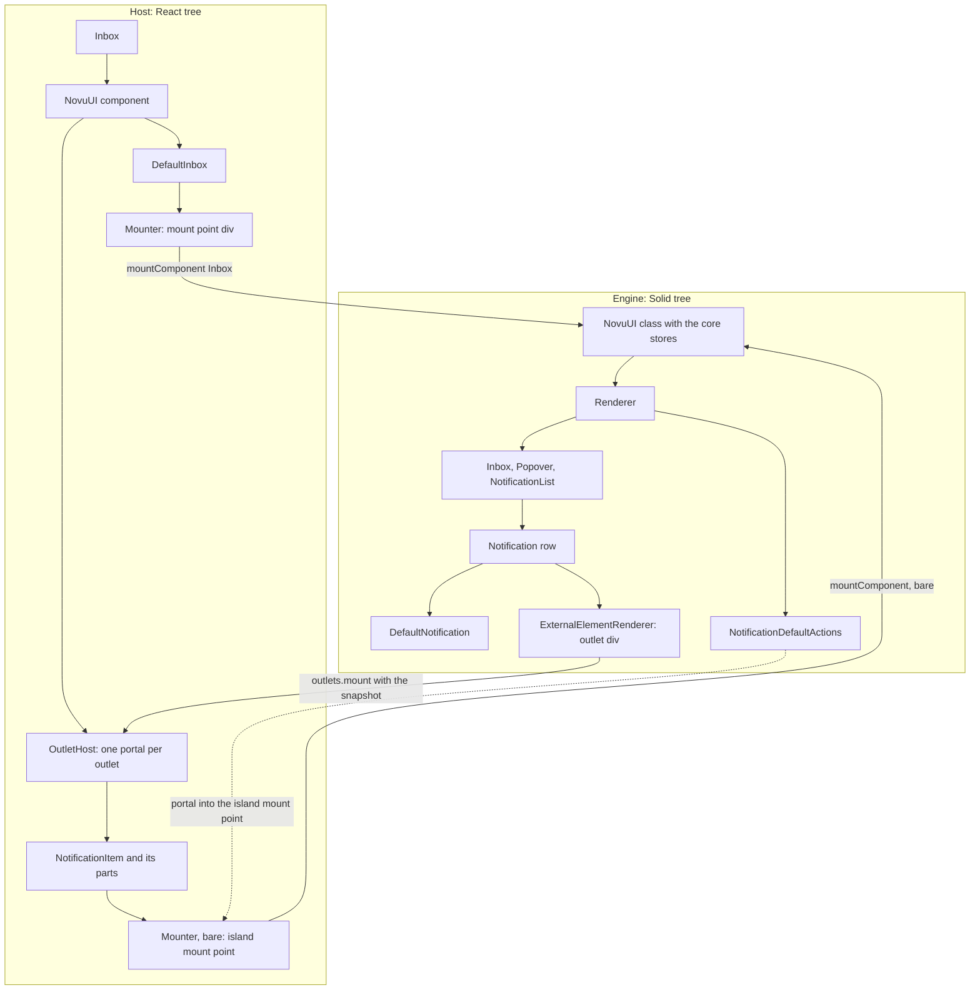
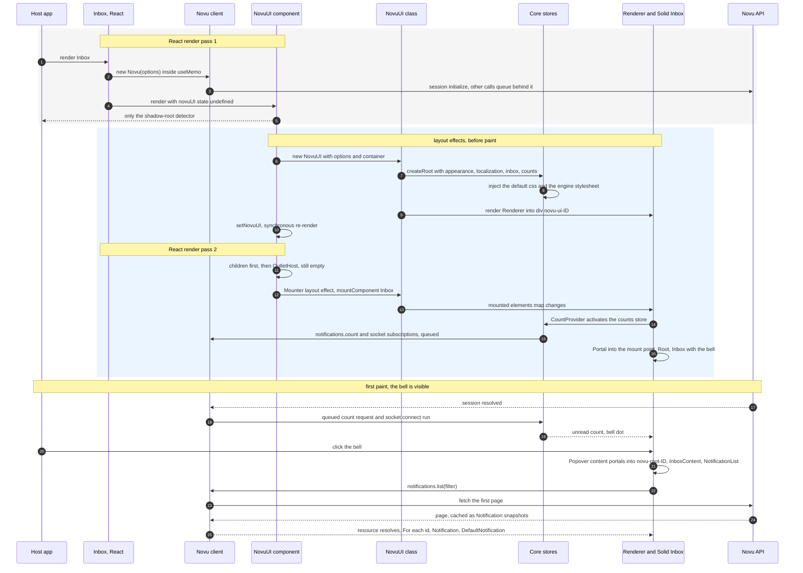
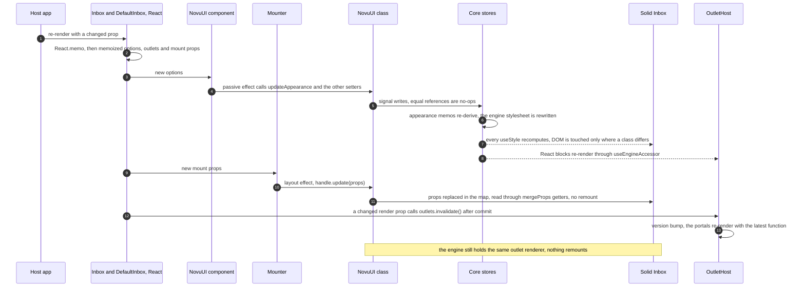
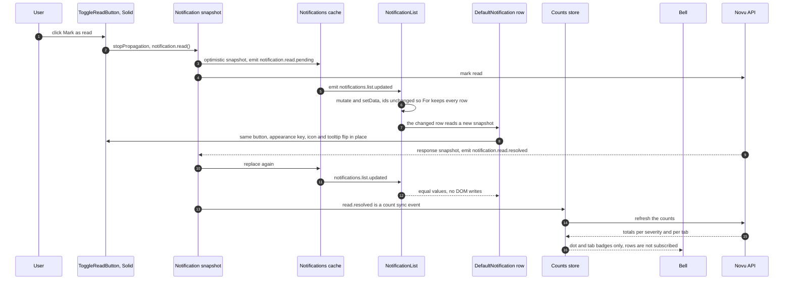
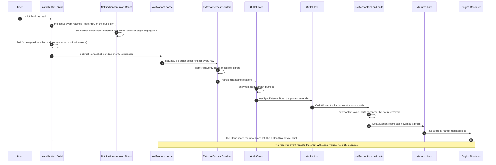
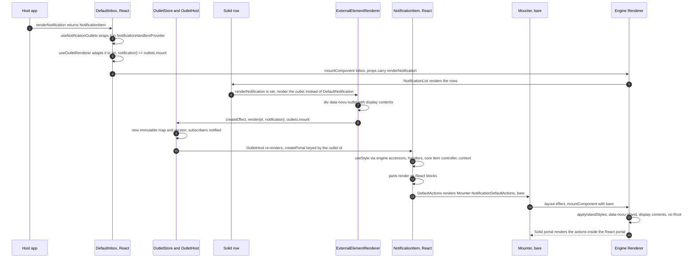

# Inbox rendering flows

How the React host (`@novu/react`) and the Solid engine (`@novu/js/ui`) render the Inbox together, step by step, and which DOM each side owns. Terms follow the glossary in [`../CONTEXT.md`](../CONTEXT.md); the decisions behind the design are recorded in the [ADRs](./adr) and the [rendering plan](./inbox-rendering-plan.md).

Three flows are covered:

1. [First render](#1-first-render): `<Inbox />` from the first React render pass to the first open of the popover.
2. [Updates](#2-updates): a host re-render, a change that starts inside the engine, and a change that reaches a host-rendered item.
3. [A custom notification item](#3-a-custom-notification-item): `renderNotification` with `NotificationItem`, blocks and islands.

Paths are relative to the repository root. `react/` stands for `packages/react/src`, `js/` for `packages/js/src`.

## The cast

| Layer | Package | Pieces that matter for rendering |
| --- | --- | --- |
| Client | `@novu/js` | `Novu` (HTTP client, session, event emitter, socket), the `Notifications` module and its cache, `Notification` snapshots |
| Core | `@novu/js/ui-core` | the stores `appearance`, `localization`, `inbox`, `counts`; `resolveStyle` and the style tables; the item controller and `isInsideIsland`; the bridge types `MountHandle`, `OutletHandle`, `OutletCleanup`; `subscribeAccessor` |
| Engine | `@novu/js/ui` | the `NovuUI` class; `Renderer` with `InboxComponentsRenderer`, `MountedComponent` and `Root`; the Solid `Inbox`, `NotificationList`, `Notification`, `DefaultNotification`, `ExternalElementRenderer`; the islands `NotificationDefaultActions` and `NotificationCustomActions` |
| Host | `@novu/react` | `NovuProvider`, `Inbox`, the React `NovuUI` component, `DefaultInbox`, `Mounter`, `OutletStore` and `OutletHost`, `useOutletRenderer` and `useNotificationOutlets`, `NotificationItem` and its parts, `useEngineStores` and `useStyle` |

Two rules explain most of what follows:

- The host mounts the engine into a **mount point**, and the engine hands **outlets** back to the host. Both directions go through the bridge: a handle with `update` and `unmount`, and immutable notification snapshots ([ADR 0002](./adr/0002-push-updates-and-immutable-snapshots-across-the-bridge.md)).
- Everything the engine and a host-native **block** share lives in the core, so a block resolves the same classes and runs the same behaviour wherever it is rendered ([ADR 0001](./adr/0001-hybrid-engine-with-host-native-blocks.md), [ADR 0003](./adr/0003-shared-inbox-state-lives-in-the-core.md)).



Solid and React never render into the same element. The engine renders into the host's mount points, the host renders into the engine's outlets, and an island is the engine rendering into a mount point that sits inside such an outlet.

## 1. First render

The default `<Inbox />` with no render props. Everything up to the first paint happens in two React render passes and their layout effects, so the bell is on screen in the first frame. The notification list is not rendered, and not fetched, until the popover opens.



### Step by step

**React render pass 1.**

1. `Inbox` (`react/components/Inbox.tsx`) memoizes the subscriber and, without an outer `NovuProvider`, wraps itself in `InternalNovuProvider`. That provider creates the `Novu` client in a `useMemo`, so the client exists during render. The client constructor initializes the session at once (`js/session/session.ts`), and every module call goes through `callWithSession`, which queues until `session.initialize.resolved`. The socket is created but does not connect until the first socket event is subscribed.
2. `InboxChild` memoizes the engine options and renders `<NovuUI options novu>` with `DefaultInbox` as its child.
3. The React `NovuUI` component (`react/components/NovuUI.tsx`) owns one `OutletStore`, adapts host icon renderers into engine icon renderers that call `outlets.mount`, and keeps the engine instance in state. In this pass the instance is still `undefined`, so it renders only the shadow-root detector and none of its children.

**Layout effects of pass 1, before paint.**

4. A layout effect constructs the engine `NovuUI` class (`js/ui/novuUI.tsx`) with the options and the detected container. The constructor creates the signals for appearance, localization, options and tabs, then `createRoot` with the four core stores. The appearance store injects two `<style>` elements into the document head, or into the host's shadow root when the detector found one: the default css once per document, and one stylesheet per engine instance with the variables and the css-in-js rules. The engine never creates a shadow root of its own.
5. The constructor renders `<Renderer />` (`js/ui/components/Renderer.tsx`) into a `div#novu-ui-ID` appended to the container or to `document.body`. `Renderer` wraps everything in providers fed from `novuUI.stores`. With no mounted elements it renders nothing, and the counts store stays inert.
6. `setNovuUI(instance)` inside the layout effect re-renders the React `NovuUI` synchronously, still before paint.

**React render pass 2.**

7. `NovuUI` now provides `{ novuUI, outlets, icons }` and renders its children first and `OutletHost` after them, so any render prop registered by a child is current when the outlets render.
8. `DefaultInbox` runs `useNotificationOutlets(props)`. With no render props every outlet renderer is `undefined`. It builds the mount props and renders `<Mounter name="Inbox" props={mountProps} />`, a plain `<div ref>` because the mount is not bare.
9. `OutletHost` subscribes to the outlet store with `useSyncExternalStore`. The map is empty, so it renders nothing.

**Layout effects of pass 2, still before paint.**

10. The `Mounter` layout effect calls `novuUI.mountComponent({ name: 'Inbox', element, props })`, which adds the element to the engine's mounted-elements map and returns a `MountHandle`. A second layout effect writes the props once more on mount, which is redundant but harmless.
11. Solid reacts synchronously. `InboxComponentsRenderer` now has one element, so it renders `CountProvider`, whose mount calls `counts.activate()`. The counts store fires the first `notifications.count` request and subscribes to the socket events, all queued behind the session.
12. `For each={elements}` renders a Solid `Portal` into the React mount div. The portal adds one container div, then `MountedComponent` renders `Root`: the branding comment and `div#novu-root-ID` with the `nv-root` class.
13. The Solid `Inbox` (`js/ui/components/Inbox.tsx`) renders `Popover.Root` with the trigger button and the bell. `Bell` reads `useUnreadCount()` and renders the default `BellContainer` with the default svg icon, since no host icon is registered. The popover starts closed, so `Popover.Content` renders nothing yet.

**After paint.**

14. The passive effect of the React `NovuUI` calls the `update*` methods of the engine with the same memoized values, which are no-ops.
15. The session request resolves. The queued count request and the socket connect run, the inbox store sets its session flags (branding, dev mode, snooze, keyless), and the bell shows the unread count from the session until the per-severity counts arrive.

**First open.**

16. Clicking the trigger toggles the inbox store's `isOpened`. `Popover.Content` portals into the closest `#novu-root-ID`, which is inside the host's React subtree rather than `document.body`, and renders `InboxContent` with the header, the list and the footer.
17. `NotificationList` (`js/ui/components/Notification/NotificationList.tsx`) creates the infinite-scroll resource, which calls `notifications.list` on the client. The client checks its cache, fetches the first page, wraps every item in a `Notification` snapshot, stores the page in the cache and emits `notifications.list.resolved`. The list shows skeletons meanwhile and also subscribes to `notifications.list.updated` to mutate its data when the cache changes later.
18. Rows render from `<For each={ids()}>`, keyed by notification id. Each row is a wrapper div with a visibility observer and a `Notification` component. Without `renderNotification` it renders `DefaultNotification`, the Solid item: the root anchor, the severity bar, the avatar, the subject and body markdown, the default actions, the custom actions, the date and the dot. In this path the actions are ordinary Solid children of the row, not islands.

### DOM after the first open

```text
document.head
├─ <style id="novu-default-css">            engine, once per document or shadow root
└─ <style id="ENGINE_ID">                    engine, variables and css-in-js rules
document.body
├─ host app
│  ├─ <div data-shadow-root-detector>        React, NovuUI component
│  └─ <div>                                  React, the Inbox mount point (Mounter)
│     └─ <div>                               Solid, Portal container
│        ├─ <!-- Powered by Novu -->         engine, Root
│        └─ <div id="novu-root-ID" class="nv-root novu ID …">
│           ├─ <button class="nv-inbox__popoverTrigger …">
│           │  └─ <span class="nv-bellContainer …">  glow, bell icon, dot when unread
│           ├─ <div style="display: none">   engine, Portal anchor
│           └─ <div>                         engine, Portal container of the popover content
│              └─ <div class="nv-inbox__popoverContent …" data-open="true">
│                 └─ <div class="nv-inboxContent …">
│                    ├─ <div class="nv-inboxHeader …">
│                    ├─ <div class="nv-notificationListContainer …">
│                    │  └─ <div class="nv-notificationList …">
│                    │     ├─ <div>                          row wrapper with the visibility observer
│                    │     │  └─ <a class="nv-notification …">   DefaultNotification, Solid
│                    │     │     ├─ <div class="nv-notificationBar …">
│                    │     │     ├─  or the fallback div
│                    │     │     ├─ <div class="nv-notificationContent …">
│                    │     │     │  ├─ <div class="nv-notificationTextContainer">  subject and body
│                    │     │     │  ├─ <div class="nv-notificationDefaultActions …">  inline Solid buttons
│                    │     │     │  ├─ <div class="nv-notificationCustomActions …">
│                    │     │     │  └─ <div class="nv-notificationDate …">
│                    │     │     └─ dot container
│                    │     ├─ more rows
│                    │     └─ <div>                          scroll sentinel with skeletons
│                    └─ <div class="nv-inboxFooter …">
└─ <div id="novu-ui-ID">                     engine, Solid root, holds only portal markers
```

Everything below the React mount point is Solid-owned DOM. React owns the detector and the mount point. Outlets, and therefore React portals, appear only where the host registered a render prop or a custom icon.

## 2. Updates

Three things change a rendered Inbox: the host re-renders, data changes inside the engine, and data changes that have to reach a host-rendered item. The engine is never rebuilt for any of them.

### 2a. The host re-renders



1. `Inbox` and `InboxChild` are wrapped in `React.memo`, so they re-run only when a prop identity changed. Inline objects and arrows in the host defeat this, see [known edges](#known-edges).
2. `InboxChild` recomputes the engine options from its dependency list and hands them to the React `NovuUI` component.
3. The React `NovuUI` builds the engine once, in a layout effect with an empty dependency list, and unmounts it when React unmounts the component. A re-render never recreates the engine. When the `appearance` identity changes, `adaptAppearanceForJs` re-wraps the host icon renderers. A passive effect then calls every setter of the engine: `updateContainer`, `updateAppearance`, `updateLocalization`, `updateTabs`, `updateOptions`, `updateRouterPush`, `updateNovu`.
4. Each setter writes a Solid signal, so an unchanged reference is a no-op. A new appearance makes the appearance store re-derive `elements` and the css-in-js class map, and an effect rewrites the engine's `<style>` element. Every Solid `useStyle` computation re-runs, and the compiled attribute effects write the DOM only where the class string differs. React blocks re-render for the same reason, because `useStyle` on the host subscribes to those accessors through `useEngineAccessor`. Localization follows the same path through the `dictionary` memo.
5. `DefaultInbox` memoizes the handlers, the wrapped `renderNotification`, the outlet bag and the mount props, so only the props that actually changed produce new values.
6. `Mounter` mounts on `[novuUI, name, bare]` only, so a prop change never remounts. Its second layout effect pushes `handle.update(props)`, which replaces the record in a new mounted-elements map.
7. In `Renderer` the memos rebuild the element arrays, but `For` is keyed by element identity, so no portal is recreated. `MountedComponent` spreads the props through a `mergeProps` getter, so the Solid `Inbox` reads the new values live, with no remount.
8. Render-prop identity is absorbed on the host side. `useOutletRenderer` keeps the latest function in a ref and returns a renderer memoized on the store and the presence of a renderer, so the engine sees one function per outlet kind for the lifetime of the component. A new inline arrow triggers `outlets.invalidate()` after commit, the store bumps its version, `OutletHost` re-renders the portals and each `OutletContent` calls the latest function, reconciling the new output in place. In the engine, `ExternalElementRenderer` sees the same `render` and the same args and does nothing.
9. Client identity is the one thing a host re-render can rebuild. `InternalNovuProvider` memoizes `new Novu(...)` on the identity of `subscriber`, `context` and `socketOptions`. Inline objects for these create a new client per render, which starts a new session, flips the engine's `novu` store, refetches the list and the counts and resubscribes the socket effects.

### 2b. A change inside the engine: mark as read on a default row



1. The click lands on `ToggleReadButton` (`js/ui/components/Notification/NotificationActions.tsx`). It stops propagation and awaits `notification.read()`. Solid's delegated handler honours the stopped event, so the row's anchor handler does not run.
2. `read()` (`js/notifications/notification.ts`, helper in `js/notifications/helpers.ts`) builds an optimistic snapshot with `isRead: true` and a `readAt`, emits `notification.read.pending` synchronously and sends the request.
3. The `NotificationsCache` listens to the pending and resolved events. It replaces the instance in every bucket the notification still matches, or removes it from a bucket it no longer matches, such as the unread-only filter, and emits `notifications.list.updated` with the aggregated result.
4. The list hook (`js/ui/api/hooks/useNotifications.ts`) checks `isSameFilter` and mutates the infinite-scroll resource, which sets the list data.
5. `NotificationList` keys `For` by id. For the default status the ids do not change, so every row keeps its DOM. Every row's prop computations re-run because they read the data signal, but only the changed row produces different values: the root class through `isClickable()`, the dot's `Show`, and inside `NotificationDefaultActions` the `ToggleReadButton` flips its appearance key, icon and tooltip text in place. `NotificationCustomActions` receives a new `primaryAction` object, and its non-keyed `Show` keeps the buttons.
6. The request resolves into a third instance and `notification.read.resolved` runs steps 3 to 5 again. Every derived value is equal, so nothing is written to the DOM. On a failed request the resolved event carries the error and no data, and the cache keeps the optimistic snapshot.
7. `notification.read.resolved` is one of the count-sync events, so the counts store calls `refreshCounts()`, guarded by a generation counter, and writes the bell total and the per-tab counts. The subscribers are the bell dot and the tab badges. Rows read only the new-messages counter, which `refreshCounts` never writes, so the counts refresh cannot touch a row.
8. A socket `notification_received` event either prepends the notification into the bucket through the cache, when the bucket is nearly empty or the inbox is closed, or only increments the new-messages counter for the banner while the list is open. In the first case `For` inserts one row and the existing rows keep their DOM. Then the counts refresh.

### 2c. The same change reaching a host-rendered item



1. The button lives in the `NotificationDefaultActions` island. React listens on the outlet div because it is a portal container, and Solid listens on `document`, so the React root's `onClick` runs first. The core controller sees `isInsideIsland` and returns without acting and without stopping propagation. Solid's delegated handler then runs the button's handler, which calls `read()`.
2. The pending event goes through the cache, the list hook and `setData` exactly as in 2b.
3. The Solid row is an `ExternalElementRenderer`. Its effect runs for every row, but the renderer is the stable host function, so only `sameArgs` decides. The changed row calls `handle.update(notification)`, the others do nothing.
4. `OutletStore` replaces that entry, keeps the other entry objects and publishes a new snapshot with the next version.
5. `OutletHost` re-renders through `useSyncExternalStore` and renders every portal again. Each `OutletContent` calls the latest render function, which wraps the host's JSX in `NotificationHandlersProvider`.
6. `NotificationItem` refreshes its handler refs, keeps its controller, and provides a new context value because the snapshot changed. The parts re-render and React reconciles their DOM, which removes the dot. `DefaultActions` computes new mount props, the `Mounter` layout effect pushes `handle.update(props)`, the engine replaces the props in its map, `For` keeps the same element, and the island reads the new snapshot through its `mergeProps` getter. `ToggleReadButton` flips in place. `CustomActions` pushes the same way. Because the push happens in a layout effect, the island changes before paint, in the same frame as the dot removal.
7. The resolved event repeats the chain with the server's instance: a second publish, a second React commit, two more island pushes, and no DOM changes since every value is equal. The counts refresh reaches the bell only, as in 2b.

What one click costs, for a list of N host-rendered rows:

| Stage | Count |
| --- | --- |
| Engine data updates (pending, resolved) | 2 |
| Outlet publishes and React commits | 2 |
| Outlet effect runs per update | N, with 1 `handle.update` |
| `OutletContent` re-renders per commit | N |
| Island prop pushes per commit, changed row only | 2, default and custom actions |
| Counts refresh | 1, two count requests, bell and tab badges only |

## 3. A custom notification item

The host passes `renderNotification`, usually returning `NotificationItem`. The engine keeps rendering the shell and the list, hands each row to the host as an outlet, and comes back into the host's item only for the islands.



### Step by step

**Host side: from a render prop to an outlet renderer.**

1. `DefaultInbox` calls `useNotificationOutlets(props)` (`react/hooks/internal/useNotificationOutlets.tsx`). It wraps `renderNotification` so that its output renders inside `NotificationHandlersProvider`, which carries `onNotificationClick`, `onPrimaryActionClick` and `onSecondaryActionClick` down to the item. When `renderNotification` is set, the part renderers (`renderAvatar`, `renderSubject`, `renderBody`, `renderDefaultActions`, `renderCustomActions`) are dropped, since the item owns them now.
2. `useOutletRenderer` (`react/hooks/internal/useOutletRenderer.ts`) turns the React render function into the engine signature `(el, ...args) => outlets.mount(el, latest, args)`. The function the engine receives is memoized on the store and the presence of a renderer, so an inline arrow that changes identity on every host render never reaches the engine. A changed render prop only updates a ref and calls `outlets.invalidate()` in a layout effect, which re-renders the existing portals with the new function.
3. The mount props carry `renderNotification` into the engine through `Mounter` and `mountComponent`, exactly like the first-render flow.

**Engine side: the row becomes an outlet.**

4. The Solid `Notification` (`js/ui/components/Notification/Notification.tsx`) checks `props.renderNotification`. When set, it renders `<ExternalElementRenderer render={renderNotification()} args={[notification]} />` instead of `DefaultNotification`.
5. `ExternalElementRenderer` (`js/ui/components/ExternalElementRenderer.tsx`) renders `<div data-novu-outlet="nv-outlet-N" style="display: contents">`. Its `createEffect` calls `render(ref, notification)` and normalizes the result with `toHandle`: an `OutletHandle` with `update` is kept for in-place updates, a bare cleanup function is wrapped so the row remounts on every change. The effect unmounts on cleanup.
6. `OutletStore.mount` (`react/context/OutletStore.ts`) reads the id from `el.dataset.novuOutlet`, replaces its immutable map, bumps the version and notifies subscribers. It returns the handle whose `update` replaces the entry's args and whose `unmount` removes the entry.
7. `OutletHost` (`react/components/OutletHost.tsx`) re-renders through `useSyncExternalStore` and renders `createPortal(<OutletContent entry />, entry.el, entry.id)` for each entry. `OutletContent` calls `entry.render(...entry.args)`. In the React tree the item lives under `NovuUI` next to `DefaultInbox`, so `useNovuUI()` and any host providers above `<Inbox>` are visible to it. In the DOM it lives inside the engine's row.

**Inside the item: blocks on the core.**

8. `NotificationItem` (`react/components/notification-item/NotificationItem.tsx`) takes the handlers from its own props and falls back to the inherited ones. It creates the core item controller once per inbox store with `createNotificationItemController` (`js/ui/core/item/controller.ts`), which reads the latest handlers through refs and navigates through the inbox store's `navigate`.
9. The root renders an `<a>` styled with `notificationItemStyles.root` and the severity key tables, the same tables `DefaultNotification` uses. `useStyle` (`react/hooks/internal/useEngineStores.ts`) subscribes to the appearance store's `elements` and `appearanceKeyToCssInJsClass` through `useEngineAccessor`, which wraps the core `subscribeAccessor` in `useSyncExternalStore`, and calls the core `resolveStyle`. A block therefore resolves the same classes as the engine, including the css-in-js classes.
10. The root provides `{ notification, handlers, renderers }` to its parts. Without children it renders `DefaultArrangement`, the built-in order of parts. With children it renders the root, the severity bar and the children, which is how a host rearranges the item.
11. Each part is plain React. It honours the matching `renderX` prop first, then renders its markup with `useStyle` and `context: { notification }`, so host appearance callbacks receive the snapshot.

**Islands: the engine inside the host's item.**

12. `DefaultActions` and `CustomActions` (`react/components/notification-item/parts/Actions.tsx`) render `<Mounter name="NotificationDefaultActions" props={{ notification }} bare />` and the custom-actions equivalent, which also carries the two action handlers. A bare `Mounter` renders a `<div style="display: contents">`.
13. The `Mounter` layout effect calls `mountComponent` with `bare: true`. In `Renderer`, `applyIslandStyles` marks the mount point and Solid's own portal container with `data-novu-island` and `display: contents`, and `MountedComponent` skips `Root`, so the island inherits the providers and the root of the engine tree it is portaled from.
14. `NotificationDefaultActions` reads `props.notification` reactively. A later `handle.update({ notification })` replaces the entry's props and the reactive spread updates the buttons in place.
15. The tooltips, the snooze dropdown and the date picker portal into the closest `#novu-root-ID`, found by walking up the DOM from the island. The outlet div sits inside the engine root, so the lookup succeeds.

**The click boundary.** The React root's `onClick` calls the core controller for every click. The controller returns early when `isInsideIsland(target)` is true and otherwise stops propagation, marks the notification read, calls `onNotificationClick` and navigates. Because React listens on its root container and Solid delegates to `document`, the island's own button handler runs afterwards on the same native event. Without the boundary the React handler would mark the notification read before the archive button could act ([ADR 0004](./adr/0004-islands-are-portals-inside-the-engine-root-with-a-click-boundary.md)).

### DOM of a custom item

```text
<div>                                              React, the Inbox mount point
└─ <div>                                           Solid, Portal container
   └─ <div id="novu-root-ID" class="nv-root …">    engine Root
      ├─ <button class="nv-inbox__popoverTrigger …">   bell
      └─ <div>                                     Portal container of the popover content
         └─ … <div class="nv-notificationList …">
            └─ <div>                               row wrapper, Solid
               └─ <div data-novu-outlet="nv-outlet-N" style="display: contents">   outlet, React portal target
                  └─ <a class="nv-notification …">          NotificationItem root, React
                     ├─ <div class="nv-notificationBar …">   React
                     ├─  Avatar block, React
                     ├─ <div class="nv-notificationContent …">
                     │  ├─ <div class="nv-notificationTextContainer">  Subject and Body blocks, React
                     │  ├─ <div data-novu-island style="display: contents">   DefaultActions mount point, React
                     │  │  └─ <div style="display: contents">               Solid Portal container
                     │  │     └─ <div class="nv-notificationDefaultActions …">  island buttons, Solid
                     │  ├─ <div data-novu-island style="display: contents">   CustomActions mount point, React
                     │  │  └─ <div style="display: contents">
                     │  │     └─ <div class="nv-notificationCustomActions …">  absent without actions
                     │  └─ <div class="nv-notificationDate …">   Date block, React
                     └─ dot container                             Dot block, React
      (the tooltip, dropdown and date-picker portals of the islands are appended to novu-root-ID)
```

### Variations

- `renderNotification` may return any JSX. Plain markup renders fine, but only `NotificationItem` brings the click handling, the read marking and the navigation.
- A vanilla host (`@novu/js/ui` without React) implements the same outlet contract directly: `renderNotification: (el, notification) => OutletCleanup`. Returning an `OutletHandle` with `update` gives in-place updates; returning a bare cleanup function means unmount and mount on every change.
- `NotificationItem` is supported inside an engine root only. Its islands look for `#novu-root-ID` in their ancestors, and the `Root` div scopes the styles.

## Known edges

Facts about the current implementation that shape the flows above. None of them is a design rule; each is a candidate for a follow-up.

- The `Novu` client is created in a `useMemo` during render, and its constructor starts the session request. Unstable `subscriber`, `context` or `socketOptions` objects rebuild the client on every host render, with a new session, a list refetch, a counts refetch and a socket resubscription.
- An inline `appearance` object rewrites the engine stylesheet, recomputes every `useStyle` and re-renders every React block on each host render. An unstable `icons` object churns the `NovuUI` context value and re-renders every consumer of `useNovuUI`.
- The options memo in `InboxChild` omits `routerPush` and `defaultSchedule`, so a change of those alone is not pushed to the engine.
- `OutletContent` is not memoized, so every outlet publish re-renders every outlet's React subtree. Unchanged entries keep their identity, and the memos below them hold, so the cost is render work only. A `React.memo` on `OutletContent` would skip them.
- The `Mounter` props effect also runs on the first commit, producing one redundant `handle.update` per mount point.
- Every engine data update re-runs the prop computations of all rows. Solid's value-comparing attribute effects and the outlet's `sameArgs` confine the DOM and outlet traffic to the changed row.
- A failed read, archive or snooze request never reverts the optimistic snapshot.
- Under the unread-only filter a read row leaves its bucket on the pending event, so the row, and a host-rendered item inside it, unmounts before the request answers.
- Two public types share a name up to one letter: React's `NotificationsRenderer` is `(notification) => ReactNode`, the engine's `NotificationRenderer` is `(el, notification) => OutletCleanup`.
- The engine's `Notifications` and `Preferences` mount wrappers strip the part renderers when `renderNotification` is set, duplicating what `useNotificationOutlets` already does on the host.
