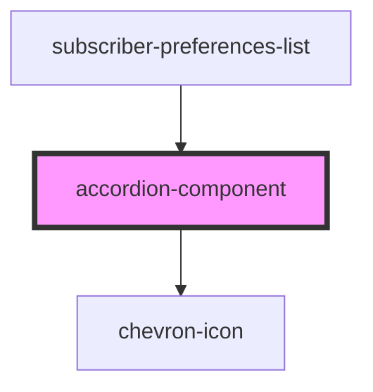

# accordion-component

<!-- Auto Generated Below -->

## Properties

| Property     | Attribute      | Description | Type      | Default     |
| ------------ | -------------- | ----------- | --------- | ----------- |
| `body`       | --             |             | `Element` | `undefined` |
| `dataTestId` | `data-test-id` |             | `string`  | `undefined` |
| `header`     | --             |             | `Element` | `undefined` |

## Dependencies

### Used by

 - [subscriber-preferences-list](../user-preferences-tab)

### Depends on

- [chevron-icon](../icons)

### Graph

----------------------------------------------

*Built with [StencilJS](https://stenciljs.com/)*
