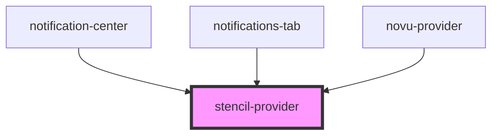

# context-provider

<!-- Auto Generated Below -->

## Properties

| Property          | Attribute      | Description | Type                      | Default     |
| ----------------- | -------------- | ----------- | ------------------------- | ----------- |
| `STENCIL_CONTEXT` | --             |             | `{ [key: string]: any; }` | `undefined` |
| `contextName`     | `context-name` |             | `string`                  | `undefined` |

## Events

| Event           | Description | Type               |
| --------------- | ----------- | ------------------ |
| `mountConsumer` |             | `CustomEvent<any>` |

## Dependencies

### Used by

 - [notification-center](../notification-center)
 - [notifications-tab](../notifications-tab)
 - [novu-provider](../novu-provider)

### Graph

----------------------------------------------

*Built with [StencilJS](https://stenciljs.com/)*
