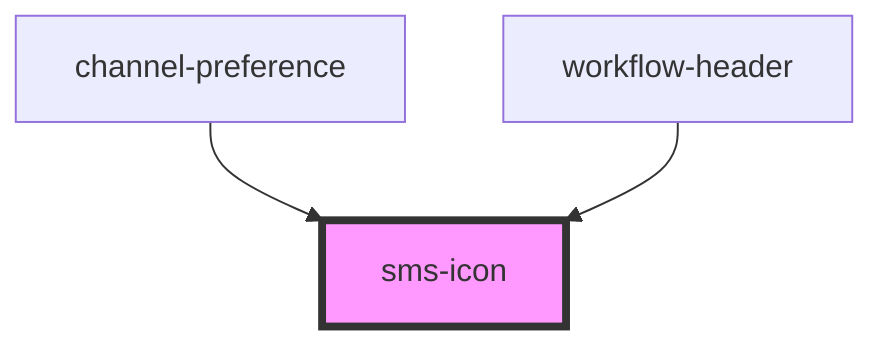

# sms-icon

<!-- Auto Generated Below -->

## Properties

| Property | Attribute | Description | Type     | Default     |
| -------- | --------- | ----------- | -------- | ----------- |
| `height` | `height`  |             | `string` | `undefined` |
| `width`  | `width`   |             | `string` | `undefined` |

## Dependencies

### Used by

 - [channel-preference](../user-preferences-tab)
 - [workflow-header](../user-preferences-tab)

### Graph

----------------------------------------------

*Built with [StencilJS](https://stenciljs.com/)*
