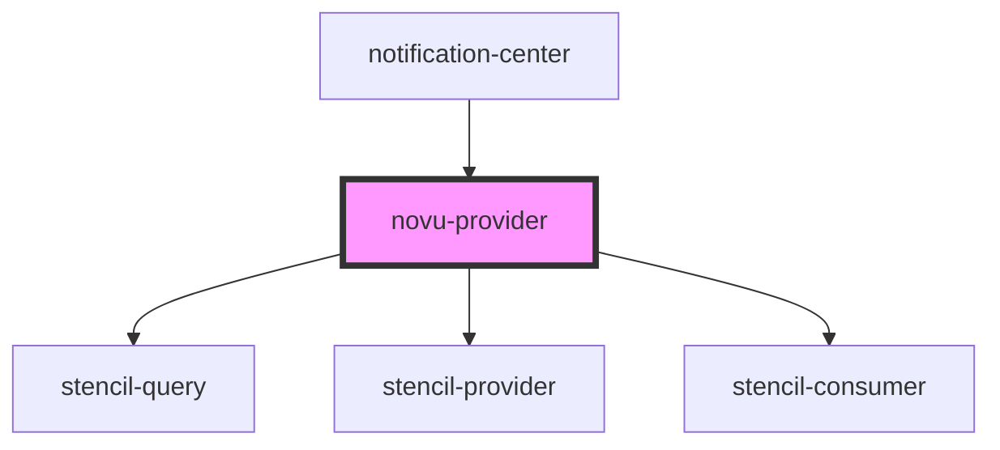

# novu-provider

<!-- Auto Generated Below -->

## Properties

| Property                | Attribute                | Description | Type                                | Default                          |
| ----------------------- | ------------------------ | ----------- | ----------------------------------- | -------------------------------- |
| `applicationIdentifier` | `application-identifier` |             | `string`                            | `undefined`                      |
| `backendUrl`            | `backend-url`            |             | `string`                            | `undefined`                      |
| `colorScheme`           | `color-scheme`           |             | `"dark" \| "light"`                 | `undefined`                      |
| `i18n`                  | `i-1-8n`                 |             | `ITranslationEntry \| I18NLanguage` | `undefined`                      |
| `socketUrl`             | `socket-url`             |             | `string`                            | `undefined`                      |
| `stores`                | --                       |             | `IStore[]`                          | `[{ storeId: 'default_store' }]` |
| `subscriberHash`        | `subscriber-hash`        |             | `string`                            | `undefined`                      |
| `subscriberId`          | `subscriber-id`          |             | `string`                            | `undefined`                      |

## Dependencies

### Used by

 - [notification-center](../notification-center)

### Depends on

- [stencil-query](../stencil-query)
- [stencil-provider](../context)
- [stencil-consumer](../context)

### Graph

----------------------------------------------

*Built with [StencilJS](https://stenciljs.com/)*
