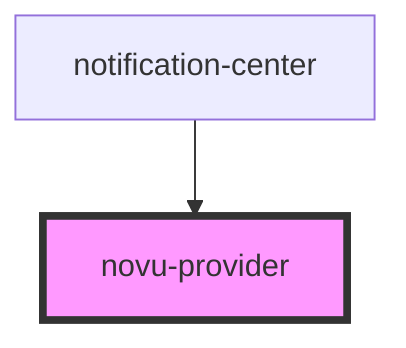

# novu-provider

<!-- Auto Generated Below -->

## Properties

| Property                | Attribute                | Description | Type                                                         | Default     |
| ----------------------- | ------------------------ | ----------- | ------------------------------------------------------------ | ----------- |
| `applicationIdentifier` | `application-identifier` |             | `string`                                                     | `undefined` |
| `backendUrl`            | `backend-url`            |             | `string`                                                     | `undefined` |
| `colorScheme`           | `color-scheme`           |             | `"dark" \| "light"`                                          | `undefined` |
| `i18n`                  | `i-1-8n`                 |             | `ITranslationEntry \| I18NLanguage`                          | `undefined` |
| `renderChildren`        | --                       |             | `(props: { organization: IOrganizationEntity; }) => Element` | `undefined` |
| `socketUrl`             | `socket-url`             |             | `string`                                                     | `undefined` |
| `stores`                | --                       |             | `IStore[]`                                                   | `undefined` |
| `subscriberHash`        | `subscriber-hash`        |             | `string`                                                     | `undefined` |
| `subscriberId`          | `subscriber-id`          |             | `string`                                                     | `undefined` |

## Dependencies

### Used by

 - [notification-center](../notification-center)

### Graph

----------------------------------------------

*Built with [StencilJS](https://stenciljs.com/)*
