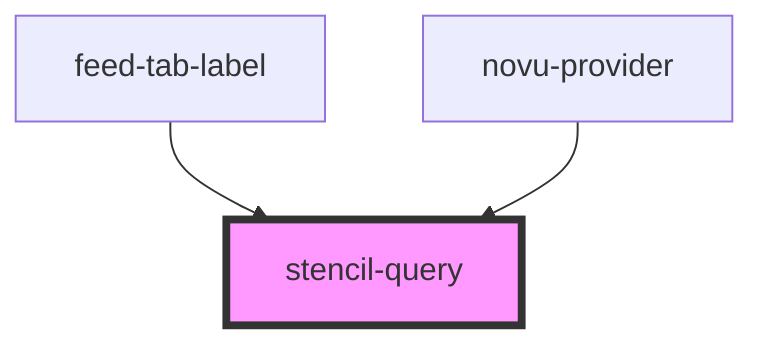

# stencil-query

<!-- Auto Generated Below -->

## Properties

| Property         | Attribute | Description | Type                                                                      | Default     |
| ---------------- | --------- | ----------- | ------------------------------------------------------------------------- | ----------- |
| `listen`         | --        |             | `(result: QueryObserverResult<unknown, unknown>) => void`                 | `undefined` |
| `options`        | --        |             | `QueryObserverOptions<unknown, unknown, unknown, unknown, QueryKey>`      | `undefined` |
| `renderChildren` | --        |             | `(result: QueryObserverResult<unknown, unknown>) => Element \| Element[]` | `undefined` |

## Dependencies

### Used by

 - [feed-tab-label](../notifications-tab)
 - [novu-provider](../novu-provider)

### Graph

----------------------------------------------

*Built with [StencilJS](https://stenciljs.com/)*
