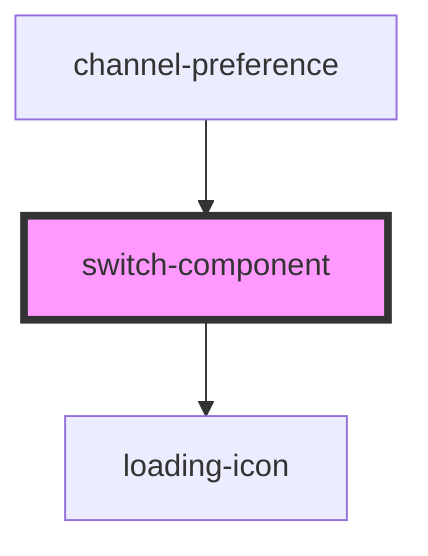

# switch-component

<!-- Auto Generated Below -->

## Properties

| Property     | Attribute      | Description | Type                 | Default     |
| ------------ | -------------- | ----------- | -------------------- | ----------- |
| `checked`    | `checked`      |             | `boolean`            | `undefined` |
| `dataTestId` | `data-test-id` |             | `string`             | `undefined` |
| `disabled`   | `disabled`     |             | `boolean`            | `undefined` |
| `onChange`   | --             |             | `(e: Event) => void` | `undefined` |

## Dependencies

### Used by

 - [channel-preference](../user-preferences-tab)

### Depends on

- [loading-icon](../icons)

### Graph

----------------------------------------------

*Built with [StencilJS](https://stenciljs.com/)*
