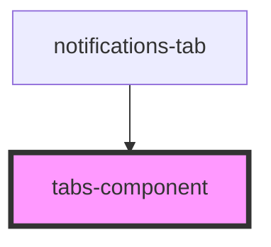

# tabs-component

<!-- Auto Generated Below -->

## Properties

| Property | Attribute | Description | Type        | Default     |
| -------- | --------- | ----------- | ----------- | ----------- |
| `active` | `active`  |             | `string`    | `undefined` |
| `tabs`   | --        |             | `Element[]` | `undefined` |

## Dependencies

### Used by

 - [notifications-tab](../notifications-tab)

### Graph

----------------------------------------------

*Built with [StencilJS](https://stenciljs.com/)*
