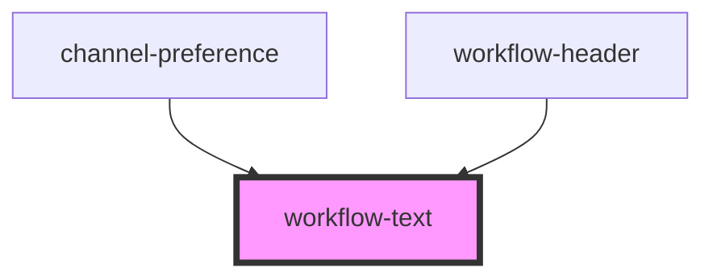

# workflow-text

<!-- Auto Generated Below -->

## Properties

| Property     | Attribute      | Description | Type           | Default     |
| ------------ | -------------- | ----------- | -------------- | ----------- |
| `color`      | `color`        |             | `string`       | `undefined` |
| `dataTestId` | `data-test-id` |             | `string`       | `undefined` |
| `size`       | `size`         |             | `"lg" \| "sm"` | `undefined` |
| `text`       | `text`         |             | `string`       | `undefined` |

## Dependencies

### Used by

 - [channel-preference](.)
 - [workflow-header](.)

### Graph

----------------------------------------------

*Built with [StencilJS](https://stenciljs.com/)*
