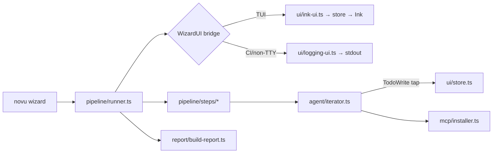

# Novu Wizard

`novu wizard` is an **autonomous** AI-assisted CLI wizard that integrates Novu (Inbox + workflows + triggers + subscribers) into an existing application using the Claude Agent SDK and the Novu MCP server.

> Status: **private beta** for enterprise customers. Requires the `IS_LLM_GATEWAY_ENABLED` LaunchDarkly flag and an enterprise tier subscription.

## Architecture



The CLI is observational: the imperative `pipeline/runner.ts` drives every step against the `WizardUI` bridge. The Ink screens never own business logic — they only `useStore` from the nanostores atom and render. The agent runs **end-to-end without prompting the user**; its progress is exposed through the agent's own `TodoWrite` calls (right pane) plus a fixed pipeline checklist (left pane).

The CLI never persists the secret key obtained via the browser flow — it lives only in process memory for the session. Subsequent runs always re-authorise.

## Files

### Driver layer
- `pipeline/runner.ts` — orchestrator: bootstrap → auth → skills → agent → MCP → report → outro.
- `pipeline/steps/*.ts` — one file per pipeline phase.

### Agent
- `agent/system-prompt.ts` — autonomous system prompt (TodoWrite-first, report.md-last).
- `agent/iterator.ts` — wraps `query()` from `@anthropic-ai/claude-agent-sdk`, configures the Novu MCP server, exposes the SDK iterator + interrupt/close.
- `agent/tool-labels.ts` — short labels for tool calls (used by live tail and chat overlay).

### Auth & detection
- `auth/device-auth.ts` — loopback HTTP server + browser open + state-validated callback.
- `auth/resolve-auth.ts` — picks `--secret-key`, `NOVU_SECRET_KEY`, or browser auth in that order.
- `context/detect-project.ts` — framework / package manager / TS / installed Novu deps detection.

### Skills
- `skills/install-skills.ts` + `skills/content/env-setup/` — at runtime, the official Novu skill set is fetched from [`novuhq/skills`](https://github.com/novuhq/skills) via `git clone --depth=1` (cached per-branch for 24h under `~/.cache/novu-wizard/skills/<branch>/`) and each skill folder under `<cache>/skills/` is copied into `<cwd>/.claude/skills/<name>/` (and into every other detected editor's skills dir). The `env-setup` gap-filler is bundled in `skills/content/`. Override the branch with `--skills-branch <ref>` (default: `main`).
- `skills/check-claude-settings.ts` — warns about `.claude/settings.json` keys that would override the wizard's LLM gateway auth.

### MCP installer
- `mcp/installer.ts` — single-pick installer that detects editors (Cursor, Claude Code, VS Code, Windsurf, Codex, Cline) and writes the Novu MCP server config into the chosen client's config file.
- `mcp/clients/*.ts` — per-editor adapters (one file each).
- `mcp/server-config.ts` — shared `mcp-remote <url> --header Authorization:Bearer <secret>` shape.

### Report
- `report/build-report.ts` — collates the trail into `novu-wizard-report.md` (Goal, Project context, Files changed, Workflows created, MCP installed, Next steps).

### UI
- `ui/store.ts` — nanostores `WizardStore` (phases, todos, trail, liveTail, overlay, gates).
- `ui/wizard-ui.ts` + `ui/ink-ui.ts` + `ui/logging-ui.ts` — `WizardUI` bridge interface and its two implementations.
- `ui/router.ts` + `ui/flows.ts` + `ui/screen-registry.tsx` — declarative pipeline of screens, resolved from the session snapshot.
- `ui/primitives/*` — vendored layout primitives (`ScreenContainer`, `SplitView`, `ProgressList`, `LoadingBox`, `PickerMenu`, etc.).
- `ui/screens/*` — `run-screen` (top header + 3-pane: pipeline ⨯ phase pane + live tail + footer; hosts the bootstrap countdown via `use-bootstrap-countdown` and swaps its right pane through bootstrap → auth → skills → agent → MCP picker → outro as `session.runPhase` advances). The driver awaits the `outro` gate before tearing the UI down so the outro pane stays visible until the user dismisses it.
- `ui/overlays/chat-overlay.tsx` — full-screen, read-only trail opened via `/chat`.
- `ui/components/{help,errors}-overlay.tsx` — kept overlays, rewired to read from the store.
- `ui/components/command-footer.tsx` + `ui/hooks/use-slash-input.ts` — small inline slash buffer (`/activity /help /errors`).
- `ui/index.tsx` — Ink mount + dark-mode background ANSI on startup, restored on exit.

### Analytics
- `analytics/events.ts` — per-screen events (`Wizard Screen Bootstrap`, `Wizard Screen Run`, `Wizard Screen Mcp`, `Wizard Screen Outro`, `Wizard Mcp Installed`, `Wizard Report Written`).

## CLI flags

- `--goal {full|inbox|workflows}` — default `full` (Inbox + workflows + triggers + subscribers).
- `--yes` — skip the bootstrap 5s countdown and auto-pick the first detected MCP editor.
- `--ci` — force the non-interactive logging UI: no Bootstrap countdown, no MCP picker, plain stdout.
- `--debug` — surface per-phase + per-todo durations in the UI and print a timing summary on exit (`[debug] timing summary` block, e.g. `total: 2m17s`, `phases: …`, `agent todos: …`). The always-on `MM:SS` clock pinned to the wizard header is independent of this flag — `--debug` only adds the granular breakdown.
- `--secret-key`, `--api-url`, `--dashboard-url`, `--mcp-url`, `--region`, `--model`, `--skills-branch` — unchanged.

## Manual end-to-end verification

> Pre-requisite: API and dashboard running locally with `NOVU_ENTERPRISE=true`, the `IS_LLM_GATEWAY_ENABLED` LaunchDarkly flag enabled for the test organization, and `NOVU_LLM_GATEWAY_ANTHROPIC_API_KEY` set on the API process.

1. Boot the API and dashboard:
   ```bash
   pnpm --filter @novu/api start:dev
   pnpm --filter @novu/dashboard dev
   ```
2. Scaffold a fresh Next.js app to integrate against:
   ```bash
   pnpm dlx create-next-app@latest wizard-target --ts --eslint --app --no-tailwind --no-src-dir --import-alias "@/*"
   cd wizard-target
   ```
3. Run wizard pointed at the local stack:
   ```bash
   pnpm --filter novu start:mode wizard --api-url http://127.0.0.1:3000 --dashboard-url http://localhost:4200
   ```
4. The browser opens `http://localhost:4200/cli/auth?cli_callback=http://127.0.0.1:<port>/callback&state=...&name=novu-wizard`. Sign in if needed, then click **Authorize**.
5. Watch the wizard run end-to-end. The agent will install packages, scaffold the Inbox, create workflows, wire trigger sites, and write `novu-wizard-report.md` in the project root.
6. After the run finishes, pick an editor in the MCP installer screen (or pass `--yes` to auto-pick the first detected one).
7. Start the sample app (`pnpm dev`), verify the inbox bell renders, then trigger the workflow and confirm a notification appears.

## Failure modes the agent should surface gracefully

- HTTP 403 from `/v1/llm/messages` → "Novu Wizard is currently in private beta for enterprise customers — reach out to your Novu CSM."
- HTTP 404 from `/v1/llm/messages` → "Novu Wizard is not available on this Novu deployment."
- 5-minute browser auth timeout → "Authorization timed out. Please try again."
- Render-time crash inside any screen → caught by `ScreenErrorBoundary`, the wizard transitions to the Outro screen with `OutroKind.Error`.
