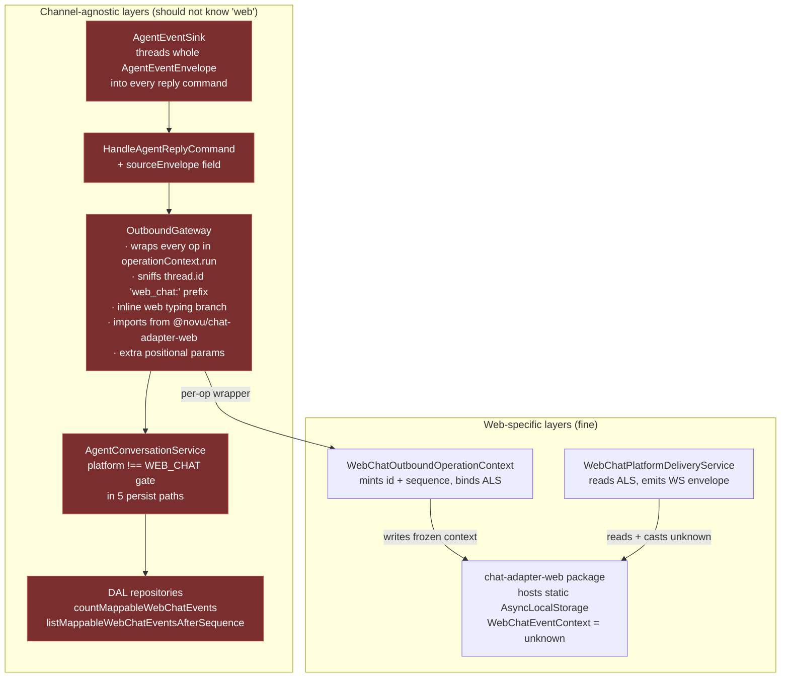
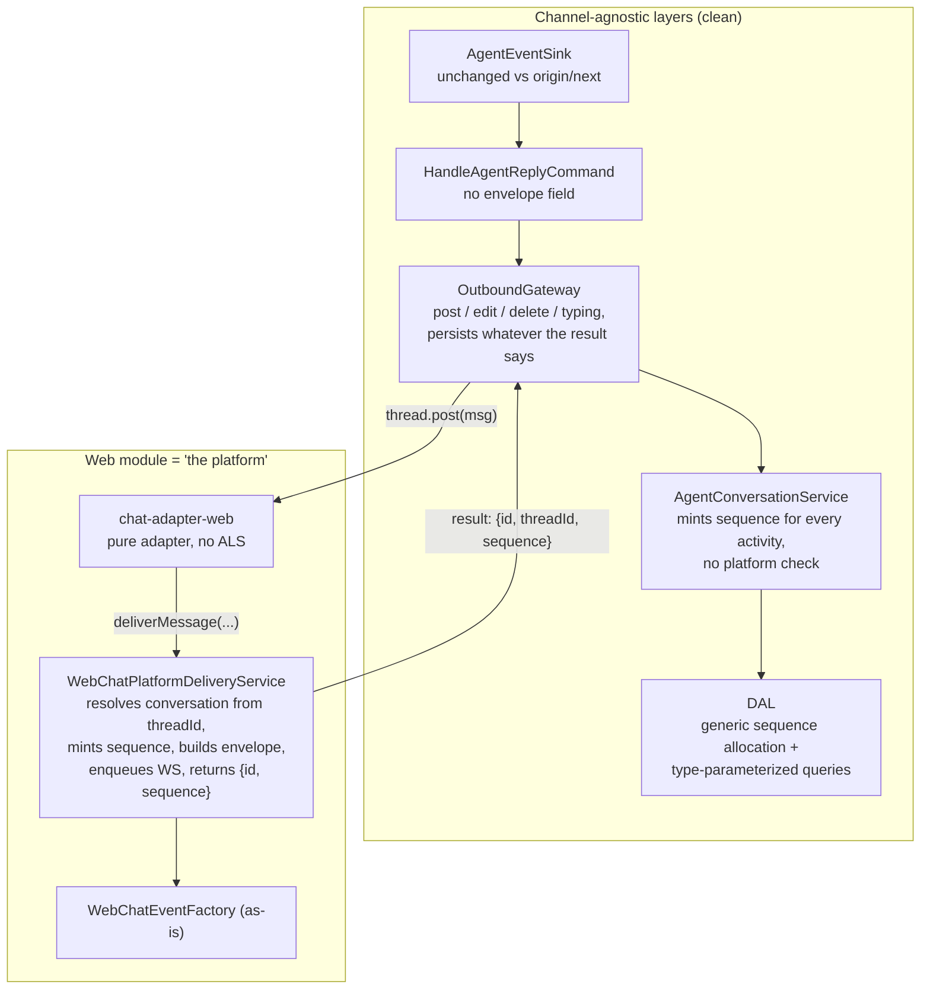
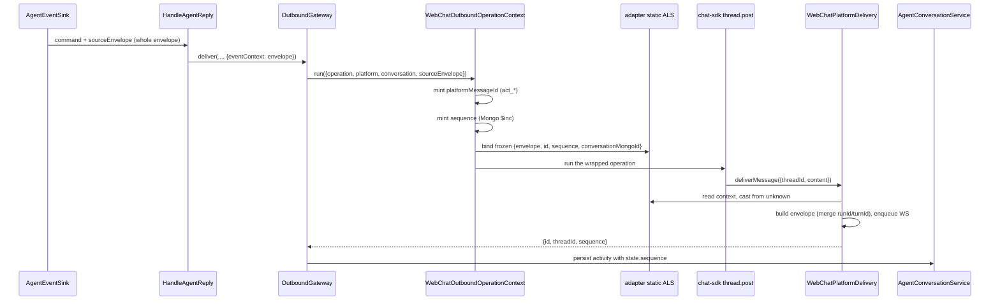
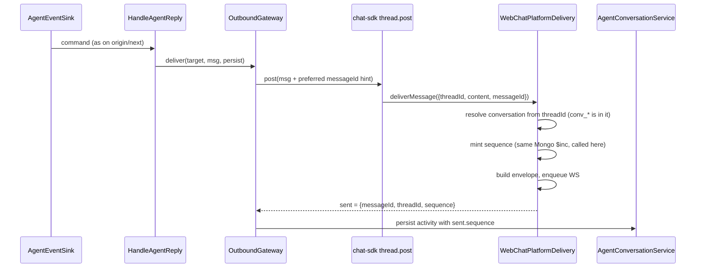
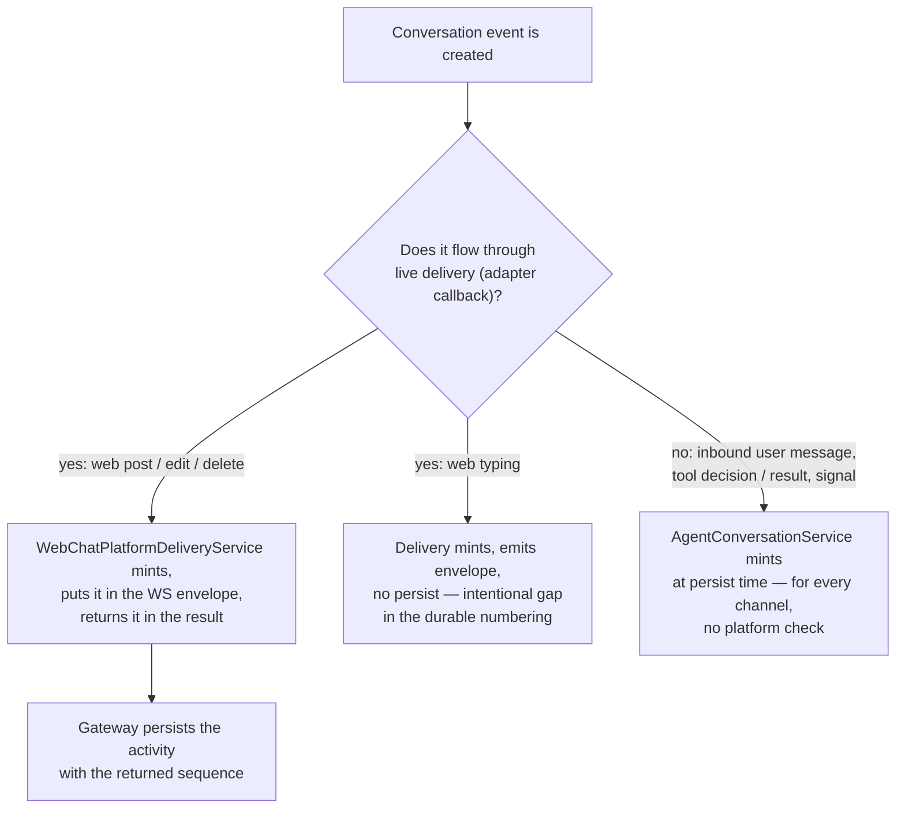
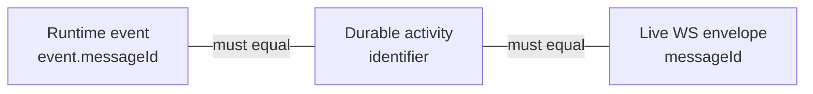

# NV-8456 — Web live delivery: invert who computes the platform concerns

Status: proposal (assessment of the current branch + reshape design)
Branch: `nv-8456-complete-adapter-owned-web-chat-live-delivery-and-durable...`

## The idea in one sentence

**Invert who computes the web-platform concerns.** Today the agnostic pipeline pre-computes web's live-delivery needs (sequence, message id, run correlation) *above* the gateway and smuggles them *down* through a context object and an AsyncLocalStorage. The proposal is to compute them *inside* the web delivery layer at delivery time and return them *up* through the normal result path — exactly the way Slack returns its `ts` and nobody upstream has to care.

## Why the current shape happened

For Slack/Telegram/email, the external platform is the live surface: the gateway posts, the platform renders, done. Web has no external platform — **Novu itself is the platform** (WS fan-out, sequence numbers, message ids). The branch solved this by teaching the layers above the adapter to prepare everything web needs before calling it. That's what produced the stitching: the needs are web's, but the code carrying them is everyone's.

## Where the leaks are today (assessment)

Ordered by severity:

1. **Envelope threading carries almost nothing.** `AgentEventSink` changed four handler signatures from `runId: string` to the whole `AgentEventEnvelope`; `HandleAgentReplyCommand` gained `sourceEnvelope`; `OutboundDeliveryOptions` gained `eventContext`; typing/delete gateway methods gained positional params. At the end of the pipe, `WebChatEventFactory.mergeSourceEnvelope` consumes only `runId` and `turnId` from it — `agentId`, `conversationId`, `version` are already known at the delivery site. Five layers transport two strings.
2. **`OutboundGateway` has web knowledge in four forms:** a direct `import { extractCardPlainText } from '@novu/chat-adapter-web'`; `thread.id.startsWith('web_chat:')` sniffing in `replyOnThread`; an inline web-only branch in `stopTypingInConversation`; and `eventContext?/conversationMongoId?` positional creep producing call sites like `stopTypingInConversation(agentId, ii, threadId, undefined, undefined, conversationId)`.
3. **`OutboundOperationContext` is generic-shaped but web-only.** One implementation, DI token bound directly to `WebChatOutboundOperationContext`, every field (`sourceEnvelope`, minted `platformMessageId`, `sequence`) exists for web. It hides the coupling rather than removing it — every post/edit/delete on every channel now runs through a wrapper whose only purpose is web live delivery.
4. **Sequence minting is web-gated inside shared persistence.** `AgentConversationService.resolveEventSequence` branches on `platform !== WEB_CHAT` in five shared persist paths, and the generic `ConversationEventSequenceService` calls a DAL method literally named `countMappableWebChatEvents`. The DAL also gained `listMappableWebChatEventsAfterSequence` — a channel-named event-visibility policy in the shared repository.
5. **The adapter package hosts an ALS it doesn't need.** `NovuWebChatAdapterImpl` gained a static `AsyncLocalStorage` with `WebChatEventContext = unknown`: the Nest binder writes into a static on the adapter class, and `WebChatPlatformDeliveryService` reads it back out, casting the `unknown`. The delivery callbacks are Nest closures on the same async chain — the package needs none of it.

What's fine: the WS bus additions (`AGENT_EVENT` enum, `external-services-route` passthrough), the `DELETE` tombstone activity type and `persistAgentDelete`, the `deliver()` refactor that removed the old web message-id branch, `evaluateAcceptBlock` in the plan-limit gate, and the DAL `sequence` storage itself.

## The layer picture

Current — the boxes that should be agnostic each carry a piece of web:

Proposed — web knowledge collapses into the web module; the agnostic layers interact with web through the same two doors every channel uses (post an operation, receive a result):

## The core flow, before and after

Three values are being smuggled down today: the **sequence**, the **platformMessageId**, and the **runId/turnId** correlation. Watch where each one is born.

Current post flow:

Everything above `thread.post` exists only to get three values from the top of the stack to `deliverMessage`. Proposed:

The gateway's job becomes: post, then persist what the result says. That is already its contract with Slack (`sent.messageId` = Slack `ts`). We're just letting `sequence` ride the same return channel — and `WebChatDeliverMessageResult.sequence` **already exists in the diff**; it's populated but never used as the transport. This proposal makes it *the* transport.

## Deep dive 1: the sequence

**What it's for:** a per-conversation monotonic number so the web client can order live events, detect gaps, and paginate history with a stable cursor.

**Who mints it, proposed rule:** *whoever makes the event real first.*

The key decision inside this: make `sequence` **channel-agnostic** rather than web-gated. Mint it for Slack and Telegram activities too. Costs one extra `findOneAndUpdate` per activity on non-web channels; buys:

- the `platform !== WEB_CHAT` branch disappears from `AgentConversationService` entirely,
- every conversation gets a stable event ordering (useful for the dashboard timeline later),
- the concept stops being "a web thing that leaked" and becomes "a conversation thing that web happens to consume."

The DAL follow-through: the *storage* (`sequence` field, unique sparse index, `allocateEventSequence`) is already generic — keep it. The *policy* ("which activity types count as web history events") moves out of the repository: `countMappableWebChatEvents` / `listMappableWebChatEventsAfterSequence` become type-parameterized queries, and the web-chat module owns the constant list of event types it exposes. The legacy-bootstrap logic in `ConversationEventSequenceService` (starting new sequences above the count of pre-sequence rows) still works — it only requires the minimum to be ≥ the number of legacy web-visible rows, which counting all rows satisfies.

## Deep dive 2: the message ID

This is the one genuine cross-layer constraint in the whole feature. Three ids must be equal or the client can't reconcile what it saw live against what it fetches from history:

Today this is solved by pre-minting the id in `WebChatOutboundOperationContext` and pushing it down via ALS. But the value is already sitting in the gateway as `persist.activityIdentifier` — the only missing link is gateway → adapter callback, and there's a boring channel for that: **the postable message itself.** The gateway includes the preferred id in the post argument; the web adapter's `parsePostableMessage` (which already handles arbitrary object shapes) extracts and strips it, and hands it to `deliverMessage` as a proper `messageId` param. To keep the gateway honest, gate the inclusion on a generic adapter capability flag (`supportsClientMessageIds` on the resolved config) — a capability declaration, not a platform branch, same philosophy as `slackNative`. Adapters that don't declare it never see the field.

With that, the adapter package sheds the entire ALS apparatus: `withEventContext`, `getEventContext`, `WebChatEventContext = unknown` — all deleted. The package goes back to being a pure adapter: fixed callbacks in, results out.

## Deep dive 3: runId / turnId

This is why the *whole envelope* is threaded through the reply path today — and `mergeSourceEnvelope` only actually consumes `runId` and `turnId` from it (the rest it already knows locally). Two options:

- **Option A (recommended start): drop it.** The delivery layer synthesizes `web_*` / `turn_*` ids, which `WebChatEventFactory.build` already does as its fallback. The client correlates live-vs-history by `messageId` + `sequence`, which it must do anyway. `AgentEventSink` and `HandleAgentReplyCommand` revert to exactly their `origin/next` shape — the entire "stitching" layer vanishes.
- **Option B (if the web SDK UI turns out to group by turn):** thread a slim `correlation?: { runId, turnId }` alongside the preferred-message-id hint — same capability channel, one mechanism, two strings. Still no envelope objects in agnostic commands.

Don't build B speculatively; A costs nothing to upgrade from because the factory fallback is already in place.

## Edit, delete, typing — same pattern

- **Edit:** target `messageId` is already a real parameter. Delivery mints the sequence, returns it, gateway persists the EDIT activity with it. The `operationContext.run` wrapper around `edit()` goes away.
- **Delete:** the durable tombstone (`ConversationActivityTypeEnum.DELETE`, `persistAgentDelete`) stays — it's genuinely channel-agnostic and a good addition. Only change: `deleteMessage`'s callback returns `{ sequence }` instead of `void` so the tombstone gets its number from the result, like everything else.
- **Typing:** fully self-contained in the web module. The registry already wires `createStartTyping`; the adapter forwards `startTyping(threadId, status)`; the delivery callback resolves the conversation *from the threadId* (it embeds `conv_*`, and `findByPublicIdentifier` already exists), mints an ephemeral sequence, emits the envelope. This deletes the inline web branch in `stopTypingInConversation`, the `eventContext?/conversationMongoId?` positional params on both typing methods, and call sites like `stopTypingInConversation(agentId, ii, threadId, undefined, undefined, conversationId)` — the gateway just calls `thread.startTyping(status)` / `thread.startTyping('')` for every channel.

That last point generalizes: once delivery resolves its own conversation from the thread id, the `conversation` ref in the operation context, the ALS fallback `conversationMongoId`, and the `web_chat:` prefix sniffing in `replyOnThread` all lose their reason to exist.

## Change map

| Component | Today (branch) | Proposed |
|---|---|---|
| `OutboundOperationContext` + token + module binding | New abstraction, one impl | **Delete** |
| `WebChatOutboundOperationContext` | Mints id + sequence, binds ALS | **Delete** (logic moves into delivery service) |
| Adapter ALS (`withEventContext`, `WebChatEventContext`) | Static ALS on adapter class | **Delete** |
| `AgentEventSink` | Envelope threaded into 4 handlers | **Revert** to `origin/next` |
| `HandleAgentReplyCommand.sourceEnvelope` | Whole envelope | **Delete** (or slim `correlation` later) |
| `OutboundGateway` | ~150 lines of wrappers, sniffing, web branches | **Shrink**: post → persist from result; ~20 lines net |
| `AgentConversationService.resolveEventSequence` | WEB_CHAT-gated | **Unconditional** mint, no gate |
| `ConversationEventSequenceService` | Called from binder + conversation service | Keep; called from delivery + conversation service |
| DAL `*MappableWebChatEvents` | Web-named policy in shared repo | Type-parameterized; policy constant lives in web-chat module |
| `WebChatPlatformDeliveryService` | Reads ALS | Self-sufficient: resolve by threadId, mint, emit, return |
| `WebChatEventFactory`, WS bus (`AGENT_EVENT`), DELETE tombstone, `evaluateAcceptBlock`, DAL `sequence` storage | — | **Keep as-is** |
| `extractCardPlainText` | Imported by agnostic gateway from adapter package | Package keeps its copy for `parsePostableMessage`; gateway gets a small local card-to-text helper in `egress/` (minor duplication beats an agnostic-layer → channel-package dependency) |

## What to watch during the reshape

- **Ordering guarantee:** live envelope and durable row must carry the same sequence. The proposal preserves this because there is exactly one mint per operation (in delivery) and persist consumes the returned value — same invariant as today, different plumbing direction.
- **Failure mode shift:** today a sequence is minted even if the adapter throws (wasted number, harmless gap). Proposed, the mint happens inside delivery, so a pre-mint failure aborts before a number is burned — mildly better, no client-visible change since gaps are tolerated by design.
- **Capability flag discipline:** the preferred-message-id hint must stay behind the adapter capability check so foreign fields never reach third-party chat-sdk adapters.

## Execution order

Step 1 (sequence minted in delivery, returned through the result, gateway persists from `sent`) is the keystone; the deletions in the change map mostly fall out of it mechanically:

1. Delivery mints sequence + returns it in results (`deliverMessage` / `editMessage` / `deleteMessage`); gateway persists from `sent.sequence`.
2. Preferred-message-id hint via postable message + capability flag; delete adapter ALS and `WebChatOutboundOperationContext`.
3. Drop `sourceEnvelope` threading (sink, command, delivery options); factory synthesizes run/turn ids.
4. Unconditional sequence minting in `AgentConversationService`; remove the platform gate.
5. Typing self-containment; revert gateway typing signatures; remove `replyOnThread` sniffing and the `chat-adapter-web` import from the gateway.
6. Rename/parameterize the DAL "mappable web chat" queries; move the policy constant to the web-chat module.

## Implementation deviation: the result path can't carry `sequence`

Step 1 as written assumed the delivery result flows back to the gateway intact. It doesn't: chat-sdk's `thread.post()` **reconstructs** the `SentMessage` it returns and nullifies `raw`, so anything the adapter's `postMessage` puts beyond the standard fields is stripped before the gateway sees it. `WebChatDeliverMessageResult.sequence` could reach the adapter, but never the gateway.

The fix keeps the direction of the inversion (facts born in delivery, consumed above) but swaps the transport: a Nest-owned per-call collector, `OutboundDeliveryInfo` (`egress/outbound-delivery-info.service.ts`), backed by AsyncLocalStorage.

- The gateway wraps each adapter invocation in `deliveryInfo.collect(op)` and reads `{ messageId?, sequence? }` from the collected slot when persisting.
- `WebChatPlatformDeliveryService` (the adapter's Nest-side callback, which runs inside that same async scope) calls `deliveryInfo.report({ messageId, sequence })` after minting.
- External-platform channels never report; the slot stays empty and the gateway falls back to `sent.messageId` / unconditional minting at persist time — behavior unchanged for Slack et al.
- `WebChatDeliverMessageResult.sequence` was removed from the adapter package; the package stays pure and knows nothing about the collector.

This is still one ALS, but with the polarity inverted relative to the branch it replaces: the old `WebChatOutboundOperationContext` smuggled web inputs *down* into delivery; the collector carries delivery *outputs* up, is channel-agnostic (any in-process delivery callback may report), and lives entirely in the egress layer.
