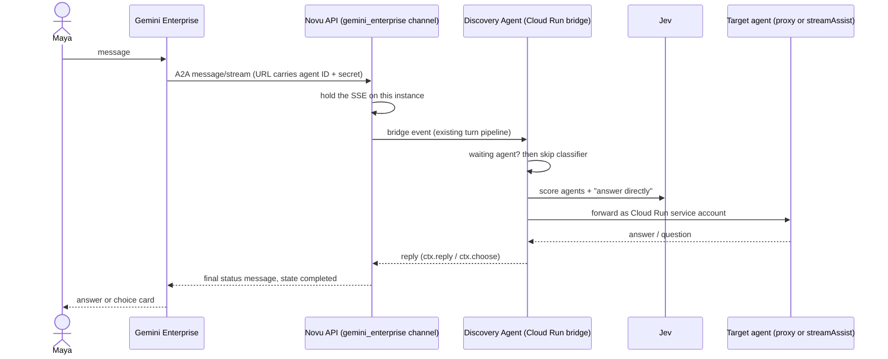

# Gemini Enterprise Discovery Agent: demo build spec

Destination of the wayfinder map [NV-8863](https://linear.app/novu/issue/NV-8863/map-gemini-enterprise-discovery-agent). Written 2026-09-29 from the 16 closed tickets. Every decision below links the ticket that settled it; evidence (transcripts, probes, prototypes) lives in the research branches and in `.pi-herdsman/` in Adam's checkout.

**Deadline:** the sandbox trial ends **2026-10-21**. The demo runs live in the sandbox, so everything must be built, deployed and recorded before then.

## 1. What the demo proves

One Novu Discovery Agent, talked to in Gemini Enterprise and in Slack, picks the right agent in the tenant, forwards the message, and returns the answer. When unsure it asks with a choice card. When the target agent asks a question, the question reaches the user and the answer goes back. ([NV-8878](https://linear.app/novu/issue/NV-8878/grilling-what-exactly-does-the-demo-show-step-by-step))

### Demo script (about 3 min, all live; backup is a screen recording of a clean run)

1. **Gemini Enterprise.** Maya @mentions the Discovery Agent: "Research how the EU AI Act affects HR tools." It forwards to Deep Research, which returns a research plan. Stop at the plan (the full report takes about 8 min).
2. **Same chat, switch + `input-required`.** "What were our sales?" → switches to the A2A test agent → "Which month?" → "March" → answer.
3. **Same chat, choice card.** An ambiguous request (e.g. "Summarise last quarter.") → card "Deep Research or Sales agent?" → click → forwarded.
4. **Slack.** Maya DMs the same Discovery Agent: "What were our sales?" → same routing and answer.

**Acceptance for the whole build:** the 4 steps run end to end, twice in a row, and the run is screen-recorded. The recording is the artifact.

**Cut:** Marketplace mock, no-code agent, Novu dashboard, billing meter.

## 2. Components and where they run

| Component | Where | Owner of the code |
|---|---|---|
| Gemini Enterprise app (tenant) | Sandbox project `gemini-enterprise-test-509310`, engine `gemini-enterprise-17899859_1789985955771`, `global` | Google |
| `gemini_enterprise` channel | Novu API, `apps/api/src/app/agents/`, next to `web_chat`, on **Novu Cloud staging** | Novu monorepo, branch off `next` |
| Slack channel | Existing Novu Slack channel, NV-8880 test workspace | Existing code |
| Discovery Agent | `@novu/framework` bridge app on **Cloud Run in the sandbox project** | New standalone project |
| Deep Research | Made by Google, reached via `streamAssist` | Google |
| A2A test agent | Cloud Run in the sandbox project, registered as agent `11935712447824575282` | `.pi-herdsman/sandbox/a2a-test-agent` |

Flow for one message ([NV-8877](https://linear.app/novu/issue/NV-8877/grilling-where-does-each-piece-run-and-how-is-it-gated), [NV-8873](https://linear.app/novu/issue/NV-8873/prototype-how-does-the-gemini-enterprise-channel-return-replies-on-the)):



Slack uses the same bridge; only the channel side differs.

## 3. Discovery Agent (new standalone project)

### 3.1 Candidate agents: a fixed list
- A config file in the project, not Agent Registry. Registry holds none of our A2A or no-code agents and search returned nothing ([NV-8871](https://linear.app/novu/issue/NV-8871/task-what-does-agent-registry-actually-return-in-our-sandbox)).
- Each entry: `id`, `name`, `description` (from the `jsonAgentCard` text), `path` (`a2a_proxy` | `stream_assist`), and the target ID.
- Filled once by an admin script run as an Owner, calling Discovery Engine v1alpha `agents.list` (needs `discoveryengine.agents.manage`, which the service account doesn't have). ([NV-8875](https://linear.app/novu/issue/NV-8875/grilling-which-identity-forwards-the-message-in-each-channel-and-how))
- Demo entries: **Deep Research** (`stream_assist`, `agentId: "deep_research"`) and **A2A test agent** (`a2a_proxy`, `11935712447824575282`). Leave `Render Stub` and `My Workflow` out.

### 3.2 Routing policy ([NV-8874](https://linear.app/novu/issue/NV-8874/prototype-what-does-one-routing-turn-look-like), [NV-8866](https://linear.app/novu/issue/NV-8866/research-what-does-the-routing-decision-look-like-and-which-mechanism))
Runs first in `onMessage`.
1. **An agent is waiting for an answer** (`route.waiting` set): send the message straight to it. No classifier call.
2. **Otherwise** Jev scores every listed agent plus "answer directly", with the current agent passed as context and the last 3 user messages + last reply (~600 tokens) as history.
   - Top agent ≥ **0.70** → forward (stay if current, else switch).
   - "Answer directly" ≥ **0.60** → the Discovery Agent answers itself with Gemini.
   - Anything else → choice card (`ctx.choose`) with the top 2–3 options. The pick arrives in `onAction` via `ctx.humanResponse`.
3. **On a switch** send only the user's message. Each target keeps its own session.
4. **Sticky state** in `ctx.metadata.route`: `{ current, waiting, sessions: { [agentId]: sessionName } }`.
5. **"Change agent"** button on every forwarded answer → opens the choice card over all listed agents.
6. **Jev fails** → Gemini `gemini-3.5-flash-lite` on Vertex AI, JSON `responseSchema` with an enum of agent IDs + `high/medium/low` confidence (`high` = forward, else card).
7. **Forward fails** → "Open @Agent" card naming the agent. Nothing else. ([NV-8875](https://linear.app/novu/issue/NV-8875/grilling-which-identity-forwards-the-message-in-each-channel-and-how))

**Decided while writing this spec:** the Deep Research plan does **not** set `route.waiting`. Otherwise demo step 2 ("What were our sales?") would be sent to Deep Research as a plan edit. After a plan, the next message is classified normally; if it goes to Deep Research (e.g. "Start Research"), it is sent on the saved session.

### 3.3 Forwarding ([NV-8872](https://linear.app/novu/issue/NV-8872/task-can-we-forward-to-each-demo-agent-and-carry-input-required), [NV-8864](https://linear.app/novu/issue/NV-8864/research-which-forwarding-path-reaches-each-agent-type))
All calls carry `Authorization: Bearer <service account token from the Cloud Run metadata server>`, `x-goog-user-project: gemini-enterprise-test-509310`. `ENGINE` = `projects/398896934586/locations/global/collections/default_collection/engines/gemini-enterprise-17899859_1789985955771`.

**A2A agents: Discovery Engine A2A proxy (v1, protobuf shape).**
```
POST https://discoveryengine.googleapis.com/v1/{ENGINE}/assistants/default_assistant/agents/{id}/a2a/v1/message:stream?alt=sse
{"message":{"messageId":"<uuid>","role":"ROLE_USER","content":[{"text":"..."}],
  "contextId":"<saved session name, omitted on the first turn>"}}
```
- Save `message.contextId` (a Gemini Enterprise session name) in `route.sessions[id]`.
- **Question detection:** a reply with no text whose `replies[].actionInvocation.actionName` (stream) or `diagnosticInfo` planner step `functionCall.functionName` is `mock_function_call_for_required_user_input`. Relay `args.input_required` to the user as a normal reply and set `route.waiting = id`.
- **Answer:** text-only `message:send`/`:stream` with the saved `contextId`. Never send `taskId` (ignored) or a `DataPart` (400). Clear `route.waiting` when a reply has text.
- `message:send` returns the answer text twice in `content[]`; de-duplicate.
- No text and no known marker → "This agent needs more input: open it in Gemini Enterprise" card.

**Deep Research: `streamAssist`.**
```
POST https://discoveryengine.googleapis.com/v1alpha/{ENGINE}/assistants/default_assistant:streamAssist?alt=sse
{"query":{"text":"..."},"session":"<saved, omitted on first turn>",
 "agentsSpec":{"agentSpecs":[{"agentId":"deep_research"}]},"toolsSpec":{"webGroundingSpec":{}}}
```
- Save `sessionInfo.session`. Skip `thought: true` chunks. The plan arrives in about 25–29 s.
- A malformed `agentId` silently falls back to the default assistant; validate IDs against the list.

**Not forwardable:** workflow, ADK and Dialogflow agents → "Open @Agent" card. Not in the demo list.

### 3.4 Identity, config, hosting ([NV-8875](https://linear.app/novu/issue/NV-8875/grilling-which-identity-forwards-the-message-in-each-channel-and-how), [NV-8877](https://linear.app/novu/issue/NV-8877/grilling-where-does-each-piece-run-and-how-is-it-gated))
- **Forwarding identity:** the Cloud Run runtime service account, in both channels. No `agentAuthorization`, no OAuth client, no Slack sign-in. Target agents see the robot account, not the employee.
- **Service account roles** (in the sandbox project): the NV-8872 probe roles (`roles/discoveryengine.user`), plus `roles/aiplatform.user` (Vertex Gemini) and `roles/secretmanager.secretAccessor`. `GET /card` returns 403 for it; not needed.
- **Keys:** Gemini via Vertex AI with ADC (no key). Jev key and the bridge's `NOVU_SECRET_KEY` in Secret Manager, mounted as env vars. The Novu API holds no keys.
- **Cloud Run:** CPU always allocated (the bridge keeps working after it acks), request timeout ≥ 30 min. `min-instances: 1` during rehearsal and recording to avoid cold starts.

## 4. `gemini_enterprise` channel in the Novu API ([NV-8873](https://linear.app/novu/issue/NV-8873/prototype-how-does-the-gemini-enterprise-channel-return-replies-on-the), [NV-8870](https://linear.app/novu/issue/NV-8870/task-what-renders-in-gemini-enterprise-and-can-we-post-later), [NV-8877](https://linear.app/novu/issue/NV-8877/grilling-where-does-each-piece-run-and-how-is-it-gated))

Reference mapping code: `.pi-herdsman/prototype/nv-8873-reply-stream/ge-channel.mjs` (`parseInbound`, `cardToA2uiParts`, `openTurn`/`step`).

### 4.1 Ingress
- Gemini Enterprise is registered straight at `/v1/agents/:agentId/webhook/:integrationIdentifier` with an **unguessable per-integration secret in the path**, checked by the API. Gemini Enterprise sends no credential to a URL outside Cloud Run (probed), and never fetches an agent card from the URL.
- Organisation and environment come from the agent document, as for every channel (`agent-config-resolver.service.ts`). ([NV-8876](https://linear.app/novu/issue/NV-8876/grilling-how-does-a-customer-company-map-to-a-novu-organisation))
- Inbound is always JSON-RPC `message/stream`, `blocking: true`, latest message only, no push config. First turn has no `contextId`; later turns echo the `contextId` we returned.
- **Subscriber:** one per A2A `contextId` (no user identity arrives).

### 4.2 Holding the reply stream
- Hold the SSE on the instance that received the request; write frames straight to the Express `res` (`sendWebResponse` buffers, so it can't stream).
- New adapter `gemini_enterprise` in `ChatInstanceRegistry.buildAdapters` next to `web_chat`. `postMessage` / `editMessage` / `startTyping` publish deliveries keyed by **thread = `contextId`**.
- End of turn comes from `AgentEventSink` `run-finish` / `run-error` (and the bridge-failure path), keyed by **`turnId`** (= bridge `deliveryId`).
- **Transport: Redis Streams**, not pub/sub (pub/sub lost a reply when its listener reconnected). `XADD ge:thread:<contextId>` (MAXLEN ~200, 30-min TTL), one `XREAD BLOCK` from a cursor per held stream, holder key `ge:holder:<contextId>`.
- **Text is held and sent once**, in the final status message. Gemini Enterprise appends every `artifact-update`, so sent text can't be edited. In-between versions go out as the `working` status line.
- **Deadline ~25 min** (Gemini Enterprise fails the turn at 28 min 20 s and never tells us): send "taking longer, ask me again" and end. **Keep-alive** SSE comment every ~15 s.
- **Terminal state always `completed`.** Relayed questions (`input-required` from a target) are ordinary completed replies; the Discovery Agent's `route.waiting` does the rest.
- A second message on the same `contextId` replaces the open stream ("stopped: you sent a newer message").
- **No posting later**: nothing can be pushed into a Gemini Enterprise chat after the stream closes.

### 4.3 Cards and clicks
- `CardElement` → A2UI v0.9 DataParts (`createSurface` + `updateComponents`, catalog `https://www.gstatic.com/vertexaisearch/a2ui/v0_9/gemini_enterprise_composite_catalog.json`) in the final status message. Markdown renders; a message with only A2UI parts renders.
- Every button: `action.event = { name: "novu_action", context: { actionId } }`.
- A click arrives as a new turn on the same `contextId` with a `DataPart` `mimeType: application/json+a2ui`, `data.action.{name, context}`. Map it to `{id, value, sourceMessageId}` for the existing `chat.processAction` → `HumanInteractionInbound` path. On click, `updateComponents` the old card to remove its buttons.
- The agent card registered with Gemini Enterprise must declare the A2UI v0.9 extension (copy `a2a-render-stub/agent-card.json`).
- Requires `IS_AGENT_HUMAN_HITL_ENABLED` on for the demo organisation.
- Nice to have: a Gemini Enterprise layout for the choose card with full-label buttons instead of letters.

### 4.4 Gating and meter
- LaunchDarkly flag `IS_AGENT_GEMINI_ENTERPRISE_ENABLED`, per organisation, default `false`, on for the demo organisation only.
- Hard off when `IS_SELF_HOSTED === 'true'` (the self-hosted flag service reads `process.env`).
- Checked at webhook ingress (404), integration create (403), dashboard catalog (hidden).
- `ConversationActivationService`: add a `gemini_enterprise` entry, 30-day window keyed by the `contextId` conversation. Required to compile; no gate.
- "Ask first" items per `AGENTS.md`: the new provider/platform enum in `packages/shared` and the new feature flag.

## 5. Slack
- Existing Slack channel; no new code expected. Connect the NV-8880 test workspace to the demo organisation through the existing Slack OAuth install.
- Subscribers per Slack user ID (existing auto-provision). Choice card renders as Block Kit.
- Same Discovery Agent bridge; the same routing and forwarding code runs.

## 6. A2A test agent change
- Resume on `contextId`, not `taskId`. The proxy drops `taskId` on every turn, so today "March" gets "Which month?" again. Small change in `server.ts`, then redeploy. ([NV-8878](https://linear.app/novu/issue/NV-8878/grilling-what-exactly-does-the-demo-show-step-by-step), [NV-8872](https://linear.app/novu/issue/NV-8872/task-can-we-forward-to-each-demo-agent-and-carry-input-required))

## 7. One-time setup
1. Create the demo Novu organisation by hand on staging; turn on `IS_AGENT_GEMINI_ENTERPRISE_ENABLED` and `IS_AGENT_HUMAN_HITL_ENABLED` for it.
2. Create the Novu agent + `gemini_enterprise` integration (gives the webhook URL with secret) and connect Slack.
3. Deploy the Discovery Agent to Cloud Run with its service account, roles and secrets (section 3.4).
4. Run the Owner script to write the fixed agent list.
5. Register the Discovery Agent in Gemini Enterprise as a custom A2A agent at the webhook URL, **without** `agentAuthorization`, and share it with all users.

## 8. Accepted limits (demo)
- Target agents and Gemini Enterprise history see the service account, not the employee. Every forwarded session lands in the service account's history.
- `input-required` detection depends on the undocumented `diagnosticInfo` / `actionInvocation` marker. It works for the service account; not verified for a licensed non-admin user.
- A2A agents that key state on `taskId` loop on the answer; only `contextId`-keyed agents resume.
- One organisation, one bridge: no multi-customer routing.
- Deep Research quota is about 3 full runs/day; stop at the plan in rehearsals.
- Check before recording that the step-3 wording scores below 0.70 so the card appears; keep a backup phrasing.

## 9. Deferred
Everything under "Not yet specified" on the map: authenticating Gemini Enterprise calls (Cloud Run front door), acting as the user, `auth-required`, confirming before actions, per-user visibility, retention, rate limits, Marketplace purchase → organisation, many customers, Jev vs the Marketplace default-model rule, more channels.

## 10. Proposed build tickets

| # | Ticket | Depends on | Rough size |
|---|---|---|---|
| 1 | A2A test agent resumes on `contextId` | – | 1 h |
| 2 | `gemini_enterprise` channel: ingress with path secret, SSE holding, adapter, Redis Streams, deadline, keep-alive | – | 3–4 days |
| 3 | `gemini_enterprise` channel: A2UI cards and click handling | 2 | 1–2 days |
| 4 | `gemini_enterprise` channel: flag gating, self-hosted off-switch, dashboard catalog, meter entry | 2 | 0.5–1 day |
| 5 | Discovery Agent: forwarding clients (proxy + `streamAssist`), question relay, session state | – | 2 days |
| 6 | Discovery Agent: routing (Jev + Gemini fallback), choice card, "Change agent", "Open @Agent" | 5 | 2 days |
| 7 | Deploy + setup: Cloud Run, service account roles, Secret Manager, Owner script, org, registration, Slack connect | 1, 4, 6 | 0.5–1 day |
| 8 | Rehearse and record the demo | 7 | 0.5 day |

Tickets 2–4 and 5–6 can run in parallel. Sizes are rough estimates for one developer.
